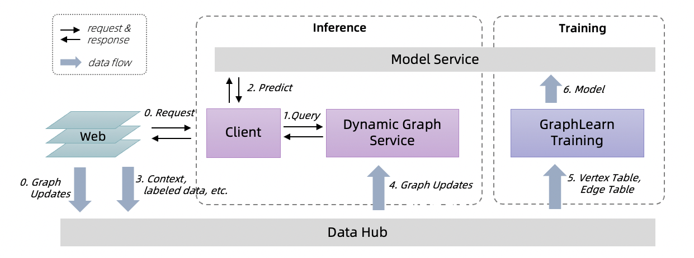

[](https://pypi.org/project/graph-learn/)
[](https://graph-learn.readthedocs.io/en/latest/)
[](https://github.com/alibaba/graph-learn/actions)
[](https://github.com/alibaba/graph-learn/blob/master/LICENSE)

[**Documentation**](https://graph-learn.readthedocs.io/en/latest/)

[简体中文](README_cn.md) | English

**Graph-Learn** (formerly AliGraph) is a distributed framework designed for the development and application of large-scale graph neural networks.
It has been successfully applied to many scenarios within Alibaba, such as search recommendation, network security, and knowledge graph.
After Graph-Learn 1.0, we added online inference services to the Graph-Learn framework, providing a complete solution including training and inference for GNNs to be used in real business.

- GraphLearn-Training

  The training framework, supports sampling on batch graphs, training offline or incremental GNN models.

  It provides both Python and C++ interfaces for graph sampling operations and provides a gremlin-like GSL (Graph Sampling Language) interface. For GNN models, Graph-Learn provides a set of paradigms and processes for model development. It is compatible with both TensorFlow and PyTorch, and provides data layer, model layer interfaces and rich model examples.

  [Detail](https://graph-learn.readthedocs.io/en/latest/gl/intro.html)

- Dynamic-Graph-Service

  An online inference service, supports real-time sampling on dynamic graphs with streaming graph updates.

  It provides a performance guarantee of sampling P99 latency in 20ms on large-scale dynamic graphs. The Client side of the Online Inference Service provides Java GSL interfaces and Tensorflow Model Predict.

  [Detail](https://graph-learn.readthedocs.io/en/latest/dgs/intro.html)


Use GraphLearn-Training and Dynamic-Graph-Service for training and inference.


1. A user initiates a request on the Web (0), samples in real time on the dynamic graph via the Client side (1), uses the samples as model input, and requests the prediction results from the Model service (3).
2. the prediction results, feedback, and some context on the Web are sent to the Data Hub (0, 3), eg, Log Service.
3. data updates streamingly flow into the Dynamic Graph Service as graph updates (4).
4. GraphLearn-Training hourly loads window of graph data, incremental trains models, and updates model on tensorflow Model service.


## Citation

Please cite the following paper in your publications if **Graph-Learn** helps your research.

```
@article{zhu2019aligraph,
  title={AliGraph: a comprehensive graph neural network platform},
  author={Zhu, Rong and Zhao, Kun and Yang, Hongxia and Lin, Wei and Zhou, Chang and Ai, Baole and Li, Yong and Zhou, Jingren},
  journal={Proceedings of the VLDB Endowment},
  volume={12},
  number={12},
  pages={2094--2105},
  year={2019},
  publisher={VLDB Endowment}
}
```

## License

Apache License 2.0.
