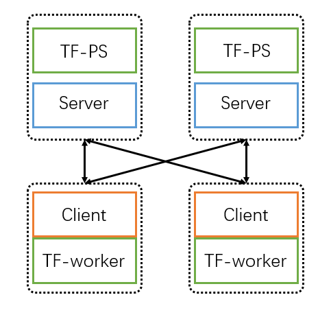

# Launch **GL** on Kubernetes

## Dependency

**GL** can integrated into the kubernetes ecosystem easily.

[TF-operator](https://github.com/kubeflow/tf-operator) is essential to launch a **GL** job on Kubernetes. If you don't need the additional features (such as UI and ML pipeline) provided by [Kubeflow](https://www.kubeflow.org/), you can refer to [Arena](https://github.com/kubeflow/arena/blob/master/docs/installation/INSTALL_FROM_BINARY.md) for one click installation.

**GL** supports both CPU and GPU training. If you need to use GPUs in **GL**, please make sure that GPU resources are available in your cluster. Checkout the GPU support of k8s: [Schedule GPUs](https://kubernetes.io/docs/tasks/manage-gpus/scheduling-gpus/).


## Single-box example

Deploy the **GL** tensorflow job with tf-operator:

```
kubectl apply -f graphsage.yaml
```

Please refer to `graphsage.yaml` for detailed configurations.

## Distributed example

To launch the distributed **GL** jobs, you need to make sure that a distributed file system (eg, NFS) is mounted successfully either on each host machine or with [PVC](https://kubernetes.io/docs/concepts/storage/persistent-volumes/#persistentvolumeclaims).

**GL** relies on the distributed file system to synchronize the states among servers and clients.

`graphsage-dist.yaml` is an example of launching a tensorflow-based **GL** job with 2 parameter-servers and 2 workers, using tf-operator. In this case, the same number of clients and servers of **GL** are co-placed with the workers and parameter-servers. The architecture is shown below.

<p align=center>

<p align=center> An example of running distributed GraphSAGE on **GL** with distributed TensorFlow </p>
</p>

To launch the example:

```
kubectl apply -f graphsage-dist.yaml
```

Note that, the tf-operator will generate `TF_CONFIG` as an environment variable for each pod. We use `launch_graphlearn.py` to parse the `TF_CONFIG` to generate arguments of ps-host/worker-host/job-name/task-index for the **GL** application. Finally, the **GL** application is executed as a sub-process of our **GL** launcher.

In this example, we assume an NFS that can be accessed by all machines are mounted at location `/mnt/data/nfs`.

[Home](../README.md)
