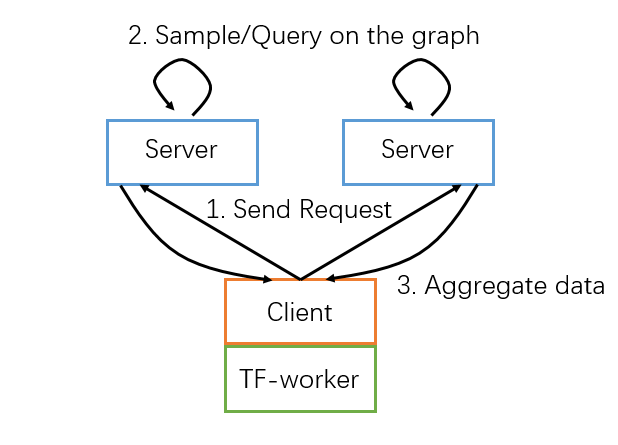

# Distributed mode

**GL** supports arbitrary combinations of servers and clients running in distributed mode. The server role is responsible for loading and managing the graph. The client role operates in the same process with a deep learning framework to offer graph data for training. During the execution of a training job, the data query or sampling request is generated from clients and processed in servers. Finally, the results of servers are aggregated back to clients.

Note that, the "server" and "client" are just logic roles in **GL**. In fact, they can also be placed in the same machine.

We provide a distributed GraphSAGE example using 2 clients and 2 servers that co-place with 2 TF-worker and 2 TF-parameter-server. Please refer to the [Distributed training with TensorFlow](../examples/tf/graphsage/README.md) or [K8S example](k8s.md) for details.

[Home](../README.md)
