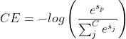

## Common Losses

nn/tf/loss.py

### Recommended scenario unsupervised loss
For recommending unsupervised learning loss, we implement two common loss functions, Sigmoid Cross Entropy loss (BCE) and Softmax Cross Entropy loss.
​

#### sigmoid_cross_entropy_loss

```python
def sigmoid_cross_entropy_loss(pos_logit,
                               neg_logit):
  """Sigmoid cross entropy loss.
  Args:
    pos_logit: positive logits, tensor with shape [batch_size]
    neg_logit: negative logits, tensor with shape [batch_size]
  Returns:
    loss, a scalar tensor
  """
  true_xent = tf.nn.sigmoid_cross_entropy_with_logits(
      labels=tf.ones_like(pos_logit), logits=pos_logit)
  negative_xent = tf.nn.sigmoid_cross_entropy_with_logits(
      labels=tf.zeros_like(neg_logit), logits=neg_logit)
  loss = tf.reduce_mean(true_xent) + 1.0 * tf.reduce_mean(negative_xent)
  return loss
```
​

#### unsupervised_softmax_cross_entropy_loss
Softmax CE loss, which treats negative samples as a shared form in a batch, allows the original binary classification to be viewed as a "multi-classification" task with one positive sample and negative samples of batch_size * neg_num. If we consider the labels as one-hot encoding format, i.e., only positive samples are labeled as 1, then the total loss is.
​


where sp denotes the score of the positive sample.

```python
def unsupervised_softmax_cross_entropy_loss(src_emb,
                                            pos_emb,
                                            neg_emb,
                                            temperature=1.0):
  """Softmax cross entropy loss.
  This loss is mostly used for inner product based two-tower model 
  for recommdener systems.
  Args:
    src_emb: src embedding, tensor with shape [batch_size, dim]
    pos_emb: positive dst embedding, tensor with shape [batch_size, dim]
    neg_emb: negative dst embedding, tensor with shape [batch_size * neg_num, dim]
  Returns:
    loss, a scalar tensor
  """
  pos_sim = tf.reduce_sum(tf.multiply(src_emb, pos_emb), axis=-1, keepdims=True)
  neg_sim = tf.matmul(src_emb, tf.transpose(neg_emb))
  logit = tf.nn.softmax(tf.concat([pos_sim, neg_sim] , axis=-1) / temperature)
  loss = -tf.reduce_mean(tf.log(logit[:, :1] + 1e-12))

  return loss
```
