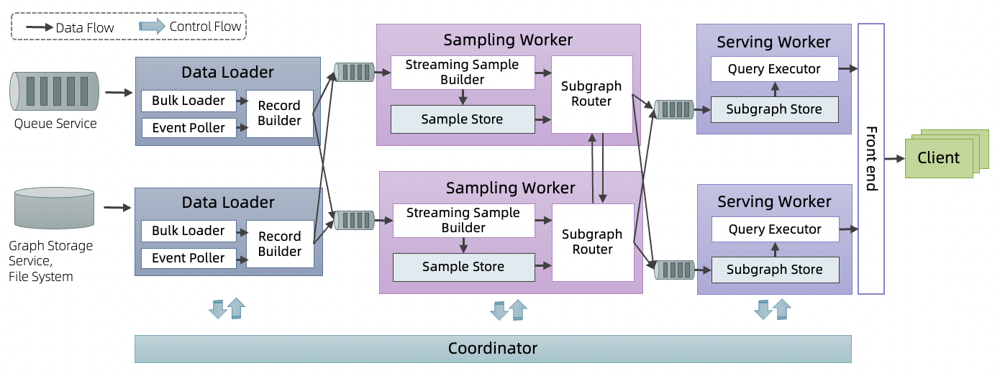

# Introduction
Most GNN models (e.g. GraphSAGE) in trained based on static graphs, however, there are many scenarios in real business where the structure of the graph and features change dynamically, and the representation may be time-dependent. The following are scenarios in which dynamic graphs may have greater benefits than static graphs.

- Dynamic graph structure, graph features
  - Points, edges are applied to the graph representation in the order of occurrence
- Representation periodicity: according to Mercer's theorem, temporal patterns can be inscribed by a series of periodic kernel functions
  - For example, if a customer is interested in drinking a cup of coffee at 2:00 p.m. every day but not the rest of the day, the periodicity of the customer's interest can be captured by encoding time into the customer's embedding.
- Concept drift: The statistics change over time, resulting in inaccurate prediction results of the model
  - For example, the dynamic change of the model due to the change of fraudulent means can actually be a representation of a periodic kernel function, but it requires the model to be updated in real time.

Dynamic graphs correspondingly have some Temporal GNN models, such as discrete dynamic graph DTDG models EvolveGCN, HGT, continuous dynamic graph models
TGAT, TGN, APAN, etc., who encode timestamps into the representations. The traditional static graph models, on the other hand, do not characterize temporal information, but on dynamically changing graphs, their representations should also change in real time due to changes in graph structure and graph features.
Dynamic graph services are oriented to dynamic graph training and inference. The current phase of open source work is real-time inference sampling on continuously changing dynamic graphs. According to the needs of the model, inference sampling on dynamic graphs is N-hop neighbor sampling of a vertex, and the neighbor sampling is generally the K most recent interactions, with each neighbor retaining the attributes of the M most recent versions.

The dynamic graph sampling service currently provides an integrated solution for training and inference combined with GraphLearn and Tensorflow, refer to the e2e tutorial.

The overall performance of the dynamic graph sampling service guarantees P99 20ms sampling latency and second-level data update staleness.

## Architecture

In order to meet the above requirements, we design a System Architecture based on Query aware subgraph streaming pre-sampling.

The whole service contains three subservices, DataLoader, Sampling Worker and Serving Worker, each of which supports failover.

When Serving Worker serves a Query request sent by a Client, the Query result is guaranteed to already exist in the local storage to prevent the latency increase caused by cross-network transmission. We stream the Graph update to the Serving Worker through asynchronous data transfer.

The Data Flow of the data update flows sequentially through.
- Queue Service: as the stream data source or Graph Storage Service, and File System as the batch data source.
- DataLoader: from the data source via Bulk Loader to load a batch update or via Event Poller to load a streaming update, which then flows through Record Builder to build a VertexUpdateRecord or EdgeUpdateRecord.
- DataLoader - Sampling Worker queue: Record flows into the corresponding Sampling Worker according to a certain slicing strategy, and slicing, flow control and Ckpt are performed through the queue.
- Sampling Worker: According to the installed Query, the inflowing Record is sampled and written to Sample Store, and samples are sent out from SampleStore according to the Dependency information on Subgraph router. The Dependency information, which is actually the subscription information of the Subgraph on the Serving Worker to the record, is represented as a SubscriptionTable.
- Sampling worker - Serving worker queue: Sampling worker sends samples to the corresponding SubGraph based on the subscription information of the samples by the Serving Worker.
- Sering Worker: pull data from the queue and write it to the local SubGraph Store, and when there is a sample request from the client, it reads the samples from the local SubGraph Store through Query Executor, organizes them, and returns the sample subgraph to the client.

## Performance
Query: 2 hop sampling and feature lookup for all the vertices.
1 serving worker with P99 latency < 20ms guarantee has QPS > 20,000.
The staleness of the stream data update P99 < 5s.
