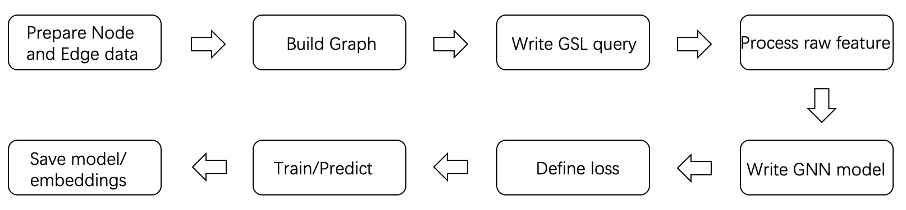
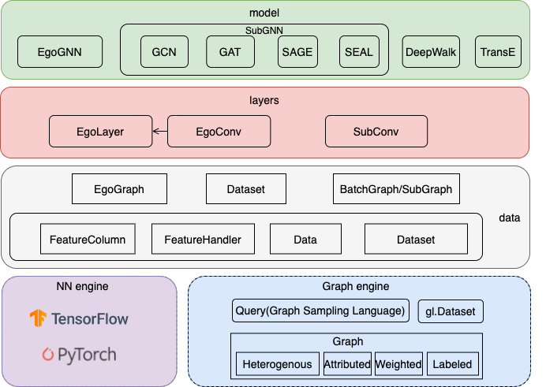

## Paradigms and Processes

The biggest difference between graph learning algorithms, especially graph neural networks (GNNs), and general DNN models is the existence of relationships or dependencies between samples. Such inter-data dependencies make it difficult to develop GNNs models directly using deep learning engines like TensorFlow or PyTorch.

Firstly because graph data is different from general image and text data and cannot be used directly or efficiently with the data processing capabilities provided by TensorFlow and PyTorch, especially for large-scale heterogeneous graphs.
The second is because GNN is computed based on graph structure data, and the computational path is points and edges in the graph, and it is not easy to build models directly based on the original APIs of TensorFlow or PyTorch.

In order to solve these problems, we have implemented a concise paradigm and process for developing GNNs algorithms from our past practical experience and summarized the shortcomings of previous versions. With this paradigm, we hope to simplify the development of GNNs algorithms and facilitate algorithm developers to quickly build GNNs algorithms suitable for their scenarios.

### Model Paradigm
Most GNNs algorithms follow the computational paradigm of message passing or neighbor aggregation, and some frameworks and papers divide the message passing process into aggregate, update, etc. However, in practice, the computational process required by different GNNs algorithms is not exactly the same.

In practical industrial applications, the size of the graph is relatively large and the features on the nodes and edges of the graph are complex (there may be both discrete and continuous features), so it is not possible to perform message passing/neighbor aggregation directly on the original graph.  A feasible and efficient approach is based on the idea of sampling, where a subgraph is first sampled from the graph and then computed based on the subgraph.
 After sampling out the subgraph, the node and edge features of that subgraph are preprocessed and uniformly processed into vectors, and then the computation of efficient message passing can be performed based on that subgraph.

To summarize, we summarize the paradigm of GNNs into 3 stages: subgraph sampling, feature preprocessing, and message passing.

1. Subgraph sampling: Subgraphs are obtained through GSL sampling provided by GraphLearn, which provides graph data traversal, neighbor sampling, negative sampling, and other functions.
2. Feature preprocessing: The original features of nodes and edges are preprocessed, such as vectorization (embedding lookup) of discrete features.
3. Message passing: Aggregation and update of features through topological relations of the graph.

According to the difference of neighbor sampling operator in subgraph sampling and NN operator in message passing, we organize the subgraph into EgoGraph or SubGraph format. EgoGraph consists of central object ego and its fixed-size neighbors, which is a dense organization format. SubGraph is a more general subgraph organization format, consisting of nodes, edges features and edge index (a two-dimensional array consisting of row index and column index of edges), generally using full neighbor. The conv layer based on SubGraph generally uses the sparse NN operator. The examples of EgoGraph and SubGraph are shown in the following figure.

EgoGraph refers to a subgraph composed of ego (central node) and k-hop neighbors; SubGraph refers to a generalized subgraph represented by nodes, edges and edge_index.

Next, we introduce two different computational paradigms based on EgoGraph and SubGraph.

#### EgoGraph-based node-centric aggregation
EgoGraph consists of ego and neighbors, and the message aggregation path is determined by the potential relationship between ego and neighbors. k-hop neighbors only need to aggregate the messages of k+1-hop neighbors, and the whole message passing process is carried out along the directed meta-path from neighbors to themselves. In this approach, the number of sampled neighbor hops and the number of layers of the neural network need to be exactly the same. The following figure illustrates the computation of a 2-hop neighbor model of GNNs. The vector of original nodes is noted as h(0); the first layer forward process needs to aggregate 2-hop neighbors to 1-hop neighbors and 1-hop neighbors to itself, the types of different hop neighbors may be different, so the first layer needs two different conv layers (for homogeneous graphs, these two conv layers are the same), and the features of nodes after the first layer are updated to h(1) as the input of the second layer; at the second layer, it needs to aggregate the h(1) of 1-hop neighbors to update the ego node features, and the final output node features h(2) as the embedding of the final output ego node.

#### SubGraph-based graph message passing
Unlike EgoGraph, SubGraph contains the edge_index of the graph topology, so the message passing path (forward computation path) can be determined directly by the edge_index, and the implementation of the conv layer can be done directly by the edge_index and the nodes/edges data. In addition, SubGraph is fully compatible with the Data in PyG, so the model part of PyG can be reused.

#### Comparison of EgoGraph and SubGraph
 

|  | EgoGraph | SubGraph |
| --- | --- | --- |
| Data Composition | Self-nodes and k-hop neighbor nodes | Nodes and edge_index |
| Topology | Tree topology with k-hop neighbors only | SubGraph topology |
| supported sampling operators | fix-sized neighbor sampler | full neighbor sampler |
| programming paradigm | node-centric aggregation(GraphSAGE like) | graph message passing(like DGL/PyG) |
| NN operator | dense | sparse(segment_sum/mean...) | dense
| compute paths | neighbor node to center node | source node to destination node |
| hetero graph | support | support(since v1.1.0) |
| PyTorch support | Not implemented | PyG-compatible, corresponding to Data in PyG |
| Implemented algorithms | 0.4 models are based on EgoGraph implementation.
GraphSAGE, bipartite graph GraphSAGE/GAT, etc. | GCN, GAT, GraphSAGE, SEAL, etc. |

 

Note: EgoGraph itself represents a batch of the nodes and neighbors; SubGraph represents only a subgraph, and a batch_size of subgraphs is represented by BatchGraph.

For PyTorch, the current model layer directly reuses pyG, and we implement Dataset and PyGDataLoader to convert GSL. Data in PyG is equivalent to our SubGraph, and Batch is equivalent to BatchGraph.

### Pipeline

A GNN training/prediction task usually consists of the following steps.

First, prepare the graph data according to the application scenario.
Graph data exists in the form of a vertex table and an edge table, see the section "Data Sources" for the exact format. Usually, an application scenario will involve multiple types of vertices and edges, which can be added one by one using the interface provided by GraphLearn. The data sources of vertices and edges are independent, and the backend engine will complete the construction of heterogeneous graphs after adding them to GraphLearn. The construction of graph data is a very important part, which determines the upper limit of algorithm learning, so how to generate reasonable edge data and how to choose appropriate features need to be consistent with business goals. Welcome you can actively share and discuss your own graph construction experience in GraphLearn user group.

After the graph is constructed, samples need to be sampled from the graph to obtain the training samples. It is recommended to use GSL to construct the sample query, which can use GraphLearn's asynchronous and multi-threaded cache sampling query function to efficiently generate the training sample stream.

The output of GSL is in Numpy format, while the model based on TensorFlow or PyTorch needs data in tensor format, so the data format needs to be converted first, in addition, the features of the original graph data may be complex and cannot be directly accessed for model training, for example, the node features "id=123456, age= 28, city=Beijing" and other plaintexts need to be processed into continuous features by embedding lookup. The meaning of different features is different, and the space and dimension of vectorization are different, so we need to describe clearly the type, value space, and dimension of each feature after vectorization when adding vertex or edge data sources.Based on the above information, GraphLearn provides a convenient interface to convert raw data into vector format.

In terms of GNN model construction, GraphLearn encapsulates EgoGraph based layers and models, and SubGraph based layers and models, which can be used to build a GNNs model after selecting a model paradigm that suits your needs. The GNNs model takes EgoGraph or BatchGraph (SubGraph of mini-batch) as input and outputs the embedding of the nodes.

After getting the embedding of the vertices, the loss function is designed with the scenario, and the common scenarios can be classified into two categories: node classification and link prediction. Take link prediction as an example, we need "embedding of source vertex, embedding of destination vertex, embedding of target vertex with negative sampling" as input, and output the loss, and then optimize the loss by iterating through the trainer. GraphLearn encapsulates some common loss functions, which can be found in the section "Common Losses".

The overall framework of GraphLearn's algorithm is shown in the following figure.

The underlying framework is a distributed memory-based graph query/computation engine that provides heterogeneous, multi-attribute, weighted, labeled, directed/undirected graph of points, edge traversal, neighbor sampling, negative sampling, attribute query and other functions, while supporting TensorFlow1.12/1.13 and PyTorch1.8.1 backend.
From the bottom to the top is the data layer data, the model layer layers and models, and finally a number of basic and commonly used examples are provided.
For details on each module, see the "Data Layer" and "Model Layer" sections under the different backends (tensorflow or pytorch).

We are committed to building a simple, flexible, rich and efficient algorithm framework for algorithm developers, while focusing on algorithm innovation and business implementation to promote the practical implementation of graph learning in many scenarios such as recommendation and security.
Later we will also gradually build efficient and easy-to-use algorithm libraries for these scenarios.
If our work is helpful to you, please let us know, and feel free to contribute code.
