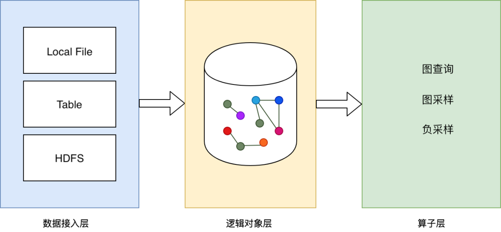

# Data Sources

This document is used to illustrate the data formats supported by GraphLearn and how they are described and parsed through the API. <br /> 

## Data Formats
Graph data can be divided into **vertex data** and **edge data**. In general, vertex data contains **vertex ID** and **properties** that describe an entity; edge data contains **source vertex ID** and **destination vertex ID** that describe the relationship between vertices. In heterogeneous graph scenarios, multiple types of vertices and edges exist respectively. Therefore, we need the type information of vertices and edges in order to recognize different types of vertices and edges. The type information is described through an API. Both vertices and edges can have attributes, e.g. "A user bought a product on Saturday morning", the time information "Saturday morning" is an edge attribute. In addition, there are many scenarios where users need the concept of "weight", either as a vertex weight or as an edge weight, as a measure of importance, such as "sampling neighbor nodes by weight". The source of "weights" is diverse and varies from task to task. In a supervised learning classification task, vertices or edges may also have labels. <br /> <br /> We will use these typical examples for the classification of vertices and edges.
<br />We abstract the data format of these typical scenarios as **ATTRIBUTED**, **WEIGHTED, and LABELED** for vertices or edges that contain attributes, have weights, and have labels, respectively. For vertex data sources and edge data sources, these three can exist simultaneously or partially. <br />

### Base format
The base vertex data contains only a vertex ID, of type bigint, and each entry represents a vertex. Often only the vertex ID is not enough, it also needs to contain attributes, weights or labels. <br />
<br />The base edge data contains only the source vertex ID and the destination vertex ID, of type bigint, each representing an edge that represents the relationship between two vertices. The schema of the base edge data source is shown below.
The base edge data format can be used independently, i.e., without additional attributes, weights, and labels. <br /> 

The base edge format schema

| Domain | Data Type | Remarks |
| --- | --- | --- |
| src_id | BIGINT | |
| dst_id | BIGINT | |


### Attribute format (ATTRIBUTED)
Used to express attribute information for vertices or edges. In general, vertices have attributes by default, otherwise only the edge table is sufficient. The attribute column has only one column and is of type string.
The string can be internally split by custom delimiters for multiple attributes. For example, if a vertex has 3 attributes, `shanghai, 10, 0.01`, separated by the separator ':', then the attribute data corresponding to that vertex is `shanghai:10:0.01`.
When the data format has attributes, either vertex data or edge data, it is necessary to display the specified **ATTRIBUTED** to inform the system when the API is described.

Vertex data attribute format schema

| Field | Data Type | Remarks |
| --- | --- | --- |
| id | BIGINT | |
| attributes | STRING | | |

<br />
Edge attribute format schema

| field | data type | comments |
| --- | --- | --- |
| src_id | BIGINT | |
| dst_id | BIGINT | |
| attributes | STRING | | |
<br /> 

### Weighted format (WEIGHTED)
Used to express the case where vertices or edges carry weights. The weight column has only one column and is of type **float**. When the data format has weights, either vertex data or edge data, the specified **WEIGHTED** needs to be displayed in the API description to inform the system.

Vertex data weighted format schema

| field | data type | info column |
| --- | --- | --- |
| id | BIGINT | | |
| attributes | FLOAT | |

<br /> 
Edge data weighted format schema

| field | data type | comments |
| --- | --- | --- |
| src_id | BIGINT | |
| dst_id | BIGINT | |
| weight | FLOAT | | |
<br /> 

### Label format (LABELED)
Used to express the case where a vertex or edge has a label. The label column has only one column and is of type int. When the data format has a label, either vertex data or edge data, the specified **LABELD** needs to be displayed to inform the system when the API is described.

Vertex data labeled format schema

| Field | Data Type | Remarks |
| --- | --- | --- |
| id | BIGINT | | |
| label | INT | | |
<br />

Edge data labeled format schema

| field | data type | note |
| --- | --- | --- |
| src_id | BIGINT | |
| dst_id | BIGINT | |
| label | INT | |
<br />

### Combined format
ID is the mandatory information for composing vertex and edge data sources, and weight, label, and attribute are optional information. When one or more of **WEIGHTED, ATTRIBUTED, LABELED** are available at the same time, the combination of mandatory and optional formatting information needs to follow a certain order in the data source. <br /> <br />
<br />1) **VERTICAL DATA SOURCE**, the order of the mixed format schema is shown in the table below. <br />

| Field | Data Type | Remarks |
| --- | --- | --- |
| id | BIGINT | required |
| weight | FLOAT | optional: WEIGHTED |
| label | BIGINT | optional: LABELED |
| attributes | STRING | optional: ATTRIBUTED |


<br />2) **SIDE DATA SOURCE**, the order of the mixed format schema is shown in the table below. <br /> <br

| fields | data types | comments |
| --- | --- | --- |
| src_id | BIGINT | Required |
| dst_id | BIGINT | required |
| weight | FLOAT | optional: WEIGHTED |
| label | BIGINT | optional: LABELED |
| attributes | STRING | optional: ATTRIBUTED |


<br />Expansion information can be selected from **0 or more**, and the **order of the schema needs to be maintained in the same order as the previous table**. <br /> <br />

## Data Source



<br /> The system abstracts the data access layer to easily dock multiple types of data sources, currently GL supports LocalFileSystem and HDFS, other data sources can be mounted to local. The data representation is two-dimensional structured, the row represents a vertex or an edge data, the column represents a vertex or an edge information. <br />


### Local FileSystem
Access to local files/ or files mounted locally as graph data sources, supporting folders, files.
Under distributed, each GraphLearn Server reads all data of the specified file as data source, so when using local files (including mount to local file) as graph data source for distributed GraphLearn, you need to do slice of the original data in advance and specify different slice as data source for each Server.

In the local file, the data types are as follows. Among them, column names are not required. Support reading data from one or more local files.

| Column | Type |
| --- | --- |
| id | int64 |
| weight | float |
| label | int32 |
| features | string |

<br />

1) The format of the vertex file. The first row is the column name, which represents the mandatory or extended information, separated by **tab**, and each element is "column name:data type". The rest of the data in each row represents the information of a vertex, corresponding to the information name of the first column, separated by **tab**.

```python
# file://node_table
id:int64 feature:string
0 shanghai:0:s2:10:0.1:0.5
1 beijing:1:s2:11:0.1:0.5
2 hangzhou:2:s2:12:0.1:0.5
3 shanghai:3:s2:13:0.1:0.5
```

<br />2) Edge file format. The first row is the column name, which indicates the mandatory or extended information, separated by **tab**, and each element is "column name:data type". <br />The rest of the data in each row represents the information of an edge, corresponding to the information name of the first column, separated by **tab**.

```python
# file://edge_table
src_id:int64 dst_id:int64 weight:float feature:string
0 5 0.215340 red:0:s2:10:0.1:0.5
0 7 0.933091 grey:0:s2:10:0.1:0.5
0 1 0.362519 blue:0:s2:10:0.1:0.5
0 9 0.097545 yellow:0:s2:10:0.1:0.5
```

<br />With a local file as the data source, you can use the file path directly in the script. See the next chapter "[graph object](graph_object.md)" for details. <br />


### HDFS(since v1.1.0)
The separator between columns can be specified by the following command.
```
gl.set_field_delimiter("\001")
```
read all the files in the directory (the same schema, indicating a node table or edge table), the path is: hdfs://cluster/xxx/directory/
read a single file, the path is: hdfs://cluster/xxx/directory/file


## User API

### Decoder definition
The `Decoder` class is used to describe the data format described above and is defined as follows.

```python
class Decoder(weighted=False, labeled=False, attr_types=None, attr_delimiter=":")
"""
weighted: describes whether the data source is weighted or not, default is False
labeled: Describes whether the data source is labeled, defaults to False
attr_types: When the data source has attributes, this parameter is a string list describing the type of each attribute.
                Each element of the list supports only "string", "int" and "float" types.
                The parameters are shaped like ["string", "int", "float"], representing data with three attributes in the attribute column.
                In order, they are string, int, and float.
                The default is None, i.e. the data source has no attributes.
attr_delimiter: When the data has attributes (compressed into a large string), it is necessary to know how to parse them, and this parameter describes the separator between the attributes.
                For example, if "shanghai:0:0.1", the delimiter is ":". The default is ":".
attr_dims: Only used in the TF version of graph neural network to describe the corresponding discrete attributes encoded as embeding dimensions, which is an int list.

        The correspondence of all valid attr_type and attr_dim is as follows.
        | attr_type |attr_dim| encoded into |
        | --------- | -- | -------- |
        | ("string",10) | 8 | Embedding variable, bucketsize=10, dim=8 |
        |("string",10,True)| 8 |Sparse embedding variable, bucketsize=10, dim=8|
        |("string",None,True)| 8| Sparse dynamic embedding variable, dim=8 |
        |"int" |None| Continues numeric tensor |
        | ("int",10) | 8 | Embedding variable, bucket size=10, dim=8 |
        | "float" |None/0| Continues numeric tensor |
"""

  @property
  def feature_spec(self):
  """
  Used only when combined with a TF NN model, returns a FeatureSpec object.  
  """
```

### Vertex Decoder
There are several forms of Decoder for vertices.

```python
import graphlearn as gl

### schema = (id int64, weight double)
gl.Decoder(weighted=True)

# schema = (id int64, label int32)
gl.Decoder(labeled=True)

# schema = (id int64, attributes string)
gl.Decoder(attr_type={your_attr_types}, attr_delimiter={you_delimiter})

# schema = (id int64, weight float, label int32)
gl.Decoder(weighted=True, labeled=True)

# schema = (id int64, weight float, attributes string)
ag.Decoder(weightd=True, attr_type={your_attr_types}, attr_delimiter={you_delimiter})

# schema = (id int64, label int32, attributes string)
gl.Decoder(labeled=True, attr_type={your_attr_types}, attr_delimiter={you_delimiter})

# schema = (id int64, weight float, label int32, attributes string)
gl.Decoder(weighted=True, labeled=True, attr_type={your_attr_types}, attr_delimiter={you_delimiter})
```


### Edge Decoder
The edge Decoder has the following forms.

```python
import graphlearn as gl

### schema = (scr_id int64, dst_id int64)
gl.Decoder()

# schema = (src_id int64, dst_id int64, weight float)
gl.Decoder(weighted=True)

# schema = (src_id int64, dst_id int64, label int32)
gl.Decoder(labeled=True)

# schema = (src_id int64, dst_id int64, attributes string)
gl.Decoder(attr_type={your_attr_types}, attr_delimiter={you_delimiter})

# schema = (src_id int64, dst_id int64, weight float, label int32)
gl.Decoder(weighted=True, labeled=True)

# schema = (src_id int64, dst_id int64, weight float, attributes string)
gl.Decoder(weightd=True, attr_type={your_attr_types}, attr_delimiter={you_delimiter})

# schema = (src_id int64, dst_id int64, label int32, attributes string)
gl.Decoder(labeled=True, attr_type={your_attr_types}, attr_delimiter={you_delimiter})

# schema = (src_id int64, dst_id int64, weight float, label int32, attributes string)
gl.Decoder(weighted=True, labeled=True, attr_type={your_attr_types}, attr_delimiter={you_delimiter})
```

### Usage examples
Assume that the data sources are shown in Table 1, Table 2, and Table 3 below. 

Table 1 item vertex table

| id | feature |
| --- | --- |
| 10001 | feature1:1:0.1 |
| 10002 | feature2:2:0.2 |
| 10003 | feature3:3:0.3 |

Table 2 user vertex table

| id | feature |
| --- | --- |
| 0.1:0.2:0.3 |
| 0.4:0.5:0.6 |
| 125 | 0.7:0.8:0.9 |


Table 3 user-item side table

| src_id | dst_id | weight |
| --- | --- | --- |
|123 | 10001 | 0.1 |
|124 | 10001 | 0.2 |
|124 | 10002 | 0.3 |

<br />Build `item_node_decoder` for the item vertex table, `user_node_decoder` for the user vertex table, and `edge_decoder` for the edge table, with the following code.

```python
import graphlearn as gl

item_node_decoder = gl.Decoder(attr_types=["string", "int", "float"])
user_node_decoder = gl.Decoder(attr_types=["float", "float", "float"])
edge_decoder = gl.Decoder(weighted=True)
```

<br />After constructing Decoder for each data source, add the data source to the graph and specify the corresponding Decoder, see [graph object](graph_object.md) for details.

### Decoder and NN models combined
#### attr_types, attr_dims
<br />In general, `Decoder` only needs to describe `weighted`, `labeled`, `attr_types`, `attr_delimiter` to parse and load graph data into the graph.

<br />GraphLearn supports that the vertices or edges in the original graph data contain `int`, `float`, and `string` types of features, and each type has a different representation in the NN model. For example, features of type `int` can be used as continuous values or discrete ids. Features of type `string` can be single-valued or multiple-valued. The definition of features needs to be clearly described when adding the graph data source, which can then be seamlessly converted through the interface provided by GraphLearn to interface with GNN algorithms.

<br /> Therefore, when combined with neural networks, `attr_types` and `attr_dims` need to be processed as follows.
1. `string` attribute in `attr_types` is suggested to be hashed to `int`, i.e. `"string"` becomes `tuple` type `("string", bucket_size)`.
Attributes of type `string` are more difficult to handle, and the usual practice is to first map `string` to `int` by `hash`, and then encode `int` into embedding. GL has a special extension for attributes of type `string`, i.e., it supports converting `string` to `int` in the initialization phase of the graph data.
In this case, the `"string"` in the `attr_types` parameter needs to be changed to the `tuple` type `("string", bucket_size)`, and `bucket_size` indicates the size of the `int` space being converted to. If this conversion is done, subsequent accesses will be uniformly `int` type attributes (including with conditional negative sampling).
In addition to simplifying subsequent operations, this conversion will also greatly reduce memory overhead. 

2. Discrete attributes need to specify `attr_dims`.
When combined with the GNN model of TF, each attribute column of the data will go through the feature column and be expressed as a vector. Therefore, in the code combined with the TF model, `Decoder` should not only express the original input type `attr_types` of each attribute column, but also describe how the discrete attributes are encoded as Embedding vectors. Specifically, `attr_dims` needs to be filled in with the Embedding dimension of the attribute at the corresponding position. We list all cases of `attr_type` and corresponding `attr_dim` expression attributes in the parameter annotations of the `Decoder` class, and here are a few common examples.

<br />case1: Only the float feature.
```
# 20 float features
# The following user nodes have a vector dimension of 20
decoder = gl.Decoder(attr_types=['float'] * 20)
# No need to specify attr_dims when they are all float attributes

g = gl.Graph()
g.node(source=file_path, node_type='user', decoder=decoder)
```
<br />case2: Use the int feature as a continuous feature.
```
# 1 float, 2 int features, int will be treated as continuous features
# The vector dimension of the following user vertices is 1 + 1 + 1 = 3
decoder = gl.Decoder(attr_types=['float', 'int', 'int'])

g = gl.Graph()
g.node(source=file_path, node_type='user', decoder=decoder)
```

<br />case3: Use the int feature as a discrete feature.
```
# 1 float, 2 int features, the first int is treated as a continuous feature, the second int is treated as an id of bucket size 1000
# where the idized int will be mapped to a vector space of dimension 16
# attr_dims length must be consistent with attr_types, non-id class features corresponding to the position fill None can
# The vector dimension of the following user vertices is 1 + 1 + 16 = 18
decoder = gl.Decoder(attr_types=['float', 'int', ('int', 1000)])
                     attr_dims=[None, None, 16])

g = gl.Graph()
g.node(source=file_path, node_type='user', decoder=decoder)
```

<br />case4: single-valued string feature, i.e. the original data type is string, first hashed to int, then treated as a discrete feature.
```
# 2 string, 1 int features, treated as bucket size 500, 800, 1000 ids respectively
# The three types of ids will be mapped to a vector space of dimension 8, 12 and 16
# The vector dimension of the following user vertices is 8 + 12 + 16 = 36
decoder = gl.Decoder(attr_types=[('string', 500), ('string', 800), ('int', 1000)])
                     attr_dims=[8, 12, 16])

g = gl.Graph()
g.node(source=file_path, node_type='user', decoder=decoder)
```

<br />case5: Multi-valued string feature, where the original data type is string and the values are separated by , and each value is then treated as a single-valued string.
```
# 2 string features, the second of which is a multi-value feature, where the multi-values are separated by commas, and each value will be treated as a bucket size of 800 ids
# The two types of features will be mapped to a vector space of dimension 8 and 12, where the result of the multi-valued features is the sum of the vectorization of each value
# The vector dimension of the following user vertices is 8 + 12 = 20
decoder = gl.Decoder(attr_types=[('string', 500), ('string', 800, True)])
                     attr_dims=[8, 12])

g = gl.Graph()
g.node(source=file_path, node_type='user', decoder=decoder)
```
The above is illustrated with vertex features as an example, and the same applies to edge features.

