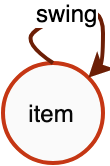

# Graph object

Graph objects are ontologies that organize raw data for manipulation by higher-level operators. graph objects support homogeneous graphs, heterogeneous graphs, and attribute graphs, and the details of the graph are expressed through the relevant APIs. The construction of a Graph object consists of roughly **3 steps**.

- **Declare Graph object**.
- **Describing the topology**
- **Initialize data**


## Declaring Graph objects
Declaring the Graph object is simple, the code is as follows. All subsequent related operations are based on `g`.

```python
import graphlearn as gl
g = gl.Graph()
```

<br />

## Describing topology
Topology describes the relationship between edges and vertices in a graph. Topology here refers to the relationship of a "class" of data, not a "single" piece of data. The topological relationships are all directed, i.e. directed graphs. <br /> <br /> For example, for a graph of a data, the topology of the data is the relationship of the data.
<br />For example, for a "product-item" isomorphic graph, the topology is shown in Figure 1. The graph has only item-to-item data associations, and the edge type is swing, which represents the item associations generated by the swing algorithm, and the source and destination vertices are both of item type.




<br />For a "user-item-item" bipartite graph, the topology is shown in Figure 2. The graph contains two types of edges. The click edge represents the click relationship between user and item, where the source vertex type is user and the destination vertex type is item; the swing edge represents the association relationship between item and item, where both the source and destination vertex types are item.


<br /> Figure 2 User-item-item heterogeneous relationship graph<br /> 

<br />The types of these points and edges will be the basis for performing **heterogeneous graph** operations, which need to be perceived by the user and used as input to the operator. For example, if "sampling the associated products of some users clicked products", then the system will know to sample the related nodes along "**user->click->item->swing->item**" and not other path. <br /> <br /> In practice, the diagram of the
<br />In practice, the number of edges in a graph is much larger than the number of vertices, and in most cases vertices are rich in attribute information, and edges and vertices are often stored separately to save space. We build the topology by adding a vertex data source and an edge data source to the Graph object in the form of a vertex data source. 


### Adding vertices
The Graph object provides the **node()** interface for adding a kind of vertex data source. **node()** returns the Graph object itself, which means that **node()** can be called multiple times in succession. The specific interface form and parameters are as follows.

```python
def node(source, node_type, decoder)
''' Describe the correspondence between vertex types and their data schema.

source: string type, the data source of the vertex, see the chapter "Data source" for details.
node_type: string type, the vertex type.
decoder: decoder object, used to describe the schema of the data source.
'''
```

Table 1 Vertex data sources with attributes

| id | attributes |
| --- | --- |
| 10001 | 0:0.1:0 |
| 10002 | 1:0.2:3 |
| 10003 | 3:0.3:4 |

Table 2 Vertex data source with weights

| id | weight |
| --- | --- |
| 30001 | 0.1 |
| 30002 | 0.2 |
| 30003 | 0.3 |

The data sources as shown in the table above can be added to the Graph object with the following code. When there are multiple types of vertices, please note that the node_type cannot be the same for each call to `node()`.

```python
g.node(source="table_1", node_type="user", decoder=Decoder(attr_types=["int", "float", "int"])) \
 .node(source="table_2", node_type="movie", decoder=Decoder(weighted=True)
```

### Adding edges
The Graph object provides the **edge()** interface for adding an edge data source that supports specifying isomorphic or heterogeneous edges as undirected edges. **edge()** returns the Graph object itself, which means that **edge()** can be called multiple times in succession. By adding the edge data source, the correspondence between the edge type in the graph and its source and destination point types is determined, and then combined with the corresponding vertex type data source, together they form a large graph that ties the connection relationship. The specific interface form and parameters are as follows.

```python
def edge(source, edge_type, decoder, directed=True)
''' Describes the correspondence between the edge type and its source and destination vertex types, and the correspondence between the edge type and the data schema.

source: string type, the data source of the edge, see "Data source" section for details.
edge_type: tuple, the content of the 3-tuple (source type, destination type, edge type).
decoder: decoder object, used to describe the schema of the data source.
directed: boolean, if or not the edge is undirected. The default is True for directed edges. When is an undirected edge, the sampling must pass the GSL interface.
'''
```

Table 3 Edge data sources with weights

| src_id | dst_id | weight |
| --- | --- | --- |
| 10001 | 10002 | 0.1 |
| 10002 | 10001 | 0.2 |
| 10003 | 10002 | 0.3 |
| 0.4 | 10004 | 10003 | 0.4 |

Table 4 Edge sources with attributes

| src_id | dst_id | weight | attributes |
| --- | --- | --- | --- |
| 20001 | 30001 | 0.1 | 0.10,0.11,0.12,0.13,0.14,0.15,0.16,0.17,0.18,0.19 |
| 20001 | 30003 | 0.2 | 0.20,0.21,0.22,0.23,0.24,0.25,0.26,0.27,0.28,0.29 |
| 20003 | 30001 | 0.3 | 0.30,0.31,0.32,0.33,0.34,0.35,0.36,0.37,0.38,0.39 |
| 20004 | 30002 | 0.4 | 0.40,0.41,0.42,0.43,0.44,0.45,0.46,0.47,0.48,0.49 |

The edge data source, as shown in the table above, can be added to the Graph object by the following code. When multiple types of edges exist, please note that the edge_type cannot be the same each time `edge()` is called.

```python
ui_decoder = Decoder(weighted=True)
uv_decoder = Decoder(weighted=True, attr_types=["float"] * 10, attr_delimiter=',')

g.edge(source="table_3", edge_type=("user", "item", "click"), decoder=ui_decoder)
 .edge(source="table_4", edge_type=("user", "movie", "click_v"), decoder=uv_decoder)
```


### Undirected edges
<br />The argument `directed=True` to the `edge()` interface means directed edge, `directed=False` means undirected edge. <br />
<br />The undirected edge actually adds a reverse edge with the same weight to the original directed edge, i.e., if the original edge is (src, dst), then a new one is added (dst, src), and there will be some differences in the data loaded into the graph depending on whether the src and dst are of the same type (homomorphic undirected edge and heteromorphic undirected edge). <br />
<br />Specifically, for example:<br />
<br />Adding edges at composition time, specifying them as undirected edges. <br />
```
g.edge(source, (src_type, dst_type, edge_type), decoder, directed=False)
```
- src_type and dst_type are the same, e.g. edge type is ("item", "item", "i2i"), when i2i is an undirected edge, the edge will add a copy of the dst to src join, while de-weighting. <br />

```
Raw i2i data Load i2i data into the graph
item item -> item item
1 2            1 2
2 1            2 1
1 3            1 3
2 3            3 1
3 3            2 3
1 4            3 2
               3 3
               1 4
               4 1
```

- src_type and dst_type do not match, e.g. edge type is ("user", "item", "u2i"), when u2i is an undirected edge, an extra copy of i2u's reverse edge is actually loaded at load time, in addition to the original u2i edge. <br />

```
Original u2i data Loaded into graph u2i data + Loaded into graph i2u data
user item -> user item  +   item user
1 2           1 2           2 1 
2 1           2 1           1 2
1 3           1 3           3 1
2 3           2 3           3 2
3 3           3 3           3 3
1 4           1 4           4 1
```

<br />The use of isomorphic undirected edges and heterogeneous undirected edges during traversal is detailed in the GSL documentation.
<br />When sampling, you need to choose a reasonable edge direction based on your specified meta-path, and use outV (from src to dst) and inV (from dst to src) wisely. outV and inV interfaces are detailed in the GSL documentation.


### partition
In a distributed scenario, i.e. when there are multiple GraphLearn Servers, the graph will be automatically partitioned to store the graph in a distributed manner. The default partition is to distribute the nodes and edges according to the number of src_id % server.


## Initialization

After the vertices and edges are added, the initialization interface needs to be called to complete the construction from raw data to the in-memory index. The initialization process determines how the graph data is Served, single-computer or distributed. Once initialization is complete, the Graph object is ready for manipulation. <br />

### Local Mode
Local Mode/Standalone Mode is simple and indicates that the Graph object holds all graph data. <br />

```python
g.init()
```

### Distributed mode

<br />Distribution is divided into Server Mode and Woker Mode. `Graph.init()` parameters are configured differently for different distribution modes. <br />

#### Worker Mode

In this mode, the data is distributed on each Worker, and the Workers are interconnected with each other, and each Worker corresponds to the entry of a Graph object. When performing operations such as graph sampling or querying, the Graph object submits the request to the local Worker, and the Worker decides how to distribute it. There is no network communication between the Graph object and the local Worker.
<br />
Worker Mode requires the following API, i.e. pass in the index of the current worker, and the total number of workers. <br />

``` python
g.init(task_index, task_count)
```
<br />
Worker Mode is suitable for cases where the graph size is not very large. In combination with distributed training, such as TensorFlow, the individual graph tiles are located in the same process as the Worker nodes of the TF. Since the scale of the distribution is not very large (the number of Workers is not very large), the two-by-two interconnection between Workers does not cause a burden on the network. In addition, for scenarios where models are trained in parallel, atypical worker-ps mode, Worker Mode deployment is also required. <br />

Combined with TensorFlow, the rough code is as follows. <br />

- Use communication synchronization mode<br />

```python
gl.set_tracker_mode(0)
if FLAGS.job_name == "worker":
  worker_hosts = FLAGS.worker_hosts.splt(',')
  # Replace port with another unoccupied port
  worker_hosts = [str(host.split(':')[0]) + ':8888' + str(i) for i, host in enumerate(worker_hosts)]
  g.init(task_index=FLAGS.task_index, hosts=worker_hosts)
  # Your model, use g to do some operation, such as sampling
  g.close()
else:
  # ps.join()
```

- Synchronize with shared files, such as shared file address mount as "/mnt/tracker"<br />

```python
if FLAGS.job_name == "worker":
  g.init(task_index=FLAGS.task_index, task_count=len(FLAGS.worker_hosts.split(',')), tracker="/mnt/tracker")
  # Your model, use g to do some operation, such as sampling
  g.close()
else:
  # ps.join()
```

#### Server Mode
In this mode, the data is distributed on each Server, and the Servers are interconnected two by two. In this mode, the entry point of Graph object is located at the Client side. Each Client is connected to a unique Server, which acts as a response Server for the Client. the correspondence between the Client and Server is determined by the load balancing algorithm. the Client acts as the entry point and submits a request to its response Server, which decides how to distribute the processing. <br /> <br /> The Server Mode is suitable for distributed scales of very large size.

Server Mode is suitable for cases where the scale of the distribution is very large (more than a hundred Workers), when using Worker Mode deployment will greatly increase the network interconnection overhead because of the large size of the Workers. In addition, the size of the graph data and the size of the Worker do not necessarily match, for example, when 1000 Workers are trained concurrently, it is not necessary to have so many Workers to host Graph data, the data is too spread out will seriously reduce performance. In general, the number of trained Workers >= the number of Graph Servers. <br

Note: Currently Server Mode requires that the number of servers must be less than or equal to the number of clients. <br /> The Server Mode deployment code is as follows.

Server Mode deployment code is as follows. <br />

```python
g.init(cluster={}, job_name="", task_index=0)
"""
cluster(dict): key package function "server", "server_count", "client_count", "tracker".
  "server": string, to be filled in during communication synchronization, indicating the ip:port of all GraphLearn servers
  "server_count": int, filled in during file synchronization, indicates the number of GraphLearn servers
  "client_count": int, filled in when synchronizing files, indicates the number of GraphLearn clients
  "tracker": string, filled in when synchronizing files, indicates the address of the shared file where synchronization information is recorded
job_name(string): role type, takes the value of "client" or "server"
task_index(int): the number of the current role
"""
```
Combine with TensorFlow, Client on the worker side and Server on the ps side, or place Server separately in another role of TensorFlow. Rough code is as follows. <br
- By communication synchronization, GraphLearn Server is put here to run on TF ps, and also on other machines. <br />

```python
gl.set_tracker_mode(0)
server_hosts = FLAGS.ps_hosts.splt(',')
server_hosts = [str(host.split(':')[0]) + ':8888' + str(i) for i, host in enumerate(server_hosts)]
cluster = {"server": server_hosts, "client_count": len(FLAGS.worker_hosts.split(','))}
if FLAGS.job_name == "worker":
  g.init(cluster=cluster, job_name="client", task_index=FLAGS.task_index)
  # Your model, use g to do some operation, such as sampling
  g.close()
else:
  g.init(cluster=cluster, job_name="server", task_index=FLAGS.task_index)
  # ps.join()
  g.wait_for_close()
```

- By file synchronization, GraphLearn Server is put here to run on TF ps, and also on other machines. Here the shared file directory is "mnt/tracker" as the path of mount for example. <br

```python
cluster = {"server_count": len(FLAGS.server_hosts.split(',')),
           "client_count": len(FLAGS.worker_hosts.split(',')),
           "tracker": "/mnt/tracker"}
if FLAGS.job_name == "worker":
  g.init(cluster=cluster, job_name="client", task_index=FLAGS.task_index)
  # Your model, use g to do some operation, such as sampling
  g.close()
else:
  g.init(cluster=cluster, job_name="server", task_index=FLAGS.task_index)
  # ps.join()
  g.wait_for_close()
```
### Synchronous mode
GraphLearn's distributed task startup needs to make each role in the task aware of all GraphLearn Server hosts, and two types of synchronization are supported: file system-based and communication-based synchronization. <br />
- File system-based synchronization<br />

File system-based synchronization means that all machines executing GraphLearn tasks can access the same file address and do hosts synchronization by reading and writing file contents. <br />
This file address is shared, and is typically supported through NFS or other storage directory mounts, etc. <br />
File system synchronization is the default synchronization mode and requires specifying the tracker directory. <br />

Here is an example of Server Mode, via file sync, where GraphLearn Server is placed on TF ps to run, or on other machines. The shared file directory is the path "mnt/tracker" of mount as an example. 

```python
cluster = {"server_count": len(FLAGS.server_hosts.split(',')),
           "client_count": len(FLAGS.worker_hosts.split(',')),
           "tracker": "/mnt/tracker"}
if FLAGS.job_name == "worker":
  g.init(cluster=cluster, job_name="client", task_index=FLAGS.task_index)
  # Your model, use g to do some operation, such as sampling
  g.close()
else:
  g.init(cluster=cluster, job_name="server", task_index=FLAGS.task_index)
  # ps.join()
  g.wait_for_close()
```

<br />Other examples are detailed in the corresponding examples in distributed mode. <br />

- Communication-based synchronization<br />

Communication-based synchronization means specifying the hosts (ip:port) of all GraphLearn Servers in advance. Note that the ip can be the same as the TF PS's ip so that GraphLearn Server will run on the machine where the TF ps is located; however, when following the TF ps's ip, it must not be the same as the ps's port, otherwise it will lead to port conflicts. <br

Based on the communication synchronization, you need to set tracker_mode:<br />

```python
gl.set_tracker_mode(0)
```

Here is an example of synchronization by communication in Server Mode. <br />

```python
gl.set_tracker_mode(0)
server_hosts = FLAGS.ps_hosts.splt(',')
server_hosts = [str(host.split(':')[0]) + ':8888' + str(i) for i, host in enumerate(server_hosts)]
cluster = {"server": server_hosts, "client_count": len(FLAGS.worker_hosts.split(','))}
if FLAGS.job_name == "worker":
  g.init(cluster=cluster, job_name="client", task_index=FLAGS.task_index)
  # Your model, use g to do some operation, such as sampling
  g.close()
else:
  g.init(cluster=cluster, job_name="server", task_index=FLAGS.task_index)
  # ps.join()
  g.wait_for_close()
```

Other examples are detailed in the corresponding examples in distributed mode. <br /> <br />

<br /> **Please note that the call to g.close() needs to be shown when you are done using it, regardless of whether it is standalone or distributed.**<br />
