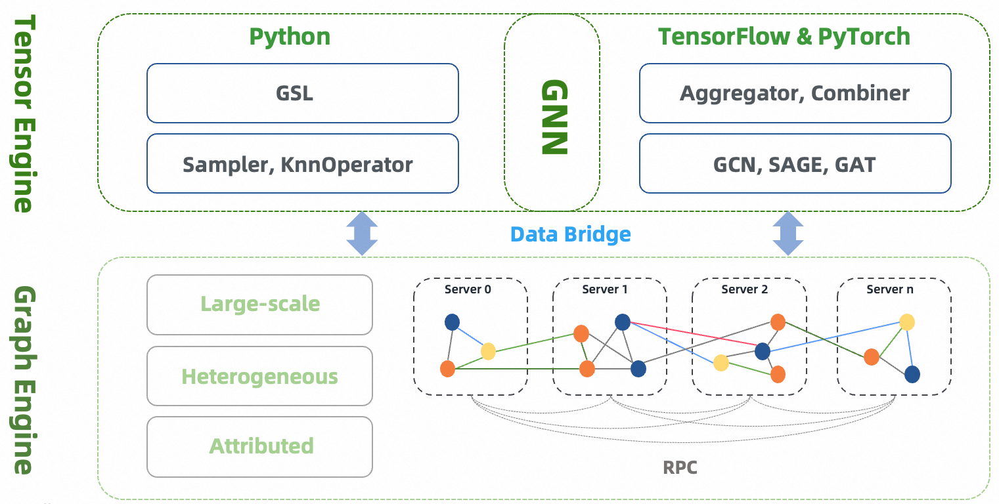

# Introduction

GraphLearn-Training  is a distributed framework designed for the development and application of large-scale graph neural networks.
It has been successfully applied to many scenarios within Alibaba, such as search recommendation, network security, and knowledge graph.
It supports sampling on batch graphs, training offline or incremental GNN models.
It provides both Python and C++ interfaces for graph sampling operations and provides a gremlin-like GSL (Graph Sampling Language) interface. For GNN models, Graph-Learn provides a set of paradigms and processes for model development. It is compatible with both TensorFlow and PyTorch, and provides data layer, model layer interfaces and rich model examples.

## Architecture

