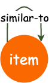
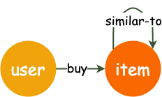

# Graph Object Introduction
`Graph` is a unit that organizes the raw data to enable the process of high-level operations. 

Only one unique `Graph` object can exist in a **GL** job. 

It is able to support all kinds of graphs, including homogeneous graphs, heterogeneous graphs with different types of nodes or edges, and graphs with properties attached on nodes or edges.

We ofter rich APIs to extract information about the graph.

Usually three steps are essential to create a graph object:

• Declare a `Graph` object

• Describe its topology

• Initialize data

# Declare the Graph object
The declaration of a Graph object is simple, as listed below. All subsequent operations are performed based on `g`.
```python
import graphlearn as gl
g = gl.Graph()
```

# Describe the topology
Graph topology describes the relationship between edges and nodes in the graph. The topology here refers to the relationship of meta information of the graph, not data records.

For example, for a homogeneous graph that represents "item-item" relationship, its topology is shown in Figure 1.
There is only one single edge type defined in this graph, named as "similar-to". It indicates the association between two nodes that are both with the type of "item", showing their similarity.
The source node and destination node types are both "item".  

<p align=center>

<p align=center>Figure 1: An example of "item-item" graph</p>
</p>


Figure 2 illustrates a "user-item-item" bipartite graph.
The figure contains two types of edges. The "buy" edge represents the "buy" connection between "user" and "item", whose source node type is "user" and the destination node type is "item'.
The "similar-to" edge represents the association relationship between "item" and "item". The types of both source nodes and destination nodes are "item".

<p align=center>

<p align=center>Figure 2: An example of "user-item-item" bipartite graph</p>
</p>

The types and connections of those nodes and edges are the basic primitives of the heterogeneous graph, which need to be perceived by users and is treated as the inputs of operators in **GL**. 

**GL** users can express their business semantics based on the defined graph topology, such as sampling some items that similar to the ones that some users brought. Therefore, **GL** will perform sampling actions on the path of "user--buy-->item--similar_to-->item".

In practice, the number of edges in the graph is much larger than the nodes. Moreover, nodes usually are embedded with rich attribute information. To save memory, we separate the storage of edges and nodes in graph object.

### Add node data source
`Graph` provides `node()` API for adding node data sources. 

`node()` function returns the `Graph` object itself, which allows user to call `node()` multiple times to add multiple node data sources. 

The `node` API is as follows:  
```python
def node(source, node_type, decoder):
'''
Add one node data source to the Graph.

source:    string, the path of the node data source.
node_type: string, node type of all the nodes in the node data source.
decoder:   `Decoder`, to describe the schema of nodes, all the nodes
           in the same data source must have same schema.
'''
```
For example, we add two node sources of "user" and "item", with different data schema to the heterogeneous graph:
```python
import graphlearn as gl
g = g.node(source="user_path", node_type="user", decoder=gl.Decoder(attr_types=["string"])) \
     .node(source="item_path", node_type="item", decoder=gl.Decoder(attr_types=["int", "float"]))
```

### Add edge data source
`Graph` provides `edge()` API for adding edge data sources. 

`edge()` returns a Graph object itself, which means that you can call `edge()` multiple times to add multiple edge data sources.


By adding the edge data sources, the edge types, as well as the relationship between source and destination nodes, are well annotated. A large graph is created with both edge data sources and node data sources.

The API is as follows: 
```python
def edge(source, edge_type, decoder):
'''
Add one edge data source to the Graph.

source:    string, the path of the node data source.
edge_type: tuple, (src_node_type, dst_node_type, edge_type), describe the source node type,
           destination data type and edge type of the data source.
decoder:   `Decoder`, to describe the schema of edges, all the edges
           in the same data source must have same schema. Default is `Decoder()`, which means
           the edge data source schema is (src_ids, dst_ids)
'''
```
For example:
```python
import graphlearn as gl
buy_decoder = gl.Decoder(weighted=True)
click_decoder = gl.Decoder(weighted=True)
similar_to_decoder = gl.Decoder(attr_types=["int", "string"])

g.edge(source="buy_path", edge_type=("user", "item", "buy"), decoder=buy_decoder) \
 .edge(source="click_path", edge_type=("user", "item", "click"), decoder=click_decoder) \
 .edge(source="similar_to_path", edge_type=("item", "item", "similar-to"), decoder=similar_to_decoder)
```

# Initialize data
After adding the node data sources and edge data sources to Graph, we finish the description of topology and data source format of our graph. 

Calling the `init()` interface can finalize the declared `Graph` object as `g`. 

The operations, such as query and sampling, can be applied on `g` once it is initialized.

The graph initialization interface is as follows:
```python
def init(cluster="", job_name="", task_index=0, **kwargs)
'''
Initialize the graph with given cluster env info.

cluster: dict or string, empty when Graph runs with stand-alone mode. 
         Otherwise, cluster includes server_count, client_count and tracker.
         server_count: int, count of servers.
         client_count: int, count of clients.
         tracker: string, tracker path.
job_name: string, "client" or "server", default empty means Graph runs with stand alone mode.
task_index: int, index of current server of client.
**kwargs: remained args. For stand-alone mode, cluster is empty, you can specify 
          tracker path as kwargs if you need.
'''
```

**GL** supports both single-box deployment and distributed deployment. 

The entire graph is loaded into the memory of a standalone machine on single-box mode, 
and operations on the graph are executed one by one. 

In distributed mode, there are multiple machines participate in the processing of the graph. 

The graph is partitioned into `servers`. `Clients` are responsible to process operators. 

Please refer to [Distribution](distribution.md) for details.

[Home](../README.md)
