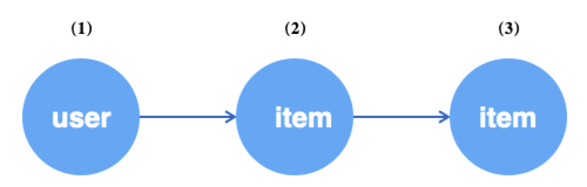

# Graph Sampling Language (GSL)

## Introduction
GNNs have been developed to date with a relatively mature programming paradigm. We divide the development of a GNN model into two phases: the data processing part of the graph model and the neural network part.
For the neural network part, we can rely on mature DL frameworks such as TensorFlow and PyTorch.
How to describe and implement graph data access patterns suitable for GNNs in a simple and efficient way, and how to interface with mainstream deep learning frameworks, is what GL focuses on. <br />
<br />In practice graphs are sampled as a necessary stage due to their scale. To summarize, graph sampling broadly consists of several categories.

- Traversal type (Traverse), which obtains point or edge data of a batch from the graph.
- Relational (Neighborhood, Subgraph), which obtains the N-hop neighborhood of points or generates a subgraph composed of points for constructing training samples.
- Negative sampling (Negative), as opposed to relational, which is generally used in unsupervised training scenarios to generate negative example samples.


<br />We abstract operations such as the above into a set of interfaces, called **GSL**.
For example, for the heterogeneous graph scenario of "users clicking on products", "randomly sample 64 users and sample 10 related products for each user by the weight of the edges".
This can be written as <br />`g.V("user").batch(64).outV("click").sample(10).by("edge_weight")`<br />
<br />**GSL** covers support for oversized graphs, heterogeneous graphs, and attribute graphs considering the characteristics of the actual graph data, and the syntax is designed close to the [Gremlin](http://tinkerpop.apache.org) form for easy understanding. <br />
## GSL syntax
We refer to a statement described by **GSL** as a **Query**. A **Query** usually consists of three types of operations, **SOURCE**, **STEP** and **SINK**.
Among them, **SOURCE** is the entry point of the query statement, which indicates from which data; **STEP** is the path that is wandered and sampled during the query, and **SINK** is the encapsulation of the execution result.
In GSL, a Query must contain **a SOURCE** and **a SINK** operation. <br


## SOURCE


### `V/E`
SOURCE is the entry point for query statements and supports the `V()` and `E()` interfaces, which represent queries from vertices and from edges, respectively. The details are as follows.

```python
def V(t, node_from=gl.NODE)
"""
Args:
    t(string): vertex type or edge type, subsequent operations will be performed on vertices of that type;
    node_from: gl.NODE | gl.EDGE_SRC | gl.EDGE_DST, respectively, for traversing the specified vertex type, traversing the source vertex for the specified edge type, and traversing the destination vertex for the specified edge type.
"""

def E(edge_type, reverse=False)
"""
Args:
    edge_type(string): edge type, subsequent operations will be performed for edges of this type;
    reverse(boolean): whether to traverse the reverse edge, default is False, and traverse the original edge.
"""
```

- **Undirected edge traversal**

Add edges at composition time, specify as undirected edges. <br />

``` python
g.edge(source, (src_type, dst_type, edge_type), decoder, directed=False)
```

There are several cases when traversing:<br />
(1) src_type and dst_type are the same, e.g. edge type is ("item", "item", "i2i"), when i2i is an undirected edge, the edge will add a copy of the dst-to-src connection while de-weighting. <br />
```
Raw i2i data Load i2i data into the graph   
item item     ->   item item
1 2                   1 2
2 1                   2 1
1 3                   1 3
2 3                   3 1
3 3                   2 3
1 4                   3 2
                      3 3
                      1 4
                      4 1
```
`g.E("i2i")`: Iterate over double and unique's i2i data as in "load to graph i2i data" above. <br />
`g.E("i2i", reverse=Ture)`: not supported, because at this point i2i is an undirected edge and does not distinguish between forward and reverse. <br />

(2) src_type and dst_type are not consistent, e.g. edge type is ("user", "item", "u2i"), when u2i is an undirected edge, an extra copy of i2u's reverse edge is actually loaded at load time, in addition to the original u2i edge. <br />
```
Original u2i data Loaded into graph u2i data + Loaded into graph i2u data
user item -> user item   +   item user
1 2           1 2             2 1 
2 1           2 1             1 2
1 3           1 3             3 1
2 3           2 3             3 2
3 3           3 3             3 3
1 4           1 4             4 1
```
`g.E("u2i")`: Iterate over the "u2i data loaded into the graph", i.e. the original data. <br
`g.E("u2i", reverse=Ture)`: Iterate over the "i2u data loaded into the graph", i.e. the reverse data. <br

### `batch`
When fetching data from a graph, `batch()` is used to specify how much V() or E() is fetched at a time. If you want to do `shuffle()` on the data at the same time, note that it comes after `batch()`. When ``shuffle(traverse=True)`, if the remaining data is less than batch_size but not 0, the actual data will be returned, which will not trigger OutOfRangeError. only if the remaining data is 0 will ``OutOfRangeError`` be triggered.

```python
def batch(batch_size):
"""
Args:
	batch_size(int): how much of the source data to fetch at a time.
"""
```

### `shuffle`
You can pick up `shuffle` after `batch`. `shuffle()` is an optional interface that indicates whether to do a random fetch of vertices/edges when fetching data from the graph.

```python
def shuffle(traverse=False):
"""
Args:
  traverse(boolean): if or not to shuffle the data source, default False.
      True means traverse in order, and OutOfRangeError will be triggered when traversing to the end, False will not OutOfRangeError.
"""
```

### Example

(1) Sequential traversal of user vertices in the graph, batch size 64, OutOfRange when traversing the full graph user vertices.<br />

```python
query = g.V("user").batch(64).alias('seed').values()
ds = gl.Dataset(query)
while True:
  try:
    ds.next()
  except gl.OutOfRangeError:
    break
```

(2) Randomly traverse 64 vertices of type user with putbacks. Never OutOfRange.<br />

```python
query = g.V("user").batch(64).shuffle().alias('seed').value()
ds = gl.Dataset(query)
for i in range(100):
  ds.next()
```

(3) Randomly traverse 64 vertices of type user without putback, and OutOfRange when traversing the full graph of user vertices.<br />

```python
query = g.V("user").batch(64).shuffle(traverse=True).alias('seed').values()
ds = gl.Dataset(query)
while True:
  try:
    ds.next()
  except gl.OutOfRangeError:
    break
```

Traversing edges by `E` is similar.

## STEP graph sampling/negative sampling

STEP is used to describe the path of the query wander and how it is sampled. A query statement can contain from 0 to more than one STEP. currently, STEP contains the following two types of interfaces: a description of the path wandering and a description of how to sample. A complete STEP contains **walking** + **sampling** (graph sampling or negative sampling). <br />

Interface describing path wandering, indicating the transfer of the current operation object. For example, `g.V()` indicates that the current operation object is a vertex, and the current operation object can be transferred to the outgoing edge of the vertex by `outE()`, and the subsequent operations indicate that they are performed against the edge. When the operation of the edge is finished, the focus can be shifted to the destination vertex or source vertex corresponding to the edge again by `inV()` / `outV()`. <br />

(1) Traversal interface:<br />

```python
def inV():
""" the committed edge (which can only follow the edge operation), indicating the one of the two vertices with the arrow pointing to it, the destination vertex
"""

def outV():   
""" the successor edge (which can only be followed by the edge operation), representing the one from which the arrow originates, i.e. the source vertex
"""

def inE(edge_type):
""" the committed vertex (can only be followed by the vertex operation), representing the incoming edge of the vertex
Args:
	edge_type(string): the type of the edge, when the edge is directed, inE is called with an error
"""

def outE(edge_type):
""" takes on the vertex (can only follow the vertex operation) and represents the outgoing edge of the vertex
Args:
	edge_type(string): the type of the edge
"""

def inV(edge_type):
""" the vertex to take on (can only be followed by a vertex operation), indicating the upstream vertex of the vertex along the edge
Args:
	edge_type(string): the type of the edge, when the edge is directed, call inV with an error
"""

def outV(edge_type):
""" the vertex to take on (can only be followed by the vertex operation), indicating that the vertex is downstream of the vertex along the edge
Args:
	edge_type(string): the type of the edge
"""

def outNeg(edge_type):
""" the committed vertex (which can only follow the vertex operation), indicating that the vertex is negatively sampled downstream of the vertex at that edge type
Args:
	edge_type(string): the type of the edge
"""
    
def inNeg(edge_type):
""" the committed vertex (can only be followed by a vertex operation), which means negatively sampling upstream vertices under this edge type
Args:
	edge_type(string): the type of the edge, when the edge is directed, call inNeg with an error
"""
```

(2) Sampling interface:

The interface describing the sampling method, based on the description of the preorder path and the current operation object is a vertex, how to sample the vertices of that type as the neighbors of the preorder vertices, including how much to sample and the sampling strategy. <br />

```python
def sample(N):
""" take on the vertex (can only follow the vertex operation), indicating how much of the current vertex to sample as a neighbor of the preceding vertex
Args:
	N(int): the number of samples
"""

def by(strategy):
""" immediately after sample(), indicating the sampling strategy
Args:
	strategy(string): sampling strategy
    	If the preorder path is sampled, the supported strategies include: 
          "edge_weight", "in_degree", "topk", "random", "full";
    	If the preorder path is negatively sampled, the supported policies include: 
          "in_degree", "random", "node_weight"
"""
```


### Graph Traversal
`outV(edge_type)`/`outE(edge_type)`: advances from the source vertex of an edge to the destination vertex, i.e. the source vertex wanders along its outgoing edge.
`inV(edge_type)`/`inE(edge_type`): starting from the destination vertex of the edge to the source vertex and going backward, i.e., the destination vertex wanders along its incoming edge. Where the edge corresponding to `edge_type` must be an undirected edge (at composition time, `directed=false` must be specified, i.e., it can wander backwards, refer to Figure Object).

For example, for the heterogeneous graph shown below, starting from the user vertex, sample the one-hop neighbors of user along the u2i edge, and then sample the two-hop neighbors of user along the i2i edge.



```python
g.V("user").batch(64).alias('src') # (1) get 64 user vertices
 .outV("u2i").sample(10).by("edge_weight").alias('hop1') # (2) Sample 10 neighboring items for each user above
 .outV("i2i").sample(15).by("random").alias('hop2') # (3) sample 15 neighboring items for each of the above item

```

<br />If you use edges as the data source, you can then fetch the edges and then operate on their endpoints separately. In general, acquiring edges is often used for unsupervised learning, where the edges are seen as positive samples and then the source vertices of the edges are sampled for negative neighbors as negative samples.


```python
g.E("u2i").batch(64).alias('edge') # (1) get 64 random edges of u2i
 .ouV().alias('src') # (2) jump to the source vertex of the edge, i.e. user
 .outNeg("u2i").sample(10).by("random").alias('neg') # (3) sample 10 unrelated items for each of the above users

```

<br />When the edges are undirected, you can achieve circular sampling by `outV(edge_type)` and `inV(edge_type)`, where the source and destination points are neighbors of each other.


```python
g.V("user").batch(64).alias('src') # (1) get 64 random user vertices
 .outV("u2i").sample(10).by("random").alias('hop1') # (2) sample 10 neighboring items for each of the above users
 .inV("u2i").sample(5).by("random").alias('hop2') # (3) sample 10 neighboring users for each of the above items

```

### Graph sampling

The Query interface for graph sampling is combined as follows.

```python
# Sample neighboring vertices along the outgoing edges
outV(edge_type).sample(N).by(strategy)

# Sample neighbor vertices along incoming edges
inV(edge_type).sample(N).by(strategy)

# Sample neighboring edges along outgoing edges
outE(edge_type).sample(N).by(strategy)

# Sample neighboring edges along the outgoing edge
inE(edge_type).sample(N).by(strategy)
```


GL currently supports the following sampling strategies, corresponding to the `strategy` parameter of the **.by** interface. <br


| **strategy** | **description** |
| --- | --- |
| edge_weight | Sampling with probability with edge weights |
| random | random_with_replacement |
| topk | Return the neighbors with edge weight topK, if there are not enough neighbors, refer to the padding rule.
| in_degree | Probability sampling by vertex degree.
| full | If the number of neighbors is less than N, return all neighbors, if greater than N, truncate by N. |


Fill rule: when the data required for sampling is insufficient, the result should be filled in some way. By default, `default_neighbor_id` is used to fill the insufficient `id`, `default_neighbor_id` is 0 by default, and can be set by `gl.set_default_neighbor_id(xx)`. To loop padding, i.e. to loop existing neighbor ids instead of `default_neighbor_id`, set the padding mode `gl.CIRCULAR`, `gl.set_padding_mode(gl.CIRCULAR)`.


**Example:**
The following example represents traversing the "**user**" vertices in the graph with a batch size of 64, and sampling probability according to the weight of the "**purchase**" edge for each "**user** " samples 10 "**users**" "**purchases**" of "**merchandise**" for each "**user**". <br />

```python
g.V("user").batch(64).alias("u") \
 .outV('buy').sample(10).by("edge_weight").alias("1hop")
```


### Negative sampling

The Query interface for negative sampling is combined as follows:<br

```python
### Sample negative neighbor vertices along out edges (.where means add conditional negative sampling)
outNeg(edge_type).sample(expand_factor).by(strategy)[.where(target, condition={})]

# Sampling negative neighbor vertices along incoming edges (.where means negative sampling with condition)
inNeg(edge_type).sample(expand_factor).by(strategy)[.where(target, condition={})]

# Vertex table negative sampling
Neg(node_type).sample(expand_factor).by("node_weight")
```
The parameter expand_factor of the ``sample`` interface, indicates that fewer negative samples are made for each vertex sampled.


GL currently has support for the following negative sampling strategies, corresponding to the `strategy` parameter of the **.by** interface. <br

| strategy | description |
| --- | --- |
| random | random negative sampling, not guaranteed true-negative |
| in_degree | Negative sampling with probability of vertex entry distribution, guaranteed true-negative |
| node_weight | Negative sampling at the vertex table by vertex weight, only for Neg(node_type) |

<br />

Use of the `where` argument: <br />

```python
def where(target, condition={}):
  """ Add condition for negative samlpler. used after `by`.

    Args:
      target (string): Alias of upstream which is the postive sample
        Alias of upstream which is the postive sample that condition should match.
      condition (dict, optional): Keys are as following.
        "batch_share" (bool, optional): Whether sampled negative samples are
          Defaults to False.
        "unique" (bool, optional): Whether sampled negtive samples are unique.
          Defaults to False.
        "int_cols" (int list, optional): int columns as condition.
          Defaults to []. Indicates negative sampling under these specified properties.
          For example, if target has 3 int attributes, int_cols=[0,1] means that the first int attribute and target's 1st
          int attribute, and the 2nd int attribute with the same node as the 2nd attribute of target are selected for negative sampling.
        "int_props" (float list, optional) : proportions of int columns.
          Defaults to []. Indicates the proportion of each property sampled in int_cols.
          For example, if int_cols=[0,1],int_props=[0.1,0.2], it means that the first int property of target is sampled at the same point as the first int property of target
          The first point with the same int attribute as target is sampled at the first point with the same int attribute as target, and the second point with the same int attribute as dst_ids is sampled at
        The second int attribute of dst_ids is sampled at the same point as the first int attribute of target, and the second int attribute of dst_ids is sampled at the same point as the second int attribute.
        "float_cols" (int list, optional): float columns as condition.
          Defaults to [].
        "float_props" (float list, optional): proportions of float columns.
          Defaults to [].
        "str_cols" (int list, optional): string columns as condition.
          Defaults to [].
        "str_props" (float list, optional): proportions of string columns.
          Defaults to [].
    """
```
**Note:**

- Attributes described as ("string", Size) in attr_types in Decoder are seen as int attributes in condition.
- Each of int_props, float_props, str_props must be a float type, i.e., for example, [1] needs to be written as [1.0]

**Example:**

- The following example represents traversing the "**user**" vertices in the graph with a batch size of 64 and sampling 10 random "**user**" "**unpurchased**" "**products**" for each "**user**".

```python
g.V("user").batch(64).alias("u") \
 .outNeg('buy').sample(10).by("random").alias("1hop") \
 .values()
```

- The following example represents traversing the "**purchased**" edge of the graph with a batch size of 64 and conditionally sampling 10 "**users**" for each "**user**" on the edge " "**not purchased**" for "**goods**", where "**goods**" need to satisfy the condition that and "**User**" with the same 1st int attribute of "**Merchandise**" sampled 10*0.25, and "**User**" with the same 2nd int attribute of "**Merchandise** sampled 10*0.25 for "**product**" with the same int attribute and 10*0.25 for "**user**" with the same 1st str attribute. 0.5 pcs.

```python
g.E("buy").batch(64).alias("e").each(
  lambda e: (
             e.inV().alias('dst'),
             e.outV().alias('src') \
              .outNeg("buy").sample(10).by('random').where(
                   "dst",
                   condition={
                     "int_cols": [0,1], "int_props": [0.25,0.25],
                     "str_cols": [0], "str_props": [0.5]}).alias('neg'))) \
              .values()
```

## Multiplex downstream
### each
A typical GNN algorithm for graph data is often multi-way. The ``each()` interface is used to express multiple branches of the Query, and when proceeding to a certain stage, different operations are performed separately for the preorder results (there may be more than one).

```python
def each(func):
""" 
Args:
	func(lambda): Constructs a lambda expression for the subquery, with the input of the expression being the output of the immediately preceding operation.
Return:
	Query object
"""
```


For example, in the bipartite graph (user-item-item) GraphSAGE algorithm, in order to learn the similarity of user and item in the same space, we first obtain u2i edges of the graph randomly as positive samples for training, and then sample the negative neighbors (item vertices) of the source points of the edges (i.e., user vertices) to generate negative samples. user is encoded by first-order neighbors (aggregating neighborhood information to the central node). The user is encoded (aggregating neighborhood information to the central node), i.e., its first-hop neighbors need to be sampled. item also needs first-order neighbors to be encoded. The access pattern of graph data is shown below.


```python
query = g.E("u2i").batch(512).shuffle().alis('edge') # (1) get 512 random edges of u2i
 .each(lambda edge: # upstream output is the edge
    (edge.outV().alias('src').each(
      lambda src:
        (src.outV("u2i").sample(10).by("edge_weight").alias('src_1hop'), # (2) sampling 10 neighbors for the source vertex user of the edge
         src.outNeg("u2i").sample(5).by("in_degree").alias('src_neg') \ # (4) negatively sample 5 neighbors for the source vertex user of the edge
            .outV("i2i").sample(10).by("random").alias('src_neg_1hop')), # (5) sample 10 neighbors for each of the above negatively sampled items
      edge.inV().alias('dst').outV("i2i").sample(10).by("random").alias('dst_1hop') # (3) sample 10 neighbors for the destination vertex item of the edge
    ).values()

```

### Values
The each interface uses a lambda function to perform multiple downstream operations on the upstream. You can also assign upstream to a variable and use that variable to pick up multiplex downstream.


**Note: **Any **STEP** that travels from the same **SOURCE** followed by **.values()** indicates that the Query description is complete. Any STEPs traveling from the same SOURCE can only be followed by vlaues() once.
In line 19 of the example below, edge.values() and src.values() / dst.values() are equivalent.
```powershell
# Sampling edges
edge = g.E("u2i").batch(512).shuffle().alias(...)

# Get the source vertices of the edge
src = edge.outV().alias('src')
# Get the destination vertex of the edge
dst = edge.inV().alias('dst')

# Sample neighbors to the source vertex
src.outV("u2i").sample(10).by("edge_weight").alias('src_1hop')

# Negatively sample the source vertices
src.outNeg("u2i").sample(5).by("in_degree").alias('src_neg')
   .outV("i2i").sample(10).by("random").alias('src_neg_1hop'))

# Sample neighbors to the destination vertex
dst.outV("i2i").sample(10).by("random").alias('dst_1hop')

query = edge.values()
```


## Alias
### alias
Each SOURCE or STEP needs to be named by **alias** for easy subsequent access to the output results.

```python
def alias(name):
""" 
Args:
	name(string): give an alias to the operation.
Return:
	Query object
"""
```


## SINK
### values
After a Query describes Source, Step, it needs to end with .values() to indicate that the Query description is complete. any node in the Query .values() indicates the end of the Query. For example.

```python
query1 = g.E("u2i").batch(512).shuffle().alias("edges")
         .values()

src = g.V("user").batch(64).alias("src")
dst = src.outV("u2i").sample(5).by("random").alias('dst')
query2 = src.values() # equivalent to query2 = dst.values()
```


## GSL execution results
The Query expressed by GSL starts by traversing the vertices or edges in the graph, so it can be executed cyclically.
The result of GSL execution is an object consisting of all wandering vertices or edges described in the Query, which contain their own **id** and **properties, labels, and permission re**.


### datasets
**graphlearn.Dataset** interface for constructing the result of a Query as a Numpy composed **graphlearn.Nodes**/**graphlearn.Edges** or **graphlearn. Edges** object generator. see the documentation [data_object](data_object_cn.md) for a description of objects such as Nodes.

```python
class Dataset:
    def __init__(self, qeury, window=10):
    """
    query: GSL query, starting with g.V()/g.E() and ending with .values().
    window. The data set will be prefetched asynchronously, window is the size of the prefetched data.
    """
    
    def next(self):
    """
    Returns a dict, where key is each alias in the GSL query corresponding to the Dataset, and value is the data of the Nodes or Edges corresponding to the alias.
    value is the data of the Nodes or Edges corresponding to the alias.
    *V() corresponds to Nodes and *E() corresponds to Edges.
    Specially, the output corresponding to full sampling is SparseNodes or SparseEdges.
    """
```


is used in the following way.

```python
import graphlearn as gl
query = g.V("user").batch(64).alias('u')
         .outV('buy').sample(10).by('random').alias('i')
         .outE('i2i').sample(5).by('random').alias('i-i')
         .value()

ds = gl.Dataset(query)
while True:
  Try.
    res = ds.next()
  except gl.OutOfRangeError:
    Rest
```


The output of `Dataset.next()` in the above example is as follows.

```python
res = ds.next()
# { "u": Nodes, 'i': nodes, 'i-i': edges}

res["u"].ids
# Int64 np array, shape. [64]([batch_size])
res["u"].int_attrs
# Int64 np array, shape: [64, 2]([batch_size, int_attr_num]) or None
res["u"].float_attrs
# Float np arrays, shapes. [64, 3]([batch_size, float_attr_num]) or None
res["u"].string_attrs
# String np array, shape. [64, 1]([batch_size, string_attr_num]) or None
res["u"].weights
# Float np array, shape: [64]([batch_size]) or None
res["i"].labs
# Int32 np array, shape: [64]([batch_size]) or None

res["u"].ids
# Int64 np array, shape: [64, 10]([batch_size, nb_count])
res["u"].int_attrs
# Int64 np array, shape: [64, 10, 2]([batch_size, nb_count, int_attr_num]) or None
res["u"].float_attrs
# Float np arrays, shapes. [64, 10, 5]([batch_size, nb_count, float_attr_num]) or None
res["u"].string_attrs
# String np arrays, shapes. [64, 10, 3]([batch_size, nb_count, string_attr_num]) or None
res["u"].weights
# Float np array, shape: [64, 10]([batch_size, nb_count])
res["i"].labs
# Int32 np array, shape: [64, 10]([batch_size, nb_count])

res["i-i"].src_ids
# Int64 np array, shape: [64 * 10, 5]([batch_size, nbr_count])
res["i-i"].dst_ids
# Int64 np array, shape: [64 * 10, 5]([batch_size, nb_count])
res["i-i"].int_attrs
# Int64 np array, shape. [64 * 10, 5, 1]([batch_size, nb_count, int_attr_num]) or None
res["i-i"].float_attrs
# Float np arrays, shapes. [64 * 10, 5, 1]([batch_size, nb_count, float_attr_num] ) or None
res["i-i"].string_attrs
# String np arrays, shapes. [64 * 10, 5, 2]([batch_size, nb_count, string_attr_num] ) or None
res["i-i"].weights
# Float np array, shape: [64 * 10, 5]([batch_size, nb_count])
res["i-i"].labels
# Int32 np array, shape: [64 * 10, 5]([batch_size, nb_count])
```
# Example

- **Data preparation**

```powershell
vim gen_test_data.py
```

[gen_test_data.py](https://github.com/alibaba/graph-learn/blob/master/examples/basic/gen_test_data.py)

```python
def gen_files():
    Enter a random number

    u_count = 100
    i_count = 10

    with open("data/user", 'w') as f:
        s = 'id:int64\tweight:float\n'
        f.write(s)
        for i in range(u_count):
            s = '%d\t%f\n' % (i, i / 10.0)
            f.write(s)

    with open("data/item", 'w') as f:
        s = 'id:int64\tfeature:string\n'.
        f.write(s)
        for i in range(100, 100 + i_count):
            s = '%d\t%s:%d:%f:%f:%s\n' % (i, str(i) + 's', i, i*1.0, i * 10.0, 'x')
            f.write(s)

    with open("data/u-i", 'w') as f:
        s = 'src_id:int64\td_id:int64\tweight:float\n' .
        f.write(s)
        for i in range(u_count):
            for j in range(100, 100 + i_count):
                s = '%d\t%d\t%f\n' % (i, j, (i + j) * 0.1)
                f.write(s)

gen_files()
```

Execute the script
```powershell
mkdir -p data
python gen_test_data.py
```

- **Graph object construction and gsl execution**.

The "buy" edge in this example is an undirected edge.

```powershell
vim test_local.py
```

[test_local.py](https://github.com/alibaba/graph-learn/blob/master/examples/basic/test_local.py)

```python
import os
import sys

import graphlearn as gl

def test_node_iterate(graph):
  """Iterate users, sample 2 hops with path user-(buy)-item-(buy_reverse)-user.
  """
  query = graph.V("user").batch(32).shuffle(traverse=True).alias("src") \
          .outV("buy").sample(5).by("edge_weight").alias("hop1") \
          .inE("buy").sample(2).by("random").alias("hop1-hop2") \
          .inV().alias("hop2") \
          .values()

  ds = gl.Dataset(query)
  epoch = 2
  for i in range(epoch):
    step = 0
    while True:
      try:
        res = ds.next()
        step += 1

        src_nodes = res["src"]
        hop1_nodes = res["hop1"]
        hop1_hop2_edges = res["hop1-hop2"]
        hop2_nodes = res["hop2"]

        assert isinstance(src_nodes, gl.Nodes)
        assert isinstance(hop1_nodes, gl.Nodes)
        assert isinstance(hop1_hop2_edges, gl.Edges)
        assert isinstance(hop2_nodes, gl.Nodes)

        assert src_nodes.type == "user"
        assert hop1_nodes.type == "item"
        assert hop1_hop2_edges.type == ("item", "user", "buy_reverse")
        assert hop1_hop2_edges.edge_type == "buy_reverse"
        assert hop2_nodes.type == "user"

        if  step == 100 // 32 + 1:  # total user nodes count is 100
          assert tuple(src_nodes.ids.shape) == (100 % 32, )
          assert tuple(hop1_nodes.ids.shape) == (100 % 32, 5)
          assert tuple(hop1_hop2_edges.src_ids.shape) == (100 % 32 * 5, 2)
          assert tuple(hop1_hop2_edges.dst_ids.shape) == (100 % 32 * 5, 2)
          assert tuple(hop2_nodes.ids.shape) == (100 % 32 * 5, 2)

          assert tuple(hop1_nodes.float_attrs.shape) == (100 % 32, 5, 2)  # 2 float attrs
          assert tuple(hop1_hop2_edges.weights.shape) == (100 % 32 * 5, 2)
          assert tuple(hop2_nodes.weights.shape) == (100 % 32 * 5, 2)
        else:
          assert tuple(src_nodes.ids.shape) == (32, )
          assert tuple(hop1_nodes.ids.shape) == (32, 5)
          assert tuple(hop1_hop2_edges.src_ids.shape) == (32 * 5, 2)
          assert tuple(hop1_hop2_edges.dst_ids.shape) == (32 * 5, 2)
          assert tuple(hop2_nodes.ids.shape) == (32 * 5, 2)

          assert tuple(hop1_nodes.float_attrs.shape) == (32, 5, 2)  # 2 float attrs
          assert tuple(hop1_hop2_edges.weights.shape) == (32 * 5, 2)
          assert tuple(hop2_nodes.weights.shape) == (32 * 5, 2)
      except gl.OutOfRangeError:
        break

def test_edge_iterate(graph):
  """Iterate buy edges, sample hops of src and dst nodes.
    user-(buy)-item   (1) iterate edges
      |         |
    (buy)  (buy_reverse)
      |         |
    item       user   (2) sample neighbors of src and dst nodes. `
  """
  edges = graph.E("buy").batch(32).shuffle(traverse=True).alias("edges")
  src = edges.outV().alias("src")
  dst = edges.inV().alias("dst")
  neg = src.outNeg("buy").sample(2).by("in_degree").alias("neg")

  neg.inV("buy").sample(4).by("random").alias("neg_hop1")
  src.outE("buy").sample(5).by("random").alias("src_hop1_edges") \
     .inV().alias("src_hop1")
  dst.inE("buy").sample(3).by("edge_weight").alias("dst_hop1_edges") \
      .inV().alias("dst_hop1")

  query = edges.values()
  ds = gl.Dataset(query)
  epoch = 2
  for i in range(epoch):
    step = 0
    while True:
      try:
        res = ds.next()
        step += 1

        edges = res["edges"]
        src_nodes = res["src"]
        dst_nodes = res["dst"]
        neg_nodes = res["neg"]
        src_hop1_edges = res["src_hop1_edges"]
        src_hop1_nodes = res["src_hop1"]
        neg_hop1_nodes = res["neg_hop1"]
        dst_hop1_edges = res["dst_hop1_edges"]
        dst_hop1_nodes = res["dst_hop1"]

        assert edges.type == ("user", "item", "buy")
        assert src_nodes.type == "user"
        assert dst_nodes.type == "item"
        assert neg_nodes.type == "item"
        assert src_hop1_edges.type == ("user", "item", "buy")
        assert src_hop1_nodes.type == "item"
        assert neg_hop1_nodes.type == "user"
        assert dst_hop1_edges.type == ("item", "user", "buy_reverse")
        assert dst_hop1_nodes.type == "user"

        if step == 1000 // 32 + 1:  # total buy edges count is 1000
          assert tuple(neg_nodes.float_attrs.shape) == (1000 % 32, 2, 2)
          assert tuple(neg_hop1_nodes.weights.shape) == (1000 % 32 * 2, 4, )
          assert tuple(src_hop1_edges.weights.shape) == (1000 % 32, 5)
          assert tuple(src_hop1_nodes.float_attrs.shape) == (1000 % 32, 5, 2)
          assert tuple(dst_hop1_edges.weights.shape) == (1000 % 32, 3)
          assert tuple(dst_hop1_nodes.weights.shape) == (1000 % 32, 3)
        else:
          assert tuple(neg_nodes.float_attrs.shape) == (32, 2, 2)
          assert tuple(neg_hop1_nodes.weights.shape) == (32 * 2, 4, )
          assert tuple(src_hop1_edges.weights.shape) == (32, 5)
          assert tuple(src_hop1_nodes.float_attrs.shape) == (32, 5, 2)
          assert tuple(dst_hop1_edges.weights.shape) == (32, 3)
          assert tuple(dst_hop1_nodes.weights.shape) == (32, 3)

        src_ids = list(dst_hop1_edges.src_ids.flatten())
        dst_ids = list(dst_hop1_edges.dst_ids.flatten())
        weights = list(dst_hop1_edges.weights.flatten())
        for src_id, dst_id, weight in zip(src_ids, dst_ids, weights):
          assert abs(0.1 * (src_id + dst_id) - weight) < 10 ** -6

        src_ids = list(src_hop1_edges.src_ids.flatten())
        dst_ids = list(src_hop1_edges.dst_ids.flatten())
        weights = list(src_hop1_edges.weights.flatten())
        for src_id, dst_id, weight in zip(src_ids, dst_ids, weights):
          assert abs(0.1 * (src_id + dst_id) - weight) < 10 ** -6

      except gl.OutOfRangeError:
        break


def main(argv):
  cur_path = sys.path[0]

  # Step 1: Construct graph with data source.
  #   Edges:
  #     user<--(buy)-->item
  g = gl.Graph()
  g.node(os.path.join(cur_path, "data/user"),
         node_type="user", decoder=gl.Decoder(weighted=True)) \
    .node(os.path.join(cur_path, "data/item"),
          node_type="item", decoder=gl.Decoder(attr_types=['string', 'int', 'float', 'float', 'string'])) \
    .edge(os.path.join(cur_path, "data/u-i"),
          edge_type=("user", "item", "buy"), decoder=gl.Decoder(weighted=True), directed=False) \
    .init()

  # Step 2: Describe the queries on graph.
  test_node_iterate(g)
  test_edge_iterate(g)

  g.close()


if __name__ == "__main__":
  main(sys.argv[1:])
```


Execute the script

```powershell
>>> python test_local.py
```

For a detailed example see the code:  [query_examples.py](https://github.com/alibaba/graph-learn/tree/master/examples/basic/query_examples.py)

