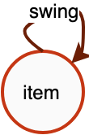
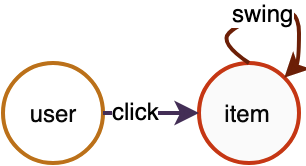

# 图对象

Graph对象是将原始数据组织起来、供上层算子进行操作的本体。Graph对象支持同构图、异构图、属性图，图中的详细信息通过相关API来表达。一个Graph对象的构建大体包括**3步**：

- **声明Graph对象**
- **描述拓扑结构**
- **初始化数据**


<a name="2Kpiz"></a>
# 1. 声明Graph对象
声明Graph对象很简单，代码如下。后续所有相关操作都基于`g`来进行。

```python
import graphlearn as gl
g = gl.Graph()
```

<br />

# 2. 描述拓扑结构
拓扑结构描述的是图中的边与顶点的关联关系。这里的拓扑指的是“一类”数据的关系，而非“一条”数据。拓扑关系都是有向的，即有向图。<br />
<br />例如，对于一个“商品-商品”同构图，其拓扑结构图1所示。图中只有item到item类型的数据关联，边类型为swing，表示通过swing算法生成的item关联关系，源顶点和目的顶点类型均为item。

<div align=center>  <br /> 图1 item-item同构关系图<br /> </div>

<br />对于一个“用户-商品-商品”二部关系图，其拓扑结构如图2所示。图中包含两种类型的边，click边表示user与item的点击关系，源顶点类型为user，目的顶点类型为item；swing边表示item与item的关联关系，源顶点和目的顶点类型均为item。

<div align=center>  <br /> 图2 user-item-item异构关系图<br /> </div>

<br />这些点、边的类型将是进行**异构图**操作的依据，需要用户感知，并作为算子的输入。比如“采样某些user点击过的商品的关联商品”，那么系统会知道沿着“**user->click->item->swing->item**”去采样相关节点，而不是其他路径。<br />
<br />实际中，图中边的数量要远大于顶点的数量，大部分情况下顶点都具有丰富的属性信息，为了节省空间，边和顶点往往是分开存储的。我们通过向Graph对象添加顶点数据源和边数据源的形式，来构建拓扑结构。<br />

<a name="OVdVh"></a>
## 2.1 添加顶点
Graph对象提供 **node()** 接口，用于添加一种顶点数据源。**node()**返回Graph对象本身，也就意味着可以连续多次调用**node()**。具体接口形式和参数如下：

```python
def node(source, node_type, decoder)
''' 描述顶点类型与其数据schema的对应关系。

source:    string类型，顶点的数据源，详见“数据源”一章。
node_type: string类型，顶点类型；
decoder:   Decoder对象，用于描述数据源的schema；
'''
```

表1 带属性的顶点数据源

| id | attributes |
| --- | --- |
| 10001 | 0:0.1:0 |
| 10002 | 1:0.2:3 |
| 10003 | 3:0.3:4 |

表2 带权重的顶点数据源

| id | weight |
| --- | --- |
| 30001 | 0.1 |
| 30002 | 0.2 |
| 30003 | 0.3 |

如上表所示的数据源，可以通过如下代码添加到Graph对象中。当存在多种类型的顶点时，请注意每次调用`node()`时的node_type不能相同。

```python
g.node(source="table_1", node_type="user", decoder=Decoder(attr_types=["int", "float", "int"])) \
 .node(source="table_2", node_type="movie", decoder=Decoder(weighted=True)
```

## 2.2 添加边
Graph对象提供 **edge()** 接口，用于添加一种边数据源，支持将同构或异构的边指定为无向边。**edge()**返回Graph对象本身，也就意味着可以连续多次调用**edge()**。通过添加边数据源，确定了图中边类型与其源点、目的点类型的对应关系，再结合对应的顶点类型数据源，共同构成一张打通连接关系的大图。具体接口形式和参数如下：

```python
def edge(source, edge_type, decoder, directed=True)
''' 描述边类型和其源顶点、目的顶点类型的对应关系，以及边类型与数据schema的对应关系。

source:    string类型，边的数据源，详见“数据源”一节。
edge_type: tuple，内容为(源点类型, 目的点类型, 边类型)3元组。
decoder:   Decoder对象，用于描述数据源的schema；
directed:  boolean, 边是否为无向边。默认True，为有向边。当为无向边时，采样必须通过GSL接口；
'''
```

表3 带权重的边数据源

| src_id | dst_id | weight |
| --- | --- | --- |
| 10001 | 10002 | 0.1 |
| 10002 | 10001 | 0.2 |
| 10003 | 10002 | 0.3 |
| 10004 | 10003 | 0.4 |

表4 带属性的边数据源

| src_id | dst_id | weight | attributes |
| --- | --- | --- | --- |
| 20001 | 30001 | 0.1 | 0.10,0.11,0.12,0.13,0.14,0.15,0.16,0.17,0.18,0.19 |
| 20001 | 30003 | 0.2 | 0.20,0.21,0.22,0.23,0.24,0.25,0.26,0.27,0.28,0.29 |
| 20003 | 30001 | 0.3 | 0.30,0.31,0.32,0.33,0.34,0.35,0.36,0.37,0.38,0.39 |
| 20004 | 30002 | 0.4 | 0.40,0.41,0.42,0.43,0.44,0.45,0.46,0.47,0.48,0.49 |

如上表所示的边数据源，可以通过如下代码添加到Graph对象中。当存在多种类型的边时，请注意每次调用`edge()`时的edge_type不能相同。

```python
ui_decoder = Decoder(weighted=True)
uv_decoder = Decoder(weighted=True, attr_types=["float"] * 10, attr_delimiter=',')

g.edge(source="table_3", edge_type=("user", "item", "click"), decoder=ui_decoder)
 .edge(source="table_4", edge_type=("user", "movie", "click_v"), decoder=uv_decoder)
```

<a name="grjJs"></a>
### 无向边
<br />`edge()`接口的参数`directed=True`表示有向边, `directed=False`表示无向边。<br />
<br />无向边实际上会在原来有向边的基础上加一条权重一样的反向的边，即假设原来有一条边是(src, dst), 那么新增一条(dst, src)，针对src和dst的类型是否相同（同构无向边和异构无向边），加载到图中的数据会有一些差异。<br />
<br />具体地举例来说：<br />
<br />构图时添加边，指定为无向边。<br />
```
g.edge(source, (src_type, dst_type, edge_type), decoder, directed=False)
```
- src_type和dst_type一致，如边类型为("item", "item", "i2i")，当i2i为无向边时，边会增加一份dst到src的连接，同时去重。<br />

```
原始i2i数据                     加载到图中的i2i数据
item	item         ->         item	item
1	2                           1	2
2	1                           2	1
1	3                           1	3
2	3                           3	1
3	3                           2	3
1	4                           3	2
                              3	3
                              1	4
                              4	1
```

- src_type和dst_type不一致，如边类型为("user", "item", "u2i")，当u2i为无向边时，在加载时实际上除了加载原始的u2i边之外，额外加载了一份i2u的反向边。<br />

```
原始u2i数据                 加载到图中的u2i数据    +     加载到图中的i2u数据
user	item            ->      user	item                 item	user
1	2                           1	2                        2	1
2	1                           2	1                        1	2
1	3                           1	3												 3	1
2	3                           2	3												 3	2
3	3                           3	3												 3	3
1	4                           1	4												 4	1
```

<br />在遍历时，同构的无向边和异构的无向边使用详见GSL文档。
<br />在采样时，需要根据自己指定的meta-path选择合理的边方向，合理使用outV(从src到dst)和inV(从dst到src)。outV和inV接口详见GSL文档。

<a name="OVdVh"></a>
## 2.3 partition
分布式场景下，即存在多个GraphLeanrn Server时，构图时会自动进行图的partition, 将图分布式存储。默认partiton是按照src_id % server数进行节点和边的分配。

<a name="HNiIP"></a>
# 3. 初始化

顶点与边添加完成后，需要调用初始化接口，完成从原始数据到内存索引的构建。初始化过程决定了图数据被Serving的情况，单机的还是分布式的。若为分布式的，还要区分Server Mode和Client-Server Mode。初始化完成后，便可对Graph对象进行操作了。<br />

<a name="nGHkF"></a>

## 3.1 单机
单机模式比较简单，表示该Graph对象Hold全部图数据。<br />

```python
g.init()
```

<a name="oKpvB"></a>
## 3.2 分布式模式

<br />分布式的模式分为Server Mode和Woker Mode。不同的分布式模式下，`Graph.init()`参数有不同的配置。<br />
### 3.2.1 Worker Mode

该模式下，数据分布式存在于各个Worker上，Worker之间两两互联，每个Worker对应一个Graph对象的入口。当进行图采样或查询等操作时，Graph对象把请求提交给本地Worker，由Worker决定如何分布式处理。Graph对象与本地Worker之间不存在网络通信。
<br />
Worker Mode需要调用如下API，即传入当前worker的id，以及总的worker数量。<br />

``` python
g.init(task_index, task_count)
```
<br />
Worker Mode适用于图规模不是很大的情况。与分布式训练结合，例如TensorFlow，各个图分片与TF的Worker节点位于同一进程。由于分布式规模不是超大（Worker数不是很大），Worker之间的两两互联不会造成网络的负担。另外，对于模型并行训练的场景，非典型的worker-ps模式，也需要使用Worker Mode部署。<br />

与TensorFlow结合，大致代码如下。<br />

- 用通信同步模式<br />

```python
gl.set_tracker_mode(0)
if FLAGS.job_name == "worker":
  worker_hosts = FLAGS.worker_hosts.splt(',')
  # 把port替换为其他未被占用的端口
  worker_hosts = [str(host.split(':')[0]) + ':8888' + str(i) for i, host in enumerate(worker_hosts)]
  g.init(task_index=FLAGS.task_index, hosts=worker_hosts)
  # Your model, use g to do some operation, such as sampling
  g.close()
else:
  # ps.join()
```

- 用共享文件同步方式，如共享文件地址mount为"/mnt/tracker"<br />

```python
if FLAGS.job_name == "worker":
  g.init(task_index=FLAGS.task_index, task_count=len(FLAGS.worker_hosts.split(',')), tracker="/mnt/tracker")
  # Your model, use g to do some operation, such as sampling
  g.close()
else:
  # ps.join()
```

### 3.2.2 Server Mode
该模式下，数据分布式存在于各个Server上，Server之间两两互联。此时，Graph对象的入口位于Client端。每个Client都与唯一一个Server连接，该Server作为Client的响应Server。Client与Server的对应关系由负载均衡算法决定。Client作为入口，提交请求到其响应Server，由该Server决定如何分布式处理。<br />

Server Mode适用于分布式规模超大的情况（百Worker以上），此时因为Worker规模很大，使用Worker Mode部署会大大增加网络互联的开销。另外，图数据的规模和Worker规模不一定匹配，例如，当1000个Worker并发训练时，并不一定需要这么多Worker去承载Graph数据，数据太分散会严重降低性能。一般而言，训练的Worker数 >= 图Server数。<br />

注意：目前Server Mode时要求server数必须小于等于 client数。<br />

Server Mode部署代码如下。<br />

```python
g.init(cluster={}, job_name="", task_index=0)
"""
cluster(dict): key包函"server"，"server_count"，"client_count"，"tracker"。
  "server": string，在通信同步时填写，表示所有GraphLearn server的ip:port
  "server_count": int，在文件同步时填写，表示GraphLearn server数
  "client_count": int, 在文件同步时填写，表示GraphLearn client数
  "tracker": string，在文件同步时填写，表示记录同步信息的共享文件地址
job_name(string): 角色类型，取值为"client"或"server"
task_index(int): 当前角色中的第几个
"""
```
与TensorFlow结合，Client位于worker端，Server位于ps端，或将Server单独放置到TensorFlow的其他role里（DLC上支持“GraphLearn”的role）。大致代码如下。<br />
- 通过通信同步，这里将GraphLearn Server放到TF ps上运行，也可以放到其他机器上。<br />

```python
gl.set_tracker_mode(0)
server_hosts = FLAGS.ps_hosts.splt(',')
server_hosts = [str(host.split(':')[0]) + ':8888' + str(i) for i, host in enumerate(server_hosts)]
cluster = {"server": server_hosts, "client_count": len(FLAGS.worker_hosts.split(','))}
if FLAGS.job_name == "worker":
  g.init(cluster=cluster, job_name="client", task_index=FLAGS.task_index)
  # Your model, use g to do some operation, such as sampling
  g.close()
else:
  g.init(cluster=cluster, job_name="server", task_index=FLAGS.task_index)
  # ps.join()
  g.wait_for_close()
```

- 通过文件同步，这里将GraphLearn Server放到TF ps上运行，也可以放到其他机器上。这里共享文件目录以mount的路径”mnt/tracker“为例。<br />

```python
cluster = {"server_count": len(FLAGS.server_hosts.split(',')),
           "client_count": len(FLAGS.worker_hosts.split(',')),
           "tracker": "/mnt/tracker"}
if FLAGS.job_name == "worker":
  g.init(cluster=cluster, job_name="client", task_index=FLAGS.task_index)
  # Your model, use g to do some operation, such as sampling
  g.close()
else:
  g.init(cluster=cluster, job_name="server", task_index=FLAGS.task_index)
  # ps.join()
  g.wait_for_close()
```
## 3.3 同步模式
GraphLearn的分布式任务启动需要让任务中每一个角色感知所有GraphLearn Server的hosts，同步的方式支持两种：基于文件系统的同步和基于通信的同步。<br />
- 基于文件系统同步<br />

基于文件系统同步是指，所有执行GraphLearn任务的机器都能够访问同一个文件地址，通过读写文件内容，来做hosts的同步。<br />
这个文件地址被共享，一般是通过NFS或者其他存储目录mount等方式支持。<br />
文件系统同步是默认的同步模式，需要指定tracker目录。<br />

这里以Server Mode下，通过文件同步为例，将GraphLearn Server放到TF ps上运行，也可以放到其他机器上。共享文件目录以mount的路径”mnt/tracker“为例。<br />

```python
cluster = {"server_count": len(FLAGS.server_hosts.split(',')),
           "client_count": len(FLAGS.worker_hosts.split(',')),
           "tracker": "/mnt/tracker"}
if FLAGS.job_name == "worker":
  g.init(cluster=cluster, job_name="client", task_index=FLAGS.task_index)
  # Your model, use g to do some operation, such as sampling
  g.close()
else:
  g.init(cluster=cluster, job_name="server", task_index=FLAGS.task_index)
  # ps.join()
  g.wait_for_close()
```

<br />其他示例详见分布式模式下的对应示例。<br />

- 基于通信的同步<br />

基于通信的同步是指事先指定所有GraphLearn Server的hosts(ip:port)。需要注意的是，ip可以和TF PS的ip一致，这样GraphLearn Server就会运行在TF ps所在的机器上；但是沿用TF ps的ip时，不可与ps的port一致，否则会导致端口的冲突。<br />

基于通信同步需要设置tracker_mode：<br />

```python
gl.set_tracker_mode(0)
```

这里以Server Mode下，通过通信同步为例。<br />

```python
gl.set_tracker_mode(0)
server_hosts = FLAGS.ps_hosts.splt(',')
server_hosts = [str(host.split(':')[0]) + ':8888' + str(i) for i, host in enumerate(server_hosts)]
cluster = {"server": server_hosts, "client_count": len(FLAGS.worker_hosts.split(','))}
if FLAGS.job_name == "worker":
  g.init(cluster=cluster, job_name="client", task_index=FLAGS.task_index)
  # Your model, use g to do some operation, such as sampling
  g.close()
else:
  g.init(cluster=cluster, job_name="server", task_index=FLAGS.task_index)
  # ps.join()
  g.wait_for_close()
```

其他示例详见分布式模式下的对应示例。<br />

<br />**请注意，无论单机还是分布式，在使用完毕时需要显示调用g.close()。**<br />
