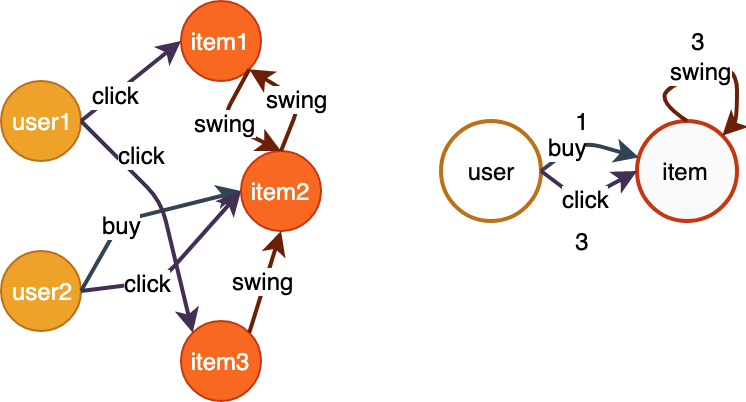

# 图查询

图对象构建完成后，可进行图查询操作。查询是指获取图的 **元信息** 和 **数据信息**, 不涉及复杂的计算和采样逻辑。<br />

<a name="WREbw"></a>
# 1 Meta查询
元信息指图结构和统计类型的信息，包括图的拓扑结构、顶点总数、边与顶点分布情况、顶点的最大出入度等。<br />

<a name="EyXMf"></a>
## 1.1 拓扑结构
```python
def get_topology()
""" 获取图的拓扑结构
返回类型为dict，其中key为edge_type，value包含src_type, dst_type两个属性。
"""
```

<br />如下所示的异构图，获取其拓扑结构及返回结果格式参见示例代码。
<div align=center>  <br /> 图1 图的拓扑信息 </div>

```python
g = Graph(...)
g.init(...)
topo = g.get_topology()
topo.print_all()

"""
egde_type:buy, src_type:user, dst_type:item
egde_type:click, src_type:user, dst_type:item
egde_type:swing, src_type:item, dst_type:item
"""
```


<a name="laOmB"></a>
## 1.2 出入度分布
待更新。<br />

<a name="FPU74"></a>
# 2 数据查询

**GL**有两个基本的数据类型： `Nodes` 和 `Edges` ，作为遍历、查询、采样的返回对象，包含了一个batch的顶点或边。特别地，非对齐的采样返回的是两个基本数据类型的稀疏形式，分别为`SparseNodes`和`SparseEdges`。<br />
<br />其中`Nodes` 接口如下。
```python
@property
def ids(self):
""" 顶点id，numpy.ndarray(int64) """

@property
def shape(self):
""" 顶点id的shape """

@property
def int_attrs(self):
""" int类型的属性，numpy.ndarray(int64)，shape为[ids.shape, int类型属性的个数] """

@property
def float_attrs(self):
""" float类型的属性，numpy.ndarray(float32)，shape为[ids.shape, float类型属性的个数] """

@property
def string_attrs(self):
""" string类型的属性，numpy.ndarray(string)，shape为[ids.shape, string类型属性的个数] """

@property
def weights(self):
""" 权重，numpy.ndarray(float32)，shape为ids.shape """

@property
def labels(self):
""" 标签，numpy.ndarray(int32)，shape为ids.shape """
```
`Edges` 接口与Nodes的区别为，去掉了ids接口，增加了以下4个接口，用于访问源顶点和目的顶点。
```python
@property
def src_nodes(self):
""" 源顶点Nodes对象 """

@property
def dst_nodes(self):
""" 目的顶点Nodes对象 """

@property
def src_ids(self):
""" 源顶点id，numpy.ndarray(int64) """

@property
def dst_ids(self):
""" 目的顶点id，numpy.ndarray(int64) """
```
关于ids的shape，在顶点和边遍历操作中，shape为一维，大小为指定的batch size。在采样操作中，shape为二维，大小为`[输入数据的一维展开大小，当前采样个数]`。<br />
<br />`SparseNodes`用于表达顶点的稀疏邻居顶点，相对于`Nodes`增加了以下接口。
```python
@property
def offsets(self):
""" 一维整形数组: 每个顶点的邻居个数 """

@property
def dense_shape(self):
""" 含有2个元素的tuple: 对应的Dense Nodes的shape """

@property
def indices(self):
""" 二维数组，代表每一个邻居的位置 """

def __next__(self):
""" 遍历接口，遍历每个顶点的邻居顶点们 """
  return Nodes
```

<br />`SparseEdges`用于表达顶点的稀疏邻边，相对于`Edges`增加了以下接口。
```python
@property
def offsets(self):
""" 一维整形数组: 每个顶点的邻居个数 """

@property
def dense_shape(self):
""" 含有2个元素的tuple: 对应的Dense Edges的shape """

@property
def indices(self):
""" 二维数组，代表每一个邻居的位置 """

def __next__(self):
""" 遍历接口，遍历每个顶点的邻居边们 """
  return Edges
```


<a name="OdSFV"></a>
## 2.1 顶点查询
Nodes可以从图上遍历或采样而来，也可以直接指定id。不管是哪种来源，都可以查询他们的属性、权重或标签。<br />
<br />指定id查询顶点：
```python
def get_nodes(node_type, ids)
''' 获取指定类型的顶点的权重、标签、属性
Args:
  node_type(string): 顶点类型
  ids(numpy.array): 顶点id
Return:
  Nodes对象
'''
```

<br />通过下面的数据展示`get_nodes()`接口的用法。

表1 user顶点数据

| id | attributes |
| --- | --- |
| 10001 | 0:0.1:0 |
| 10002 | 1:0.2:3 |
| 10003 | 3:0.3:4 |

```python
g = Graph(...)
u_nodes = g.get_nodes("user", np.array([10001, 10002, 10003]))

print(u_nodes.int_attrs) # shape = [3, 2]
# array([[0, 0], [1, 3], [2, 4]])

print(u_nodes.float_attrs) # shape = [3, 1]
# array([[ 0.1],  [0.2],  [0.3]])
```

<br />GSL中，`get_nodes()` 可以用 `V()` 代替，写法如下。
```python
g = Graph(...)
u_nodes = g.V("user", feed=np.array([10001, 10002, 10003])).emit()
```


<a name="q3IOm"></a>
## 2.2 边查询
Edges可以从图上遍历或采样而来，也可以直接指定是src_id, dst_id。不管是哪种来源，都可以查询他们的属性、权重或标签。<br />
<br />指定src_id, dst_id查询边：
```python
def get_edges(node_type, src_ids, dst_ids)
''' 获取指定类型的边的权重、标签、属性
Args:
  node_type(string): 边类型
  src_ids(numpy.array): 边的源顶点id
    dst_ids(numpy.array): 边的目的顶点id
Return:
  Edges对象
'''
```

<br />通过下面的数据展示`get_edges()`接口的用法。

表2 swing边数据 

| src_id | dst_id | weight |
| --- | --- | --- |
| 10001 | 10002 | 0.1 |
| 10002 | 10001 | 0.2 |
| 10003 | 10002 | 0.3 |
| 10004 | 10003 | 0.4 |

表3 click边数据

| src_id | dst_id | weight | attributes |
| --- | --- | --- | --- |
| 20001 | 30001 | 0.1 | 0.10,0.11,0.12,0.13,0.14,0.15,0.16,0.17,0.18,0.19 |
| 20001 | 30003 | 0.2 | 0.20,0.21,0.22,0.23,0.24,0.25,0.26,0.27,0.28,0.29 |
| 20003 | 30001 | 0.3 | 0.30,0.31,0.32,0.33,0.34,0.35,0.36,0.37,0.38,0.39 |
| 20004 | 30002 | 0.4 | 0.40,0.41,0.42,0.43,0.44,0.45,0.46,0.47,0.48,0.49 |

```python
g = Graph(...)

edges = g.get_edges(edge_type="swing", 
                    src_ids=np.array([10001, 10002, 10003]), 
                    dst_ids=np.array([10002, 10001, 10002]))

print(edges.weights)  # shape=[3]
# array([0.1,  0.2,  0.3])

click_edges = g.get_edges(edge_type="click", 
                          src_ids=np.array([20001, 20003, 20004]), 
                          dst_ids=np.array([30003, 30001, 30002]))

print(click_edges.weights)  # shape=[3]
# array([0.2,  0.3,  0.4])
```

<br />GSL中，`get_edges()` 可以用 `E()` 代替，写法如下。
```python
g = Graph(...)
edges = g.E("swing",
            feed=(np.array([10001, 10002, 10003]), np.array([10002, 10001, 10002])) \
         .emit()
```


<a name="rogkI"></a>
## 2.3 稀疏顶点/边查询
遍历、采样的结果一般为Nodes/Edges对象，用上文2.1，2.2中的接口进行查询。<br />在非对齐采样中，结果是稀疏的，如在全邻居采样（即“full”策略的邻居采样）中，由于每个顶点的邻居数不统一，因此得到的邻居不是对齐的。<br />
<br />以下以全邻居采样的边属性查询为例进行稀疏对象的接口使用说明。<br />

表4 buy边数据

| user | item | weight |
| --- | --- | --- |
| 1 | 3 | 0.2 |
| 1 | 0 | 0.1 |
| 1 | 2 | 0.0 |
| 2 | 1 | 0.1 |
| 4 | 1 | 0.5 |
| 4 | 2 | 0.3 |

```python
# 采样id为1，2，3，4顶点的全部buy类型的邻边。
res = g.V("user", feed=np.array([1, 2, 3, 4])).outE("buy").sample().by("full").emit()

# res[0] # Nodes of [1, 2, 3, 4]
# res[1] # SparseEdges

res[1].src_ids 
# array([1, 1, 1, 2, 4, 4])

res[1].dst_ids 
# array([3, 0, 2, 1, 1, 2])

res[1].offsets 
# [3, 1, 0, 2] 
# 即user1有3个邻居，user2有1个邻居，user3有0个邻居，user4有2个邻居

res[1].dense_shape
# [4, 3]
# 即[seed顶点数，seed顶点中邻居数的最大值]

res[1].indices
# [[0, 1], [0, 2], [0, 3], [1, 0], [3, 1], [3, 2]]
# 即src_ids对应在dense Nodes中的对应下标(同dst_ids对应在dense Nodes中的下标)
# 对应的dst dense Nodes：
# [[ 3,  0,  2],
#  [ 1, -1, -1],
#  [-1, -1, -1],
#  [ 1,  2, -1]]

res[1].weights
# [0.2, 0.1, 0.0, 0.1, 0.5, 0.3]

# 遍历每个顶点的全部邻边。
iterate = 0
for edges in res[1]:
    print("Iterate {}:".format(iterate), edges.dst_ids, edges.weights)
    iterate += 1
# Iterate 0: [3, 0, 2], [0.2, 0.1, 0.0], [[3, 1, 2]]
# Iterate 1: [1], [0.1],
# Iterate 2: [], []
# Iterate 3: [1, 2], [0.5, 0.3]
```

