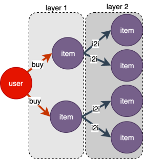

# 图采样

<a name="fOsGk"></a>
# 1 介绍
图采样是处理超大规模图的有效手段，已经在以[GraphSAGE](https://arxiv.org/abs/1706.02216)框架为代表的编程范式中广泛使用。实际中，采样除了降低数据规模以外，也实现了数据对齐，有利于Tensor-Based计算框架高效处理。<br />
<br />我们把用户对采样的需求抽象成**2类**操作：**邻居采样（NEIGHBORHOOD）**，**负采样（NEGATIVE）**。邻居采样，根据输入的顶点，采样其一跳或多跳邻居顶点，用于构造[GCN](https://arxiv.org/abs/1609.02907)理论中的感受野。邻居采样的输入，可以来自图遍历的输出，也可以来自图之外的其他数据源。负采样，根据输入的顶点，采样与其不直接相连的顶点。负采样往往作为监督学习的重要手段。<br />
<br />每一类采样操作都有不同的实现策略，如随机、按权重等。与实际生产相结合，我们已经积累了**10余种**采样算子，并开放了算子编程接口，允许用户自定义，以满足快速发展的GNN的需求。本章介绍邻居采样，负采样将在下一章中详细介绍。此外，最近的AI顶会提出的子图采样正在研发中。<br />

<a name="gvEnk"></a>
# 2 用法
<a name="OI8t6"></a>
## 2.1 接口
采样算子以meta-path和采样数量作为输入，用于表达对任意异构图、任意跳数采样的支持，采样结果组织成`Layers`对象，每一跳采样的结果为一个`Layer`，可获取其中对应的`Nodes`和`Edges`。一个采样操作可具体分为以下3步实现：

- 通过`g.neighbor_sampler()`定义采样算子，得到`NeighborSampler`对象`S`；
- 调用`S.get(ids)`, 得到顶点的邻居`Layers`对象`L`；
- 调用`L.layer_nodes(i)`, `L.layer_edges(i)`获取第`i`跳的顶点和边；


```python
def neighbor_sampler(meta_path, expand_factor, strategy="random"):
"""
Args:
  meta_path(list):     由edge_type组成的string list，指邻居采样的路径;
  expand_factor(list): 由int组成的list，第i个元素代表第i跳采样的邻居个数; 长度必须与meta_path一致
  strategy(string):    采样策略，具体参考下文的详细解释
Return:
  NeighborSampler对象
"""
```
```python
def NeighborSampler.get(ids):
""" 采样指定ids的一跳或多跳邻居
Args:
  ids(numpy.ndarray): 一维int64数组
Return:
  Layers对象
"""
```
采样返回结果为一个`Layers`对象，其含义为“源顶点的邻居顶点，以及源顶点和邻居顶点之间的边”。每一层`Layer`的ids的shape是二维的，**[前一层ids的展开大小，当前层采样个数]。**
```python
def Layers.layer_nodes(layer_id):
""" 获取第i层layer的`Nodes`，layer_id从1开始。"""
    
def Layers.layer_edges(layer_id):
""" 获取第i层layer的`Edges`，layer_id从1开始。"""
```

<br />在GSL中，参考`g.out*`和`g.in*`系列接口。例如
```python
# 采样一跳邻居顶点
g.V().outV().sample(count).by(strategy)

# 采样二跳邻居顶点
g.V().outV().sample(count).by(strategy).outV().sample(count).by(strategy)
```


<a name="j0egY"></a>
## 2.2 示例
如下图所示，从user类型的顶点开始，采样其2跳邻居，返回结果为layers，layers包含layer1和layer2。**layer的index从1开始**，即1跳邻居为layer1，2跳邻居为layer2。

<div align=center> </div>

```python
s = g.neighbor_sampler(["buy", "i2i"], expand_factor=[2, 2])
l = s.get(ids) # input ids: shape=(batch_size)

# Nodes对象
# shape=(batch_size, expand_factor[0])
l.layer_nodes(1).ids
l.layer_nodes(1).int_attrs

 # Edges对象
 # shape=(batch_size *  expand_factor[0],  expand_factor[1])
l.layer_edges(2).weights
l.layer_edges(2).float_attrs
```


<a name="UpHHt"></a>
# 3 采样策略
GL目前已支持以下几种采样策略，对应产生`NeighborSampler`对象时的`strategy`参数。

| **strategy** | **说明** |
| --- | --- |
| edge_weight | 以边权重为概率采样 |
| random | 有放回随机采样 |
| random_without_replacement | 无放回随机采样，邻居数不够时，参考填充规则 |
| topk | 返回边权重topK的邻居，邻居数不够时，参考填充规则 |
| in_degree | 以顶点入度为概率采样 |
| full | 返回全部的邻居，此时expand_factor参数不起作用，结果对象为SparseNodes或SparseEdges，对象描述详见“[数据查询](graph_query_cn.md#FPU74)” |


<br />填充规则：当采样要求的数据不足时，需要以某种方式填充返回结果。默认情况下，用`default_neighbor_id`填充补齐不足的`id`，`default_neighbor_id`默认为0，可以通过`gl.set_default_neighbor_id(xx)`来设置。如要循环填充，即循环使用已有邻居id而非`default_neighbor_id`，则设置填充模式`gl.CIRCULAR`，`gl.set_padding_mode(gl.CIRCULAR)`。

