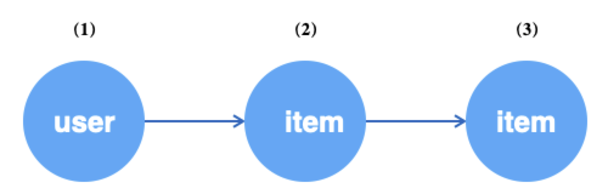
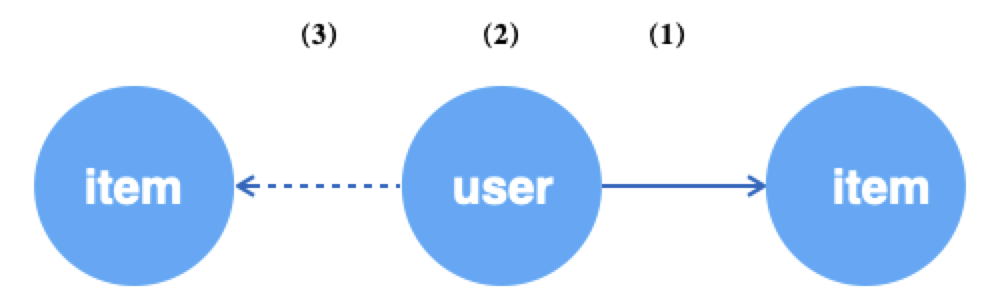
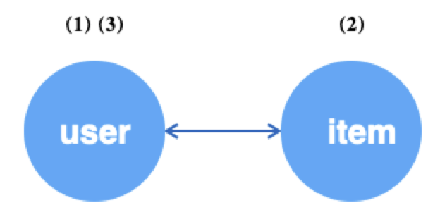
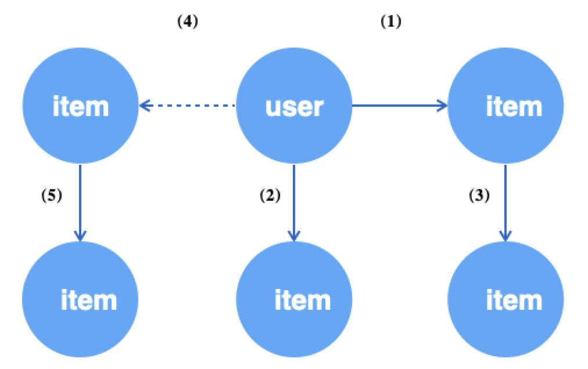

# Graph Sampling Language（GSL）

<a name="TUTVl"></a>
# 1 简介
GNN发展至今，有一套相对成熟的编程范式。我们将一个GNN模型的开发分为两个阶段：图模式的数据处理部分和神经网络部分。
神经网络部分，我们可以借助成熟的DL框架，如TensorFlow、PyTorch。
如何简单高效的描述和实现适合GNN的图数据访问模式，以及如何与主流的深度学习框架对接，是GL重点关注的。<br />
<br />实际中的图由于规模原因，采样是必要阶段。总结下来，图采样大致包含几类：

- 遍历型（Traverse），从图上获取一个batch的点或边数据；
- 关系型（Neighborhood，Subgraph），获取点的N跳邻域或生成由点构成的子图，用于构造训练样本；
- 负采样（Negative），与关系型相对，一般用于无监督训练场景，产生负例样本；


<br />我们把如上几类操作抽象成了一套接口，称为 **GSL**。
开发者可以基于**GSL**描述用于GNN的图数据流，例如，针对“用户点击商品”异构图场景，“随机采样64个user，并按边的权重为每个user采样10个关联商品”，
可以写成<br />`g.V("user").batch(64).outV("click").sample(10).by("edge_weight")`<br />
<br />**GSL**考虑实际图数据的特点，覆盖了对超大图、异构图、属性图的支持，语法设计贴近[Gremlin](http://tinkerpop.apache.org/docs/current/reference/#_tinkerpop_documentation)形式，便于理解。<br />

<a name="KFXRf"></a>
# 2 GSL语法
我们把一个由**GSL**描述的语句称为**Query**，一个**Query**通常由**SOURCE**、**STEP**和**SINK**三种类型的操作组成。
其中，**SOURCE**为查询语句的入口，表示从哪些数据出发；**STEP**为查询过程中游走和采样的路径，**SINK**为对执行结果的封装。
在GSL中，一条Query必须包含**一个SOURCE**和**一个SINK**操作。<br />

<a name="5xWGq"></a>
## 2.1 SOURCE
<a name="IHxBA"></a>
### 2.1.1 V/E
SOURCE是查询语句的入口，支持 `V()` 和 `E()` 两个接口，分别表示从顶点和从边开始查询。具体如下。
```python
def V(node_type, feed=None)
"""
Args:
  node_type(string): 顶点类型，后续操作会针对该类型的顶点进行;
  feed(None | numpy.ndarray | types.GeneratorType): 
      若为None，表示从图中获取顶点id;
      否则，允许用户指定数据来源，如上游的Numpy输出或Generator;
Return:
  一个Query对象
"""

def E(edge_type, feed=None)
"""
Args:
  edge_type(string): 边类型，后续操作会针对该类型的边进行;
  feed(None | (numpy.ndarray, numpy.ndarray) | types.GeneratorType): 
      若为None，表示从图中获取边的src_id和dst_id;
      否则，允许用户指定数据来源，如上游的Numpy输出或Generator;
Return:
  一个Query对象
"""
```


<a name="t34wT"></a>
### 2.1.2 shuffle
`V()`和`E()`之后可以接 `shuffle`。 `shuffle()` 为可选接口，当从图获取数据时（feed为None），表示是否要对顶点/边进行随机获取。
```python
def shuffle(traverse=False):
"""
Args:
  traverse(boolean): 是否要随机获取数据源，默认False。
      True表示按序遍历，当遍历到结尾时会触发OutOfRangeError，False则不会OutOfRangeError。
Return:
  Query对象
"""
```


<a name="W56KH"></a>
### 2.1.3 batch
当从图获取数据时（feed为None），`batch()`用于指定每次获取到的`V()`或`E()`的多少。若同时要对数据进行`shuffle()`，注意在`batch()`之前。当`shuffle(traverse=True)`时，如果剩余数据不足batch_size但不为0，则返回实际数据，此时不会触发OutOfRangeError。只有剩余数据为0时，才会OutOfRangeError。
```python
def batch(batch_size):
"""
Args:
  batch_size(int): 每次获取的源数据的多少。
Return:
  Query对象
"""
```


<a name="WQ5EP"></a>
### 2.1.4 示例
随机获取64个user类型的顶点。
```python
g.V("buy").shuffle().batch(64)
```
把给定id作为user类型的顶点。
```python
g.V("user", feed=np.array([1, 2, 3]))
```
获取给定id生成器的user顶点。
```python
def gen():
  while True:
    yield  np.array([1, 2, 3])

generator = gen()
g.V("user", feed=generator)
```
按序且每次获取64条类型为buy的边。
```python
g.E("buy").shuffle(True).batch(64)
```
把给定（src_ids, dst_ids）作为类型为buy的边。
```python
g.E("buy", feed=(np.array([1, 2, 3]), np.array([4, 5, 6]))
```
获取给定（src_ids, dst_ids）生成器的类型为buy的边。
```python
def gen():
  while True:
    yield  (np.array([1, 2, 3]), np.array([4, 5, 6]))

generator = gen()
g.E("buy", feed=generator)
```


<a name="5kq55"></a>
## 2.2 STEP
STEP用于描述查询游走的路径和采样的方式。一条查询语句中可以包含0到多个STEP。目前，STEP包含以下两类接口：描述路径游走，描述采样方式。<br />
<br />描述路径游走的接口，表示当前操作对象的转移。例如，`g.V()`表示当前操作对象为顶点，可以通过`outE()`把当前操作对象转移到顶点的出边上，后面的操作表示针对边来进行。当边的操作结束后，可以通过`inV() / outV()`，再将焦点转移到边对应的目的顶点或源顶点上。
```python
def inV():
""" 承接边（只能跟在边操作之后），表示两个顶点中箭头指向的那个，即目的顶点
Return:
  Query对象
"""

def outV():   
""" 承接边（只能跟在边操作之后），表示两个顶点中箭头发起的那个，即源顶点
Return:
  Query对象
"""

def inE(edge_type):
""" 承接顶点（只能跟在顶点操作之后），表示顶点的入边
Args:
  edge_type(string): 边的类型，当该边为有向边时, 调用inE报错
Return:
  Query对象
"""

def outE(edge_type):
""" 承接顶点（只能跟在顶点操作之后），表示顶点的出边
Args:
  edge_type(string): 边的类型
Return:
  Query对象
"""

def inV(edge_type):
""" 承接顶点（只能跟在顶点操作之后），表示顶点沿着边的上游顶点
Args:
  edge_type(string): 边的类型，当该边为有向边时, 调用inV报错
Return:
  Query对象
"""

def outV(edge_type):
""" 承接顶点（只能跟在顶点操作之后），表示顶点沿着边的下游顶点
Args:
  edge_type(string): 边的类型
Return:
  Query对象
"""

def outNeg(edge_type):
""" 承接顶点（只能跟在顶点操作之后），表示在该边类型下负采样下游顶点
Args:
  edge_type(string): 边的类型
Return:
  Query对象
"""
    
def inNeg(edge_type):
""" 承接顶点（只能跟在顶点操作之后），表示在该边类型下负采样上游顶点
Args:
  edge_type(string): 边的类型，当该边为有向边时, 调用inNeg报错
Return:
  Query对象
"""

def Neg(node_type):
""" 承接顶点（只能跟在顶点操作之后），表示在给定顶点的候选集上负采样
Args:
  node_type(string): 顶点类型
Return:
  Query对象
"""

def each():
""" 用于路径多分枝，一条Query最多包含一个each，且分枝后不支持合并
"""

def alias():
""" 给采样路径命名，便于后续操作
Return:
  Query对象
"""
```

<br />描述采样方式的接口，在前序路径描述的基础上，且当前操作对象为顶点时，如何采样该类型的顶点作为前序顶点的邻居，包括采样多少、采样策略。采样的策略说明参考文档“[图采样](graph_sampling_cn.md)”，负采样的策略说明参考文档“[负采样](negative_sampling_cn.md)”。
```python
def sample(N):
""" 承接顶点（只能跟在顶点操作之后），表示当前顶点采样多少作为前序顶点的邻域
Args:
  N(int): 采样的数量
Return:
  Query对象
"""

def by(strategy):
""" 紧跟sample()之后，表示采样策略
Args:
  strategy(string): 采样策略
      如果前序路径为采样，支持的策略包括: “edge_weight”, "in_degree", "topk", "random", "full";
      如果前序路径为负采样，支持的策略包括: "in_degree", "random", "node_weight"
Return:
  Query对象
"""
```


<a name="wOTQV"></a>
### 2.2.1 out*, in*
`out*()`和` in*()`系列用于描述在游走过程中**向前推进**和**向后回溯**。<br />
<br />例如，对于如下所示异构图，从user顶点开始，沿u2i边采样user的一跳邻居，再沿i2i边采样user的二跳邻居。

<div align=center> </div>

```python
g.V("user").batch(64)                       # (1) 随机获取64个user顶点
 .outV("u2i").sample(10).by("edge_weight")  # (2) 为上述每个user采样10个邻居item
 .outV("i2i").sample(15).by("random")       # (3) 为上述每个item采样15个邻居item
```

<br />若以边为数据源，可以再获取边后分别针对其端点进行操作。一般情况下，获取边往往用于无监督学习，把边看成正样本，再对边的源顶点进行负邻居采样作为负样本。

<div align=center> </div>

```python
g.E("u2i").batch(64)                     # (1) 随机获取64条u2i的边
 .ouV()                                  # (2) 跳转到边的源顶点，即user
 .outNeg("u2i").sample(10).by("random")  # (3) 为上述每个user采样10个不相关的item
```

<br />当边为无向边时，可以通过`outV()`和`inV()`来实现循环采样，源点和目的点互为邻居。

<div align=center> </div>

```python
g.V("user").batch(64)                   # (1) 随机获取64个user顶点
 .outV("u2i").sample(10).by("random")   # (2) 为上述每个user采样10个邻居item
 .inV("u2i").sample(5).by("random")     # (3) 为上述每个item采样10个邻居user
```


<a name="TTlWe"></a>
### 2.2.2 each
一个典型的GNN算法对图数据的需求往往是多路的，而非只要Query的最后结果。`each()`接口用于表达Query的多分枝，当进行到某个阶段后，针对前序结果（可能有多个）分别进行不同的操作。每条Query中最多存在一个`each()`，且是Query的最后一个操作，即`each()`之后不能再有其他操作。
```python
def each(func):
""" 
Args:
  func(lambda): 构造子query的lambda表达式，表达式的输入为紧跟上游操作的输出。
Return:
  Query对象
"""
```

<br />例如，在二部图（user-item-item）GraphSAGE算法中，我们为了学习user和item在同一空间下的相似性，首先会随机获取图的u2i边作为训练的正样本，再对边的源点（即user顶点）采样其负邻居（item顶点）产生负样本。user通过一阶邻居进行编码（把邻域信息聚合到中心节点），即需要采样其一跳邻居。item也需要一阶邻居来编码。图数据的访问模式如下所示。

<div align=center> </div>

```python
g.E("u2i").shuffle().batch(512)                            # (1) 随机获取512条u2i的边
 .each(lambda edge:                                        # 上游输出的是边
    (edge.outV().outV("u2i").sample(10).by("edge_weight"), # (2) 为边的源顶点user采样10个邻居
     edge.inV().outV("i2i").sample(10).by("random"),       # (3) 为边的目的顶点item采样10个邻居
     edge.outV().outNeg("u2i").sample(5).by("in_degree") \ # (4) 为边的源顶点user负采样5个邻居
         .outV("i2i").sample(10).by("random")))            # (5) 为上述负采样的每个item采样其10个邻居

```

<br />需要注意的是，有分枝的Query返回结果比较复杂，分枝之间没有先后顺序。我们强烈建议`each()`配合下面将要提到的`alias()`一起使用。<br />

<a name="wHdJ3"></a>
### 2.2.3 alias
`alias()` 用于标记当前SOURCE或STEP的名称，便于后续对输出结果的访问。特别的，当Query链路较长且需要保留链路中的每个结果时，`alias()`比较方便。
```python
def alias(name):
""" 
Args:
  name(string): 给操作起一个别名。
Return:
  Query对象
"""
```

<br />针对为`each()`所举的例子，可以给每个步骤赋一个alias。
```python
g.E("u2i").shuffle().batch(512).alias("edges")
 .each(lambda edge:
    (edge.outV().outV("u2i").sample(10).by("edge_weight").alias("src_1hop"),
     edge.inV().outV("i2i").sample(10).by("random").alias("dst_1hop"),
     edge.outV().outNeg("u2i").sample(5).by("in_degree").alias("neg_i") \
     .outV("i2i").sample(10).by("random").alias("neg_i_1hop")))

```


<a name="MI24G"></a>
### 2.2.4 repeat
当Query比较长且操作重复时，可以用`repeat()`简化写法。例如，针对某个同构无向图，从顶点出发采样其10跳邻居。接受一个function，与`each()`中的类似，表示该function所代表的操作被重复times次。
```python
def repeat(self, func, times, parmas_list=None):
"""
Args:
  func(function): 要被展开的函数体，第一个参数为要被操作的对象
    times(int): func被展开的次数
    params_list(list): func的输入参数，如果不为None，func的签名必须为func(x, params=None)
      params_list中的每一项会作为func每次被调用时的参数，因此params_list的大小必须为times。
Return:
  Query对象
"""
```

<br />func的第一个参数承接上游的输出，或Node或Edge，func内的操作需要符合Node和Edge的语法规范。例如下面一个Query，在无向图i-i上获取顶点，再扩展至3跳邻居。
```python
func = lambda v: v.outV("i-i").sample(5).by("random")
q = g.V("item").batch(64).repeat(func, 3).values()
g.run(q) # return a list of Nodes,
         # shapes are [[64], [64, 5], [64*5, 5], [64*5*5, 5]]
```
上述Query等价于
```python
q = g.V("item").batch(64)                \
     .outV("i-i").sample(5).by("random") \
     .outV("i-i").sample(5).by("random") \
     .outV("i-i").sample(5).by("random")
```
有参数的func示例如下。
```python
def func(v, params):
    return v.outV("i-i").sample(params[0]).by(params[1])

q = g.V("u-i").batch(64) \
     .repeat(func, 2, params_list=[(5, "edge_weight"), (10, "random")]) \
     .values()
g.run(q)
```


<a name="xDuJp"></a>
## 2.3 SINK
每一个Query必须以一个**SINK**操作为结尾，表示当前Query已经完成，可被用于解析执行或返回结果。**SINK**操作接口有两个， `values()` 和 `emit()` 。**SINK**操作在一个Query中只可以被调用一次。<br />

- `values` 返回一整条query，可多次执行。一般用于**SOURCE**为遍历的情况。
- `emit` 直接获得这条query执行一次的结果。一般用于**SOURCE**为给定id的顶点或边的情况。


<br />**SINK**操作可接收一个func参数，用于对返回结果进行后处理。每一个**SOURCE**和**STEP**操作都会返回一个 **`Nodes`** 对象或 **`Edges`** 对象(其中用full作为采样策略的采样STEP返回的是**SparseNodes**或**SparseEdges**对象)，与该操作所对应的对象相关。<br />例如， `*V()` 和 `*Neg()` 系列的**SOURCE**或**STEP**对应的是`Nodes`对象（其中用full作为采样策略的采样STEP返回的是**SparseNodes**）。<br />`*E()` 系列的**SOURCE**或**STEP**对应的是`Edges`对象（其中用full作为采样策略的采样STEP返回的是**SparseNodes**）。如何获取`Nodes`/`Edges`/`SparseNodes`/`SparseEdges`对象的值可以参考[API](graph_query_cn.md#FPU74)。<br />
<br />在**SINK**之前，Query描述了多个操作，这些操作可能有`alias()`，也有的没有。

- 对于没有出现过`alias()`的Query，所有操作的结果都会返回，按照在Query中的先后顺序排列成一个list对象，list中的每个元素为`Nodes`或`Edges`；需要注意的是，这里的顺序不包含存在分枝的情况，若有分枝，请务必使用`alias()`；
- 当存在`alias()`时，返回结果为dict，其中key为`alias()`传入的name，value为对应的`Nodes`或`Edges`。


<a name="FOeWa"></a>
### 2.3.1 values
返回Query执行结果的生成器，可被`g.run()`驱动执行，适用于迭代训练的场景。
```python
def values(func=None):
"""
Args:
  func(function): 返回结果的后处理函数
Return:
  Query结果的Generator
"""
```

<br />func可以是一个匿名函数，也可以是一个def定义的函数。func的输入为一个dict或list，视有无`alias()`而定。
```python
def func(x):
    """ x是{'a':Nodes, 'b':Nodes, 'c':Edges, 'd':Nodes}
    """
    src_ids = x['a'].ids
    src_attrs = x['a'].attrs
    neg_attrs = x['b'].attrs
    edge_weights = x['c'].weights
    ...
    return encode_fn(src_atrs, neg_attrs, ...)

q = g.V("user").shuffle().batch(512).alias('a')             \
     .outNegV("u2i").sample(5).by("in_degree").alias('b')   \
     .outE("i2i").sample(5).by("topK").alias('c')           \
     .inV().alias('d')

gen1 = q.values(func)
gen2 = q.values(lambda x: (x['a'].ids, x['b'].attrs, x['c'].weights, x['d'].attrs))
```


```python
gen = g.V("u-i").batch(3)                  \ # (0)
       .outV("i-i").sample(2).by("random") \ # (1)
       .outV("i-i").sample(2).by("random") \ # (2)
       .values()

res = g.run(gen)  # res = [Nodes, Nodes, Nodes]
print(res[0].ids)
```


<a name="tbPOc"></a>
### 2.3.2 emit
`emit()` 相当于 `values()` 和一次 `g.run()` 的结合，表示对当前Query执行一次并返回结果，结果为dict还是list视有无`alias()`而定。一般情况下，`emit()`用于调试阶段，验证代码和数据正确性时使用。
```python
def emit(func=None):
"""
Args:
  func(function): 返回结果的后处理函数
Return:
  dict或list对象，其中每个元素为Nodes或Edges
"""
```


```python
res = g.V("item", feed=np.array([1, 2, 3])) \ # (0)
       .outV("i-i").sample(2).by("random")  \ # (1)
       .outV("i-i").sample(2).by("random")  \ # (2)
       .emit()

# res = [Nodes, Nodes, Nodes]
print(res[1].ids)
```

<br />需要注意的是，当Query只有Soure（ `g.V()`  / `g.E()` ）时，`emit()`直接返回list[0]的数据。<br />

<a name="dF3l2"></a>
# 3 Query执行
<a name="Cmqcj"></a>
## 3.1 run
`run()` 接口用于执行Query，得到最终的结果，结果形式由`values()`接口的func函数定义。可以参考[`values`](#FOeWa)一节的使用示例。
```python
def run(generator):
"""
Args:
  generator: Query的generator
Return:
  Query结果，格式由values()接口决定
"""
```


<a name="h7Pvb"></a>
## 3.2 与TensorFlow结合
`values(func)`返回一个以func定义返回数据类型的generator，可以直接对接TensorFlow的[tf.data.Dataset](https://www.tensorflow.org/api_docs/python/tf/data/Dataset)。<br />
```python
query = g.E("u2i").shuffle().batch(512).alias("edges")
         .each(lambda edge:
               (edge.outV().outV("u2i").sample(10).by("edge_weight").alias("src_1hop"),
                edge.inV().outV("i2i").sample(10).by("random").alias("dst_1hop"),
                edge.outV().outNeg("u2i").sample(5).by("in_degree").alias("neg_i") \
                  .outV("i2i").sample(10).by("random").alias("neg_i_1hop"))) \
         .values()
    
ds = tf.data.Dataset.from_generator(query, ...)
value = ds.make_one_shot_iterator().get_next()
```

