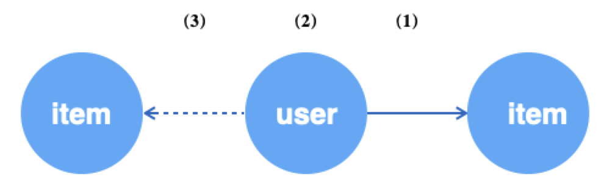

# Graph Sampling Language（GSL)

<a name="TUTVl"></a>
# 1. Introduction
There has been a well-developed programming paradigm since Graph Neural Network (GNN) was introduced. There are two stage of GNN model development, which are graph data processing and building neural network by Deep Learning framework like Tensorflow and Pytorch. How to design and implement the pattern of accessing graph data efficiently and effectively has become the focus of Graph Learn.<br />
<br />In reality, sampling is necessary due to large scale of graphs. There are several graph sampling techniques:

- Traversal based sampling, the process of visiting (checking and/or updating) each vertex in a graph
- Neighborhood/Subgraph sampling, obtain the Nth neighbors or generate a subgraph from vertices for training sets
- Negative sampling, the opposite of Neighborhood sampling, is usually used to generate negative samples in unsupervised learning

<br />So we created the Graph Sampling Language (GSL)  which is an interface of above sampling techniques. Developers can describe the GNN data stream by using GSL. For example, in the "customer clicks a product" use case, developer can sample 64 users randomly and sample 10 relative products for each user based on the weight of the edge.

```python
g.V("user").batch(64).outV("click").sample(10).by("edge_weight")
```

GSL supports super large graph, heterogeneous graph and property graph and has similar syntax like [Gremlin](http://tinkerpop.apache.org/docs/current/reference/#_tinkerpop_documentation) which is easy to understand.

<a name="KFXRf"></a>
# 2 GSL Syntax

We call a GSL statement a query, which consist of three types of operations: SOURCE, STEP and SINK. SOURCE is the entrance of a query, indicating which data to start from; STEP is the path to walk through and sample data during the query process, and SINK is the encapsulation of execution results. In GSL, a query must have  a SOURCE and SINK.

<a name="5xWGq"></a>
## 2.1 SOURCE
<a name="IHxBA"></a>
#### 2.1.1 V/E

SOURCE is the entrance of a GSL query, supporting  `V()` 和 `E()` APIs, which represent querying from vertices and edges respectively.

```python
def V(node_type, feed=None)
"""
Args:
  node_type(string): vertex type, the following operations are based on the vertex type;
  feed(None | numpy.ndarray | types.GeneratorType): 
      None means to get the vertex id from the graph;
      Otherwise, it allows users to define the data source, for example numpy array or Generator;
Return:
  a Query object
"""

def E(edge_type, feed=None)
"""
Args:
  edge_type(string): Edge type, the following operations are based on the vertex type;
  feed(None | (numpy.ndarray, numpy.ndarray) | types.GeneratorType): 
      None means to get the edge's src_id and dst_id from the graph;
      Otherwise, it allows users to define the data source, for example numpy array or Generator;
Return:
  a Query object
"""
```

<a name="t34wT"></a>
### 2.1.2 shuffle

`V()` and `E()` can be followed by `shuffle()`.  `shuffle()` is an optional API，which provides options to sample the data randomly when `feed` is set to `None`. 

```python
def shuffle(traverse=False):
"""
Args:
  traverse(boolean): if traverse the data source，default is False。
      True means traverse and raises OutOfRangeError at the end. False won't raise OutOfRangeError.
Return:
  a Query object
"""
```

<a name="W56KH"></a>
### 2.1.3 batch

When `feed` is `None`, `batch()` determines how much data `V()` and`E()` query each time. If you need to use `shuffle`, make sure you use it before `batch()`. When `shuffle(traverse=True)`, it won't return `OutOfRangeError` but the remaining data if the remaining data is less than the `batch_size` but not 0. It only returns `OutOfRangeError` if the remaining data is 0.

```python
def batch(batch_size):
"""
Args:
  batch_size(int): the amount of data of each batch
Return:
  a Query object
"""
```

<a name="WQ5EP"></a>
### 2.1.4 examples

Randomly sample 64 user type vertices.

```python
g.V("user").shuffle().batch(64)
```

Provide ids for the user type vertices.

```python
g.V("user", feed=np.array([1, 2, 3]))
```

Get user type vertices from a generator.

```python
def gen():
  while True:
    yield  np.array([1, 2, 3])

generator = gen()
g.V("user", feed=generator)
```

Get 64 buy type edges in order.

```python
g.E("buy").shuffle(True).batch(64)
```

Provide src_id and dst_ids for buy type edges.

```python
g.E("buy", feed=(np.array([1, 2, 3]), np.array([4, 5, 6]))
```

Get buy type edges from a generator.

```python
def gen():
  while True:
    yield  (np.array([1, 2, 3]), np.array([4, 5, 6]))

generator = gen()
g.E("buy", feed=generator)
```


<a name="5kq55"></a>
## 2.2 STEP

STEP is the path to walk through and sample data during the query process. A query can have 0 or more STEPs. So far, STEP has two types of APIs, which are path and sampling.

Path means the transfer of the current object. For example, `g.V()` represents the vertices of the current object, which can be transferred from a vertex to an outgoing edge by `outE()` and the following operations will be based on edges. When the edge's operations completed, it can be transferred back to the vertices by `inV()` or `outV()`.

```python
def inV():
""" followed by edges and the following operations are edge operations. inV() represents a destination vertex.
Return:
  a Query object
"""

def outV():   
""" followed by edges and the following operations are edge operations. inV() represents a source vertex.
Return:
  a Query object
"""

def inE(edge_type):
""" followed by vertices and the following operations are vertex operations.inE() represents an ingoing edge.
Args:
  edge_type(string): edge type, it returns an error when the edge is a directed edge.
Return:
  a Query object
"""

def outE(edge_type):
""" followed by vertices and the following operations are vertex operations.inE() represents an outgoing edge.
Args:
  edge_type(string): edge type
Return:
  Query对象
"""

def inV(edge_type):
""" followed by vertices and the following operations are vertex operations. inV(edge_type) represents an upstream vertex.
Args:
  edge_type(string): edge type，it returns an error when the edge is a directed edge.
Return:
  a Query object
"""

def outV(edge_type):
""" followed by vertices and the following operations are vertex operations. inV(edge_type) represents the downstream vertex.
Args:
  edge_type(string): edge type
Return:
  a Query object
"""

def outNeg(edge_type):
""" followed by vertices and the following operations are vertex operations. outNeg(edge_type) represents the downstream vertex from negative sampling of the edge.
Args:
  edge_type(string): edge type
Return:
  a Query object
"""
    
def inNeg(edge_type):
""" followed by vertices and the following operations are vertex operations. inNeg(edge_type) represents the upstream vertex from negative sampling of the edge.
Args:
  edge_type(string): edge type，it returns an error when the edge is a directed edge.
Return:
  a Query object
"""

def Neg(node_type):
""" followed by vertices and the following operations are vertex operations. Neg(node_type) represents the negative samples of the vertex candidates.
Args:
  node_type(string): vertex type
Return:
  a Query object
"""

def each():
""" used in multi-branch path, a query has one each() at most and each branch doesn't support merging.
"""

def alias():
""" Give sampling path an alias.
Return:
  a Query object
"""
```

The following is the interface that describe the sample method. Based on the previous steps description and the current object is a node, we can get how to sample the node as the neighbor of the preivous node, including the sample size and strategy. To learn more about the sample strategy, please read [graph sampling](graph_sampling_cn.md) and [negative sampling](negative_sampling_cn.md).
```python
def sample(N):
""" 承接顶点（只能跟在顶点操作之后），the number of neighbors of previous node 
Args:
  N(int): sampling size
Return:
  a Query object
"""

def by(strategy):
""" follow sample()，sampling strategy
Args:
  strategy(string): sampling strategy
      if the previous step is sampling, the supported strategies are
      if the previous step is sampling, the supported strategies are “edge_weight”, "in_degree", "topk", "random", "full";
      f the previous step is negative sampling, the supported strategies are "in_degree", "random", "node_weight"
Return:
  a Query object
"""
```

<a name="wOTQV"></a>
### 2.2.1 out*, in*

`out*()` and ` in*()` are used to decribe forward and backward propgation while travering.

For example, in the following heterogeneous graph, start from 'user' vertices, sample user's one-hop neighbors along the 'u2i' edge, and then sample the user's two-hop neighbors along the 'i2i' edge.

<div align=center> </div>

```python
g.V("user").batch(64)                       # (1) randomly get 64 'user' vertices
 .outV("u2i").sample(10).by("edge_weight")  # (2) sample 10 neighbors of each 'user' vertices
 .outV("i2i").sample(15).by("random")       # (3) for each neighbor, sample 15 neighbors
```

If data source is edges, you can obtain the edges and operate on their endpoints respectively. In general, these edges is often used for unsupervised learning, using the edges as positive samples, and then sampling the source vertices of the edges as negative neighbors as negative samples.

<div align=center> </div>

```python
g.E("u2i").batch(64)                     # (1) randomly get 64 'u2i' edges
 .ouV()                                  # (2) get the source vertex that is user
 .outNeg("u2i").sample(10).by("random")  # (3) for each user vertex, sample 10 negative neighbors
```

When the edge is undirected, circular sampling can be done by `outV()` and `inV()`. The source vertex and the destination vertex are neighbors of each other.

<div align=center> </div>

```python
g.V("user").batch(64)                   # (1) randomly get 64 'user' vertex
 .outV("u2i").sample(10).by("random")   # (2) for each 'user' vertex, sample 10 neigbors (item)
 .inV("u2i").sample(5).by("random")     # (3) for each 'item' vertex, sample 10 neigbors (user)
```

<a name="TTlWe"></a>
### 2.2.2 each

A typical GNN algorithm often has multiple requirements for graph data, rather than just query the final result. The `each()` interface is used to express multiple branches of Query. When a certain stage is reached, different operations are performed on the previous results (there may be multiple). There is at most one `each()` in each query, and it is the last operation of the query.

```python
def each(func):
""" 
Args:
  func(lambda): the lambda function to build the sub-query. The input of the function is the output of the immediately upstream operation.
Return:
  a Query object
"""
```

For example, in the user-item-item GraphSAGE algorithm, in order to learn the similarity between user and item in the same space, we first randomly obtain the u2i edges from the graph as the positive sample for training. Then, we sample the negative neighbors (item) of the source vertex (user) to generate a negative sample. The user vertex encodes the one-hop neighbors (aggregating neighborhood information to the central node). The item vertex also encodes the one-hop neighbors. An example is shown below.


<div align=center> </div>

```python
g.E("u2i").shuffle().batch(512)                            # (1) randomly get 512 u2i edegs
 .each(lambda edge:                                        # edges from upstream
    (edge.outV().outV("u2i").sample(10).by("edge_weight"), # (2) sample 10 neighbors of the source vertex (user)
     edge.inV().outV("i2i").sample(10).by("random"),       # (3) sample 10 neighbors of the destination vertex (item)
     edge.outV().outNeg("u2i").sample(5).by("in_degree") \ # (4) sample 5 negative neighbors of user vertex
         .outV("i2i").sample(10).by("random")))            # (5) sample 10 neighbors of the negative neighbor of user vertex

```

Please note that the result of the branched query is complecated, and the result from branches are not in order. Therefore, we strongly recommend to use `each()` together with `alias()` introduced in the following section.

<a name="wHdJ3"></a>
### 2.2.3 alias

`alias()` is used to label the name of the current SOURCE or STEP, which makes accessing the output results easier. In particular, when the query is long and we need to keep the results of each step, `alias()` is conveniet to access these results.

```python
def alias(name):
""" 
Args:
  name(string): the alias of the operation。
Return:
  a Query object
"""
```

If we use `each()` in the query, we can give alias for each step.

```python
g.E("u2i").shuffle().batch(512).alias("edges")
 .each(lambda edge:
    (edge.outV().outV("u2i").sample(10).by("edge_weight").alias("src_1hop"),
     edge.inV().outV("i2i").sample(10).by("random").alias("dst_1hop"),
     edge.outV().outNeg("u2i").sample(5).by("in_degree").alias("neg_i") \
     .outV("i2i").sample(10).by("random").alias("neg_i_1hop")))

```

<a name="MI24G"></a>
### 2.2.4 repeat
When the query is relatively long and the operation is repeated, you can use `repeat()` to simplify the writing. For example, for a certain isomorphic undirected graph, sample its 10-hop neighbors from the vertex. It takes in a function, similar to the one in ʻeach()`, which means that the operation represented by the function is repeated `times` times.
```python
def repeat(self, func, times, parmas_list=None):
"""
Args:
  func(function): The function body to be expanded; the first parameter is the object to be executed.
  times(int): the number of times func is repeated.
  params_list(list): The input parameter of func, if it is not None. The signature of func must be func(x, params=None)
      Each item in params_list will be used as a parameter every time func is called, so the size of params_list must be times.
Return:
  Query object
"""
```

<br />The first parameter of func takes the upstream output, which can be Node or Edge. The operations in func need to comply with the syntax specifications of Node and Edge. For example, the following Query obtains vertices on the undirected graph i-i, and then expands to 3-hop neighbors.
```python
func = lambda v: v.outV("i-i").sample(5).by("random")
q = g.V("item").batch(64).repeat(func, 3).values()
g.run(q) # return a list of Nodes,
         # shapes are [[64], [64, 5], [64*5, 5], [64*5*5, 5]]
```
The aforementioned Query is equivalent to:
```python
q = g.V("item").batch(64)                \
     .outV("i-i").sample(5).by("random") \
     .outV("i-i").sample(5).by("random") \
     .outV("i-i").sample(5).by("random")
```
Example for func with parameter as follows:
```python
def func(v, params):
    return v.outV("i-i").sample(params[0]).by(params[1])

q = g.V("u-i").batch(64) \
     .repeat(func, 2, params_list=[(5, "edge_weight"), (10, "random")]) \
     .values()
g.run(q)
```


<a name="xDuJp"></a>
## 2.3 SINK
Each Query must end with a **SINK** operation, which means that the current Query is completed and can be used to analyze execution or return results. **SINK** operation has two interfaces, `values()` and `emit()`. The **SINK** operation can only be called once in a Query.
-`values` returns the entire query, which can be executed multiple times. It is generally used when **SOURCE** is traversal.
-`Emit` directly gets the execution result of this query. It is generally used when **SOURCE** is a vertex or edge with a given id.


<br />
The **SINK** operation can receive a func parameter, which is used to post-process the returned result. Each **SOURCE** and **STEP** operation will return a **`Nodes`** object or **`Edges`** object (the sampling STEP with `full` as its sampling strategy returns **SparseNodes** or **SparseEdges** object), related to the object of the operation.
<br /> For example, the **SOURCE** or **STEP** of the `*V()` and `*Neg()` series corresponds to the `Nodes` object (the sampling STEP with `full` as its sampling strategy returns ** SparseNodes**).
<br />
The **SOURCE** or **STEP** of the `*E()` series corresponds to the ʻEdges` object (the sampling STEP with `full` as its sampling strategy returns **SparseNodes**). For instruction on how to get the value of `Nodes`/ʻEdges`/`SparseNodes`/`SparseEdges` object, please refer to [API](graph_query_cn.md#FPU74).<br />
<br />Before **SINK**, Query described multiple operations. These operations may have `alias()` or not.
-For Query without ʻalias()`, the results of all operations will be returned, arranged in a list object according to the order in the Query. Each element in this returned list is `Nodes` or `Edges`. One thing needs to pay attention is that the order here does not include the existence of branches. If there are branches, please use `alias()`.
-When there is `alias()`, the return result is a dict, where the key is the name passed by `alias()` and the value is the corresponding `Nodes` or `Edges`.


<a name="FOeWa"></a>
### 2.3.1 values
The generator that returns the execution result of the query can be executed by `g.run()`, which is suitable for recursive training settings.
```python
def values(func=None):
"""
Args:
  func(function): Post-processing function that returns the result
Return:
  Generator that returns the execution result
"""
```

<br />func can be an anonymous function or a function defined by def. The input of func is a dict or list, depending on whether there exists ʻalias()`.
```python
def func(x):
    """ x refers to {'a':Nodes, 'b':Nodes, 'c':Edges, 'd':Nodes}
    """
    src_ids = x['a'].ids
    src_attrs = x['a'].attrs
    neg_attrs = x['b'].attrs
    edge_weights = x['c'].weights
    ...
    return encode_fn(src_atrs, neg_attrs, ...)

q = g.V("user").shuffle().batch(512).alias('a')             \
     .outNegV("u2i").sample(5).by("in_degree").alias('b')   \
     .outE("i2i").sample(5).by("topK").alias('c')           \
     .inV().alias('d')

gen1 = q.values(func)
gen2 = q.values(lambda x: (x['a'].ids, x['b'].attrs, x['c'].weights, x['d'].attrs))
```


```python
gen = g.V("u-i").batch(3)                  \ # (0)
       .outV("i-i").sample(2).by("random") \ # (1)
       .outV("i-i").sample(2).by("random") \ # (2)
       .values()

res = g.run(gen)  # res = [Nodes, Nodes, Nodes]
print(res[0].ids)
```


<a name="tbPOc"></a>
### 2.3.2 emit
`Emit()` is equivalent to the combination of `values()` and a `g.run()`, which means that the current Query is executed once and the result is returned. The result is a dict or a list depending on whether there exists `alias()`. Under normal circumstances, `emit()` is used in the debugging phase to verify the correctness of the code and data.
```python
def emit(func=None):
"""
Args:
  func(function): Post-processing function that returns the result
Return:
  dict or list object, where each element is Nodes or Edges
"""
```


```python
res = g.V("item", feed=np.array([1, 2, 3])) \ # (0)
       .outV("i-i").sample(2).by("random")  \ # (1)
       .outV("i-i").sample(2).by("random")  \ # (2)
       .emit()

# res = [Nodes, Nodes, Nodes]
print(res[1].ids)
```

<br />
Worth noticing that when the query only contains Soure (`g.V()` / `g.E()`), `emit()` directly returns the data of list[0].<br />

<a name="dF3l2"></a>
# 3 Query execution
<a name="Cmqcj"></a>
## 3.1 run
`run()` interface is used to execute Query and get the final result. The result form is defined by the func function of the `values()` interface. You can refer to the usage example in the [`values`](#FOeWa) section.
```python
def run(generator):
"""
Args:
  generator: Query's generator
Return:
  Query result, whose format is determined by the values() interface
"""
```


<a name="h7Pvb"></a>
## 3.2 与TensorFlow结合
`values(func)` returns a generator whose returned data type is defined by func. This generator can be directly connected to TensorFlow[tf.data.Dataset](https://www.tensorflow.org/api_docs/python/tf/data/Dataset)。<br />
```python
query = g.E("u2i").shuffle().batch(512).alias("edges")
         .each(lambda edge:
               (edge.outV().outV("u2i").sample(10).by("edge_weight").alias("src_1hop"),
                edge.inV().outV("i2i").sample(10).by("random").alias("dst_1hop"),
                edge.outV().outNeg("u2i").sample(5).by("in_degree").alias("neg_i") \
                  .outV("i2i").sample(10).by("random").alias("neg_i_1hop"))) \
         .values()
    
ds = tf.data.Dataset.from_generator(query, ...)
value = ds.make_one_shot_iterator().get_next()
```
