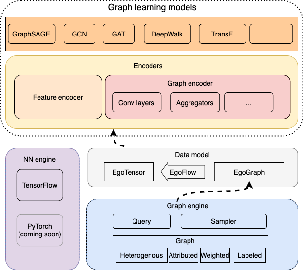
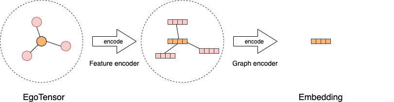

# 图学习模型

## 总览
图学习算法的实现目前主要有两种方式。第一种是直接以全图为计算对象，
原始的GCN，GAT等算法都是这种实现思路，一般会直接用邻接矩阵进行计算。
然而这种方法在大规模图上会消耗大量内存，导致无法高效训练甚至无法训练。
第二种思路是将全图分成若干子图，用深度学习里常用的批次训练方法进行训练，
每次训练一个子图，代表方法是GraphSAGE，FastGCN, GraphSAINT等。

**GL** 主要面向超大规模图神经网络的开发。它由底层的一个图引擎和上层的
算法模型构成。图引擎分布式存储图的拓扑和属性信息并提供高效的图采样查询
接口，算法模型通过调用图采样和查询接口获取子图并进行计算。

**GL** 提供了一个图学习算法的统一编程框架，支持常见图学习算法的开发，包括
GNNs, 知识图谱模型，图嵌入算法等，并且和主流的深度学习算法兼容，包括TensorFlow
和PyTorch。目前我们实现了基于TensorFlow的模型，基于PyTorch的模型正在开发中。

## 数据模型
**GL** 采用采样子图再计算的方式构建和训练模型。我们首先介绍一下基本的数据模型。

`EgoGraph` 是图学习算法编程的基本数据对象。它由一个batch的种子点或者边(称为'ego')
以及他们的'感受野'(多跳邻居)组成。`EgoGraph`由图采样和查询到的数据组成，我们实现
了常见的邻居采样、图遍历和负采样方法。

采样的数据组织成numpy格式的`EgoGraph`后根据不同的深度学习引擎转换成对应的tensor格式
`EgoTensor`，然后用`EgoFlow`管理`EgoGraph`到`EgoTensor`的转换，提供训练所需要的数据。

## 编码器

所有的图学习模型可以抽象为使用编码器将`EgoTensor`编码成最终的点、边或者子图的
向量。**GL** 首先利用特征编码器来编码原始的点和边上的特征，然后将特征编码器编码后的
原始向量用不同的图编码器进行编码，得到最终的输出。对于大多数GNN模型，图编码器
提供了如何聚合邻居信息到自身节点或者边的抽象，用不同的图卷积层实现。

基于上面介绍的数据模型和编码器，我们可以简单快速地实现不同的图学习算法。在[自定义算法](algo_cn.md)一章里，我们详细介绍了如何开发一个GNN模型。
