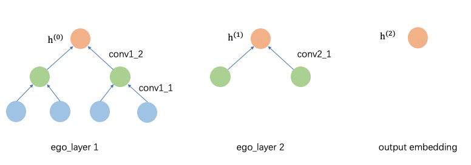
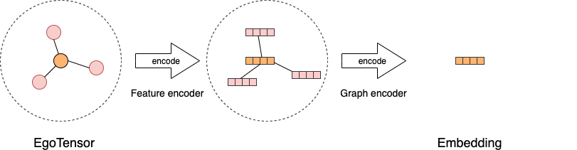

# Graph Learning Model

## Overview
There are two ways to develop a graph learning model. The first is to
compute base on the whole graph directly. The examples are GCN and GAT
that perform computations directly on an adjacency matrix. However, this
method consumes a large amount of memory on large-scale graphs. As a
result, it may cause poor performance of training. In some cases,
training is even not possible. The second idea is to divide the whole
graph into several subgraphs so that we can use batch training, which is
a common technic in deep learning, for training. We can use
GraphSAGE，FastGCN and GraphSAINT methods to train a subgraph.

**GL** is designed for large-scale graph neural
networks. It consists of an efficient graph engine, a set of user-friendly APIs,
and a rich set of built-in popular GNN models.
The graph engine stores the graph topology and attributes distributedly, 
and support efficient graph sampling amd query. 
It can work with popular tensor engines including TensorFlow and PyTorch.
In the following, our model implemnetations are based on TensorFlow.

**GL** is a graph learning framework that supports building common graph learning algorithms, such as GNNs, knowledge graph models, graph embedding algorithms, etc. It also compatible with common deep learning algorithms including TensorFlow and PyTorch.
Currently, our model implementations are based on TensorFlow. The ones are based on PyTorch are under development.

## Data model
To build and train a model, **GL** usually samples subgraphs as the training data,
and perform batch training with it. We start with introducing the basic data model.

`EgoGraph` is the underlying data model in **GL**. It consists of a
batch of seed nodes or edges(named ‘ego’) and their receptive fields
(multi-hops neighbors). We implement many build-in samplers to traverse
the graph and sample the neighbors. Negative samplers are also implemented
for unsupervised training.

The sampled data grouped in `EgoGraph` is organized into numpy format.
It can be converted to different tensor formats, `EgoTensor`, based on
the different deep learning engine. **GL** uses `EgoFlow` to convert
`EgoGraph` to `EgoTensor`. 
And the `EgoTensor` serves as the training data.

## Encoder

A graph learning model can be viewed as using an encoder to
encode the ``EgoTensor`` of a node, edge or subgraph into a vector.

**GL** first uses feature encoders to encode 
raw features of nodes or edges, and the produced feature embeddings are 
then encoded by different graph encoders 
to produce the final embedding vectors. 
For most of GNN models, graph encoders provide a way to generate an abstraction of a target node or edge 
by aggregating information from its neighbors.
This aggregation and encoding are usually
implemented by many different graph convolutional layers.

Based on the data models and encoders discussed above, one can easily implement different graph learning models. We introduce in detail how to develope a GNN model in [Developing Your Own Model](algo_en.md)

[Home](../README.md)
