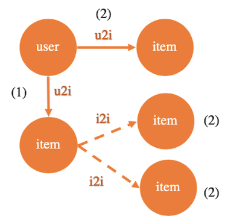

# Introduction

A lot of **GNN** developers have the research background of Graph.
To simplify the usage and make it more closer to graph grammar, **GL** designs the **Gremlin-Like API**.
The **API**s implement basic graph queries, as well as extentions to adapt for **GNN** domain.


All the **API**s start from a [**Graph**](graph.md) object. Next we will introduce each of them in detail.


# Basic Concepts

The **Gremlin-Like API** is described by a `Query` object.
A typical behavior contains three states: start from a **Source**, do some **Step**s, and then **Sink** the values. 

## Query  

The query object is used to describe a kind of user behavior.
It must begin from a **Source** and end up with a **Sink**. Query includes **VertexQuery** and **EdgeQuery**.
VertexQuery is Query on the Nodes, EdgeQuery is Query on the Edges.  
You can not get the response values until the query object is executed.


## Source

The **Source API** includes `V()` and `E()`. It means the source data comes from **Nodes** or **Edges**.
The **Source API** returns a `Query` object.

## Step

The **Step API** contains **Traversal**, **Sampling**, and **Negative sampling**. More graph operations will be extend later.
The **Step API** returns a `Query` object.

## Sink

Sink conducts as the end of the description of query. When the query being executed,
Nodes and Edges traversed would be generated as the lambda function of Sink describes. 


## Nodes

As returned values of **VertexQuery**. The field lists are: `ids`, `type`, `shape`, `int_attrs`, `float_attrs`, `string_attrs`,
`weights` and `labels`.

All of them are **NumPy** object or list. 

**`SparseNodes`** is a subclass of `Nodes`, additional fields are: `dense_shape`, `offsets`, `indices`.

## Edges

As returned values of **EdgeQuery**. The field lists are: `src_ids`, `dst_ids`, `src_type`, `dst_type`, `edge_type`, `shape`,
`int_attrs`, `float_attrs`, `string_attrs`, `weights` and `labels`. 

All of them are **NumPy** object or list. 

**`SparseEdges`** is a subclass of `Edges`, additional fields are: `dense_shape`, `offsets`, `indices`.


# Source

Includes `V()` and `E()`.

## V()

Traverse **Graph** from a batch of nodes. The nodes can be assigned with given **IDs**, or generated from the loaded **Graph**.

```python
def V(Graph, node_type, feed=None):
"""
node_type (string): type of node
feed (None | numpy.ndarray | types.GeneratorType | `Nodes` object):
  None: Default. Sample nodes with the following shuffle() and batch() API.
  numpy.ndarray: Any shape of ids.
  types.Generator: A generator of numpy.ndarray.
  `Nodes` object: A Nodes object.
"""
``` 

**Examples**

```python
# Lookup nodes whose IDs are 0, 2, 8.
res = g.V("user", feed=np.array([0, 2, 8])).emit(lambda v: v.weights)
# res: [0.0, 0.2, 0.8]
```

```python
# Traverse nodes from graph until all the nodes are visited.
gen = g.V("user").batch(3).values(lambda v: v.ids)
while True:
  try:
    print("next round: ", g.run(gen))
  except gl.OutOfRangeError:
    break

# Traverse nodes with shuffle from graph until all the nodes are visited.
gen = g.V("user").batch(3).shuffle(traverse=True).values(lambda v: v.ids)
while True:
  try:
    print("next round: ", g.run(gen))
  except gl.OutOfRangeError:
    break

# Traverse nodes randomly from graph, which will not be OutOfRange.
gen = g.V("user").batch(3).shuffle().values(lambda v: v.ids)
for i in range(3):
    print(" next round: ", g.run(gen))
``` 

## E()

Traverse **Graph** from a batch of edges. The edges can be assigned with given **IDs**, or generated from the loaded **Graph**.

**Notes:** Getting the `int_attrs`, `float_attrs`, `string_attrs`, `weights`, `labels` from the returned `Edges` of `E(edge_type, feed=...)` with given `src_ids`, `dst_ids` is not supported for now.

```python
def E(Graph, edge_type, feed=None):
"""
edge_type (string): type of edge
feed (None | numpy.ndarray | types.GeneratorType | `Edges` object):
  None: Default. Sample edges with the following shuffle() and batch().
  (numpy.ndarray, numpy.ndarray): (src_ids, dst_ids), src_ids and dst_ids must be the same shape.
  types.Generator: A generator of (numpy.ndarray, numpy.ndarray).
  Edges: An Edges object.
"""
```

**Examples**

```python
# OK
res = g.E("buy", feed=(np.array([0, 2, 8]), np.array([0, 2, 8])).emit(lambda e: e.src_ids)

# Failed. Not support for getting attrs of Edges with given src_ids, dst_ids.
res = g.E("buy", feed=(np.array([0, 2, 8]), np.array([0, 2, 8])).emit(lambda e: e.int_attrs)
# res: [0, 2, 8]

# OK
edges = gl.Edges(src_ids, src_type, dst_ids, dst_type, edge_type)
res = g.E("buy", feed=edges).emit(lambda e: e.src_ids)

# Failed. Not support for getting attrs of Edges with given src_ids, dst_ids.
edges = gl.Edges(src_ids, src_type, dst_ids, dst_type, edge_type)
res = g.E("buy", feed=edges).emit(lambda e: e.int_attrs)

# OK. Edges are with given src_ids, dst_ids, edge_ids.
edges = gl.Edges(src_ids, src_type, dst_ids, dst_type, edge_ids, edge_type)
res = g.E("buy", feed=edges).emit(lambda e: e.int_attrs)
```

```python
# Traverse edges from graph until all the edges are visited.
gen = g.E("buy").batch(3).values(lambda e: (e.dst_ids, e.weights))
while True:
  try:
    print("next round: ", g.run(gen))
  except gl.OutOfRangeError:
    break

# Traverse edges with shuffle from graph until all the edges are visited.
gen = g.E("buy").batch(3).shuffle(traverse=True).values(lambda e: (e.dst_ids, e.int_attrs))
while True:
  try:
    print("next round: ", g.run(gen))
  except gl.OutOfRangeError:
    break

# Traverse edges randomly from graph, which will not be OutOfRange.
gen = g.V("user").batch(3).shuffle().values(lambda e: (e.dst_ids, e.float_attrs))
for i in range(3):
    print("next round: ", g.run(gen))
``` 

# Step
Includes traversal Steps, Sampling, Negative Sampling Steps and other Steps.    

- **Traversal Steps**

Traverse along paths, from one traversed-object to another traversed-object. While **traversed-object**
represents the current `Nodes` or `Edges`.

|   Step   |     Input     |                      Traverse path                          |     Output     |
| -------- | ------------  | ----------------------------------------------------------- | -------------- |
|  outV()  | VertexQuery   |Traverse to the destination node along the edge              | VertexQuery    |
|  outV()  | EdgeQuery     |Traverse to the node which the current edge's arrow from     | VertexQuery    |
|  inV()   | VertexQuery   |Traverse to the source node along the edge                   | VertexQuery    |
|  inV()   | EdgeQuery     |Traverse to the node which the current edge's arrow points to| VertexQuery    |
|  outE()  | VertexQuery   |Traverse to the edge whose source node is the current node   | EdgeQuery      |
|  inE()   | VertexQuery   |Traverse to the edge whose dst node is the current node      | EdgeQuery      |
|  outNeg()| VertexQuery   |Traverse to the dst negative node along the edge             | VertexQuery    |
|  inNeg() | VertexQuery   |Traverse to the source negative node along the edge          | VertexQuery    |

- **Sampling / Negative Sampling Steps**

Includes `sample()`-step and `by()`-step. Always follows behind traversed-object.
Please refer to [Sampling Query](sampling.md) and [Negative Sampling Query](neg_sampling.md)
for details.

- **Other Steps**

Includes `alias()`-step, `each()`-step and `repeat()`-step.

## outV()

`outV(edge_type)` . Nodes to Nodes. Traverse to the destination node along the edge.

For exmaple, the topology is nodeA--(edge)-->nodeB,
nodeA.outV(edge) is nodeB.
  
  
`outV()` . Edges to Nodes. Traverse to the node which the current edge's arrow from.

For exmaple, the topology is nodeA--(edge)-->nodeB,
edge.outV(edge) is nodeA.


## inV()

 `inv(edge_type)`. Nodes to Nodes. Traverse to the source node along the edge. The edge must be undirected.

For exmaple, the topology is nodeA--(edge)-->nodeB,
nodeB.inV(edge) is nodeA.
  

`inV()`. Edges to Nodes. Traverse to the node which the current edge's arrow points to.

For exmaple, the topology is nodeA--(edge)-->nodeB,
edge.inV(edge) is nodeB. The edge must be undirected.

## outE()

`outE(edge_type)`. Nodes to Edges. Traverse to the edge whose source node is the current node.

For exmaple, the topology is nodeA--(edge)-->nodeB,
nodeA.outE(edge) is edge.

## inE()

`inE(edge_type)`. Nodes to Edges. Traverse to the edge whose dst node is the current node.

For exmaple, the topology is nodeA--(edge)-->nodeB,
nodeB.inE(edge) is edge.

## outNeg()  

`outNeg(edge_type)`. Nodes to Nodes. Traverse to the dst negative node along the edge.

For exmaple, the topology is nodeA--(edge)-->nodeB,
nodeA.outNeg(edge) is nodeB.

## inNeg() 

`inNeg(edge_type)`. Nodes to Nodes. Traverse to the source negative node along the edge. 
The edge must be undirected.

For exmaple, the topology is nodeA--(edge)-->nodeB,
nodeB.outNeg(edge) is nodeA.

## each()  
Generally, the steps traverse on a single path. But in many situations, several branches of steps could 
be the children of the current traversed object like a tree.  

The do such **tree-traversal** computations, `each()`-step exists.  


```python
def each(Query, func):
'''
func: a function or lambda function, to construct several 
      queries for current traversed object.
Return: the query itself.
'''
```

**Examples**

As shown in the following picture, traverse from (1) and then traverse to three (2).  
 
<p align=center>

<p align=center>Figure 1: An example of `each` step usage</p>
</p>


```python
g.E("u2i").shuffle().batch(512) \
 .each(lambda edge:
       (edge.outV().outE("u2i").sample(10).by("edge_weight"),
        edge.inV().outNeg("i2i").sample(10).by("in_degree"),
        edge.inV().outNeg("i2i", edge.outV()).sample(10).by("edge_weight")))
```

## alias()  
The `alias()`-step is not a real step, similar to `as()`-step in Gremlin.
 
`alias()` names current traversed object which can later be accessed by **sink** API(`values()`/`emit()`).

```python
def alias(Query, name):
'''
name: string, mark the traversed object with a name.
Return: the query itself.
'''
```

**Example**
```python
query = g.E("u2i").shuffle().batch(512).alias('a')  \
         .each(lambda edge:
               (edge.outV().outE("u2i").sample(10).by("edge_weight").alias('b'),
                edge.inV().outNeg("i2i").sample(10).by("in_degree").alias('c'),
                edge.inV().outNeg("i2i", edge.outV()).sample(10).by("edge_weight")))
query.values(lambda x: (x['a'], x['b'], x['c']))
```

## sample()
The `sample()`-step is used for sampling number of current traversed-object for each previous traversed object.
`sample()`-step is always combined with `by()`-step, which indicates the sampling strategy.

Please refer to [sampling](sampling.md) and [neg_sampling](neg_sampling.md) for details.

## repeat()
The `repeat()`-step is used for looping over a fragment of query.

```python
def repeat(Query, func, times, params_list=None, alias_list=None):
''' Repeat a query fragment N times.

func: a python function or lambda function, inputs are with two args: (`Query`, params=None).
  `Query` is the returned value of previous step, params is one of the  
  param_list element. If params_list is not None, the func must have second arg as `params` ,
  and use params in the function block. The start and end traversed object in the func must
  be both Edge or both Node, it means the input and output of func must be both `VertexQuery`
  or both `EdgeQuery`.
times: int, how many times the function would repeat.
params_list: list, if not None, length of params_list must be equal to times. 
  Each element is the input of func as arg `params`. Default is None.
alias_list: list, if not None, length of alias_list must be equal to times. 
  Names for last traversed object of each loop. Default is None.           
'''
```

**Examples**
```python
# Sample along "i-i-i-i" path:
# The original query:
q = g.V("item").batch(64).outV("i-i").sample(5).by("random") \
     .outV("i-i").sample(5).by("random")                     \
     .outV("i-i").sample(5).by("random").values()
g.run(q)

# Query use `repeat()`, equal to the query above.
func = lambda v: v.outV("i-i").sample(5).by("random")
q = g.V("item").batch(64).repeat(func, 3).values()
g.run(q) # return a list of Nodes,
         # shapes are [[64], [64, 5], [64*5, 5], [64*5*5, 5]]
```

```python
# Sample alone "i-i-i-i" path wth different strategy on each loop,
# and alias last traversed object for each loop.
def func(q, params):
  return q.outV("i-i").sample(5).by(params)
q = g.V("item").batch(64)                                                                             \
     .repeat(func, 3, params_list=["random", "edge_weight", "in_degree"], alias_list=["a", "b", "c"]) \
     .values()
g.run(q)

# The above query and result equals to:
q = g.V("item").batch(64)                                \
     .outV("i-i").sample(5).by("random").alias("a")      \
     .outV("i-i").sample(5).by("edge_weight").alias("b") \
     .outV("i-i").sample(5).by("in_degree").alias("c")   \
     .values()
g.run(q)
```

```python
# A wrong func:
func = lambda v: v.outE("i-i").sample(5).by("random")
q = g.V("item").batch(64).repeat(func, 3).values()
# func input with a VertexQuery and output with an EdgeQuery.

# A wrong func:
func = lambda v: v.outV("i-u").sample(5).by("random")
q = g.V("item").batch(64).repeat(func, 3).values()
# the first traversal path is along "i-u", then the traversed-object is "user", it is
# not the source node type of edge "i-u"

```
# Sink 
Includes `values()`-sink and `emit()`-sink. 
The traversed-objects sink as `Nodes/SparseNodes` or `Edges/SparseEdges`, their base class is `Values`.  

`*V()`-step and `*Neg()`-step finally sink as `Nodes` or `SparseNodes`, 
and `*E()`-step finally sinks as `Edges` or `SparseEdges`.  

We can describe how to get the property of `Values` when sink, and get the exact value
when execute the sunk-query.

## values()
`values()`-sink returns a generator of the traversed-objects processed by lambda function.
Use `g.run()` to get the exact value generated from the generator.


```python
def values(func=None):
""" get the values with func.
func: a function like lambda, input of func is a dict, keys are the traversed-objects with `alias()`-step.
  Default is None, which means return the original dict.
  If traversed-objects without `alias()`-step, the query must have no `each()`-step, then values
  input a list.
"""
```

**Example**
```python
query1 = g.V("user").shuffle().batch(512).alias('a')          \
          .outNeg("u2i").sample(5).by("in_degree").alias('b') \
          .outE("i2i").sample(5).by("topK").alias('c')        \
          .inV().alias('d')                                   \
          .values(func)
 
def func(x):
  """
    input: {'a':Nodes, 'b':Nodes, 'c':Edges, 'd':Nodes}
  """
  src_ids = x['a'].ids
  src_attrs = x['a'].int_attrs
  neg_attrs = x['b'].int_attrs
  weight = x['c'].weights
  ...
  return src_ids, src_attrs, neg_attrs, weight

while True:
  try:
    g.run(query1)
  except gl.OutOfRangeError:
    break
```

```python
query2 = g.V("user").shuffle().batch(512).alias('a')              \
          .outNegV("u2i").sample(5).by("in_degree").alias('b')    \
          .outE("i2i").sample(5).by("topK").alias('c')            \
          .inV().alias('d')                                       \
          .values(lambda v: (v['a'].ids, v['b'].int_attrs, v['c'].weights, v['d'].int_attrs)
```

```python
# no `alias()`-step and no `each()`-step
query3 = g.V("u-i").batch(3)                  \ # (0)
          .outV("i-i").sample(2).by("random") \ # (1)
          .outV("i-i").sample(2).by("random") \ # (2)
          .values()
res = g.run(q)
# [Nodes_(0), Nodes_(1), Nodes_(2)]
res[0].ids
# [0, 1, 2]
```

## emit()
`emit()`-sink equals to `values()`-sink with `g.run()` one time.

It returns the exact `Nodes/SparseNodes`, `Edges/SparseEdges` object or thr property processed by lambda function.


```python
def emit(func=None):
""" 
func: a function like lambda, input of func is a dict.
  Default is None, which means return the original dict.
  If traversed-objects without `alias()`-step, the query must have no `each()`-step, 
  then emit input a list. When the query has Source step only, the emit receive a `Nodes` or 
  `Edges` object as the source traversed-object.
"""
```
**Example**

```python
g.V("item", feed=np.array([1, 2, 3])) \ # (0)
 .outV("i-i").sample(2).by("random")  \ # (1)
 .outV("i-i").sample(2).by("random")  \ # (2)
 .emit()
# [Nodes_(0), Nodes_(1), Nodes_(2)]
```

## Property of Values

For `V()`/`outV()`/`inV()`, `Nodes` or `SparseNodes` object sunk.
For `E()`/`outE()`/`inE()`, `Edges` or `SparseEdges` object sunk.

We list the properties of `Nodes` as following, please refer to [Values](../graphlearn/python/values.py) for details.

```python
ids          # ndarray
             #   for source, shape=[batch_size], 
             #   for traverse, shape=[batch_size, expand_factor], 
             #     while batch_size is the flatten shape of previous traversed-object
shape        # tuple, same as shape of ids
int_attrs    # ndarray, shape is [shape, num_int_attrs]
float_attrs  # ndarray, shape is [shape, num_float_attrs]
string_attrs # ndarray, shape is [shape, num_string_attrs]
weights      # ndarray, shape is same as shape of ids
labels       # ndarray, shape is same as shape of ids
type         # node type
```

[Home](../README.md)
