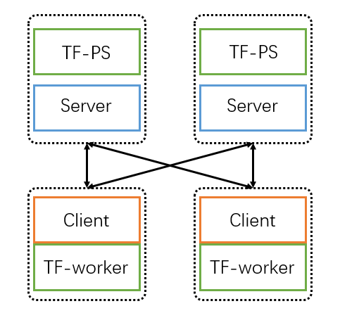

# Kubernets examples

1. Prepare data and code

You need to make sure that a distributed file system (eg, NFS) is mounted successfully either on each host machine or with [PVC](https://kubernetes.io/docs/concepts/storage/persistent-volumes/#persistentvolumeclaims).

Put directory [examples](https://github.com/alibaba/graph-learn/tree/master/examples) on it.

2. Train and evaluate with local mode.

```shell
cd tf/ego_sage/k8s
kubectl apply -f local.yaml
```

3. Train and evaluate with distribute mode.

With N **GL** Servers, we pre-split the source data with N partitions, then each Server read one of the parts to load.

```shell
cd tf/ego_sage/k8s
kubectl apply -f dist.yaml
```

`dist.yaml` is an example of launching a tensorflow-based **GL** job with 2 parameter-servers and 2 workers, using tf-operator. In this case, the same number of clients and servers of **GL** are co-placed with the workers and parameter-servers. The architecture is shown below.

**Note**: **GL** servers should use different grpc port with tf-PS.



