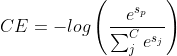

## 常见Loss

对应nn/tf/loss.py

### 推荐场景无监督loss
对于推荐无监督学习loss，我们实现了常见的两种loss函数，Sigmoid Cross Entropy loss(BCE)和Softmax Cross Entropy loss。
​

#### sigmoid_cross_entropy_loss

Sigmoid CE loss就是一个简单的二分类。

```python
def sigmoid_cross_entropy_loss(pos_logit,
                               neg_logit):
  """Sigmoid cross entropy loss.
  Args:
    pos_logit: positive logits, tensor with shape [batch_size]
    neg_logit: negative logits, tensor with shape [batch_size]
  Returns:
    loss, a scalar tensor
  """
  true_xent = tf.nn.sigmoid_cross_entropy_with_logits(
      labels=tf.ones_like(pos_logit), logits=pos_logit)
  negative_xent = tf.nn.sigmoid_cross_entropy_with_logits(
      labels=tf.zeros_like(neg_logit), logits=neg_logit)
  loss = tf.reduce_mean(true_xent) + 1.0 * tf.reduce_mean(negative_xent)
  return loss
```
​

#### unsupervised_softmax_cross_entropy_loss
Softmax CE loss，将负样本看作一个batch里共享的形式，从而可以将原来的二分类看成一个正样本和batch_size * neg_num 的负样本的一个“多分类”任务。我们将标签看成one-hot的编码格式，也即只有正样本标记为1，那么总的loss为：
​


其中，sp表示正样本的score。

```python
def unsupervised_softmax_cross_entropy_loss(src_emb,
                                            pos_emb,
                                            neg_emb,
                                            temperature=1.0):
  """Softmax cross entropy loss.
  This loss is mostly used for inner product based two-tower model 
  for recommdener systems.
  Args:
    src_emb: src embedding, tensor with shape [batch_size, dim]
    pos_emb: positive dst embedding, tensor with shape [batch_size, dim]
    neg_emb: negative dst embedding, tensor with shape [batch_size * neg_num, dim]
  Returns:
    loss, a scalar tensor
  """
  # src_emb和pos_emb是有边的正样本
  pos_sim = tf.reduce_sum(tf.multiply(src_emb, pos_emb), axis=-1, keepdims=True)
  # src_emb和neg_emb是无边的负样本
  neg_sim = tf.matmul(src_emb, tf.transpose(neg_emb))
  # 计算softmax
  logit = tf.nn.softmax(tf.concat([pos_sim, neg_sim] , axis=-1) / temperature)
  # 由于是one-hot编码，只用取正样本的softmax的log结果即可得到CE loss.
  loss = -tf.reduce_mean(tf.log(logit[:, :1] + 1e-12))

  return loss
```
