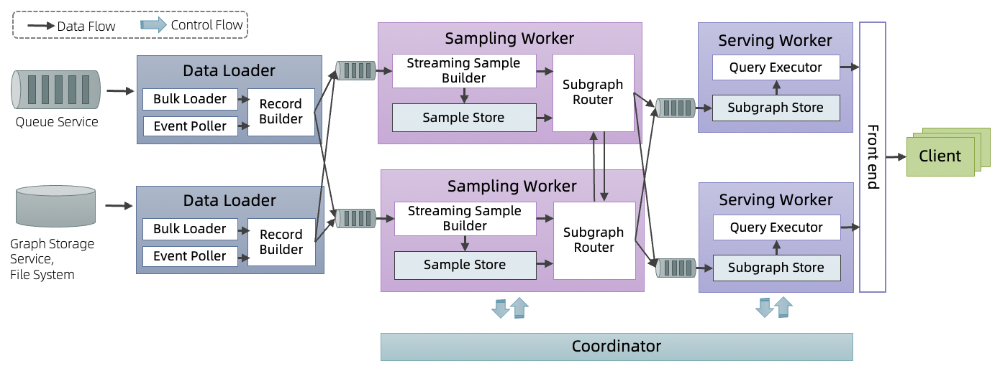

# Introduction
目前工业界许多GNN算法(e.g. GraphSAGE)都是基于静态图进行建模训练，然而在实际的业务中有很多的场景，图的结构、特征动态变化，并且表征可能与时间戳相关。以下一些场景中，动态图可能比静态图有更大的收益。

- 动态图结构、图特征
  - 点、边按照发生的顺序应用到图的表征上
- 表征周期性：根据Mercer 定理，时序模式可以通过一系列周期核函数刻画
  - 如：本地生活核销品有周期性，用户兴趣为每天下午2:00喝一杯咖啡，其余时间不喝，则可以通过时间编码到用户表征上，以捕获用户兴趣的周期性。
- 概念漂移（concept drift）：统计量随时间变化，造成模型的预测结果不准确
  - 如：因诈骗手段变化导致的模型动态变化，实际上也可以为一种周期核函数的表征，但需要模型实时更新。

动态图对应地有一些Temporal GNN模型，如离散动态图DTDG模型EvolveGCN、HGT，连续动态图模型
TGAT、TGN、APAN等，他们将时间戳编码进表征。而传统的静态图模型，虽然未表征时间信息，但在动态变化的图上，由于图结构和图特征的变化，他们的表征也应该是实时变化的。
动态图服务面向动态图训练、推理。当前一期开源工作为连续变化的动态图上的实时推理采样。根据模型的需要，动态图上的推理采样为一个顶点的N-hop邻居采样，邻居采样一般为最近发生的K个交互，每一个邻居保留最近M个version的属性。

动态图采样服务目前提供了和GraphLearn、Tensorflow结合的训练、推理一体化解决方案，参考e2e tutorial.

动态图采样服务的整体性能，保证P99 20ms的采样latency，秒级的数据更新staleness。

## Architecture

为了满足以上的要求，我们设计了一套基于Query aware的子图流式预采样的System Architecture。

整个服务包含三个子服务，DataLoader、Sampling Worker和Serving Worker，每个子服务都支持failover。

Serving Worker在服务一个Client发送过来的Query请求时，Query的结果可以保证在本地存储中已经存在，以防止跨网络传输带来的latency增加。我们通过异步的数据传输，将Graph update流式地更新到Serving Worker上。

数据更新的Data Flow依次流经：
- Queue Service：作为流数据源或Graph Storage Service，File System作为批数据源；
- DataLoader：从数据源通过Bulk Loader加载批量更新或通过Event Poller加载流式更新，然后流经Record Builder构建一个VertexUpdateRecord或EdgeUpdateRecord；
- DataLoader - Sampling Worker queue：Record根据一定的分片策略流入对应的Sampling Worker，通过queue进行分片、流控和Ckpt；
- Sampling Worker：根据安装的Query，对流入的Record进行流式的采样，写入Sample Store，并根据Subgraph router上Dependency信息，从SampleStore取出样本发送出去。Sampling Worker之间交互Dependency信息，实际上是Serving Worker上的Subgraph对record的订阅信息，以SubscriptionTable来表示。
- Sampling worker - Serving worker queue：Sampling Worker根据样本被Serving Worker的订阅信息，将样本发送给对应的SubGraph。
- Sering Worker: 从queue中pull数据，写入本地SubGraph Store。当前端有采样请求时，通过Query Executor，从本地SubGraph Store读取样本并组织起来，返回样本子图给客户端。

## Performance
一个两跳采样，属性维度100 float的latency在P99在20ms以下时，单机QPS>20000。
流数据更新的staleness P99在5s一下。
