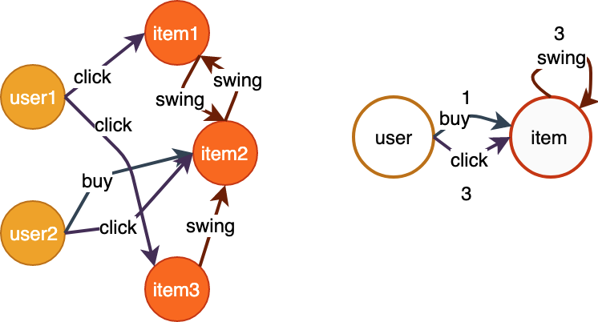

## 图查询

图对象构建完成后，可进行图查询操作。查询是指获取图的 **元信息** 和 **数据信息**, 不涉及复杂的计算和采样逻辑。<br />

<a name="WREbw"></a>
### Meta查询

元信息指图结构和统计类型的信息，包括图的拓扑结构、顶点总数、边与顶点分布情况、顶点的最大出入度等。<br />

<a name="EyXMf"></a>
#### 拓扑结构 <br />

```python
def get_topology()
""" 获取图的拓扑结构
返回类型为dict，其中key为edge_type，value包含src_type, dst_type两个属性。
"""
```

<br />如下所示的异构图，获取其拓扑结构及返回结果格式参见示例代码。



<br /> 图1 图的拓扑信息 </div>

```python
g = Graph(...)
g.init(...)
topo = g.get_topology()
topo.print_all()

"""
egde_type:buy, src_type:user, dst_type:item
egde_type:click, src_type:user, dst_type:item
egde_type:swing, src_type:item, dst_type:item
"""
```


#### 出入度分布

#### 图统计信息
```
# get the number of nodes and edges on each server.
g = Graph(...)
g.init(...)
# client method
g.get_stats()

# server method
g.server_get_stats()
```
### 数据查询

**GL**有两个基本的数据类型： `Nodes` 和 `Edges` 。遍历、查询、采样操作的返回对象是一个batch的顶点或边。特别地，非对齐的采样返回的是两个基本数据类型的稀疏形式，分别为`SparseNodes`和`SparseEdges`。<br />

### 顶点查询

Nodes可以从图上遍历或采样而来，也可以直接指定id。不管是哪种来源，都可以查询他们的属性、权重或标签。<br />

1. 指定id查询顶点<br />

```python
def get_nodes(node_type, ids)
''' 获取指定类型的顶点的权重、标签、属性
Args:
    node_type(string): 顶点类型
    ids(numpy.array): 顶点id
Return:
    Nodes对象
'''
```

<br />下面的数据展示了`get_nodes()`接口的用法。

表1： user顶点数据

| id | attributes |
| --- | --- |
| 10001 | 0:0.1:0 |
| 10002 | 1:0.2:3 |
| 10003 | 3:0.3:4 |

```python
g = Graph(...)
u_nodes = g.get_nodes("user", np.array([10001, 10002, 10003]))

print(u_nodes.int_attrs) # shape = [3, 2]
# array([[0, 0], [1, 3], [2, 4]])

print(u_nodes.float_attrs) # shape = [3, 1]
# array([[ 0.1],  [0.2],  [0.3]])
```

2. 遍历的顶点查询 <br />

```python
sampler = g.node_sampler("user", batch_size=3, strategy="random")
for i in range(5):
    nodes = sampler.get()
    print(nodes.ids)  # shape: (3, )
    print(nodes.int_attrs) # shape: (3, int_attr_num)
    print(nodes.float_attrs) # shape: (3, float_attr_num)

```

3. 采样的顶点属性查询<br />

```python
s = g.neighbor_sampler(["buy", "i2i"], expand_factor=[3, 2])
l = s.get(ids) # input ids: shape=(batch_size)

# 1跳的Nodes对象
l.layer_nodes(1).ids # shape=(batch_size, 3)
l.layer_nodes(1).int_attrs # shape=(batch_size, 3, int_attr_num)

# 2跳的Nodes对象
l.layer_nodes(2).ids # shape=(batch_size * 3, 2)
l.layer_nodes(2).int_attrs # shape=(batch_size * 3, 2, int_attr_num)
```

<a name="q3IOm"></a>
### 边查询<br />

Edges可以从图上遍历或采样而来。遍历或采样的边可以查询他们的属性、权重或标签。
<br />

- 遍历的边查询<br />

```python
sampler = g.edge_sampler("buy", batch_size=3, strategy="random")
for i in range(5):
    edges = sampler.get()
    print(edges.src_ids)  # shape: (3, )
    print(edges.dst_ids)  # shape: (3, )
    print(edges.weights)  # shape: (3, )
    print(edges.float_attrs) # shape: (3, float_attr_num)
```

- 采样的边属性查询 <br />

```python
s = g.neighbor_sampler(["buy", "i2i"], expand_factor=[3, 2])
l = s.get(ids) # input ids: shape=(batch_size)

# 1跳的Edges对象，即buyi边
l.layer_edges(1).weights  # shape=(batch_size,  3)
l.layer_edges(1).float_attrs # shape=(batch_size, 3, float_attr_num)

# 2跳的Edges对象，即i2i边
l.layer_edges(2).weights  # shape=(batch_size *  3,  2)
l.layer_edges(2).float_attrs # shape=(batch_size *  3,  2, float_attr_num)
```

<a name="rogkI"></a>
### 稀疏顶点/边查询<br />

<br />
遍历、采样的结果一般为Nodes/Edges对象，可以用上文的接口进行查询。<br />在非对齐采样中，结果是稀疏的。例如在全邻居采样（即“full”策略的邻居采样）中，由于每个顶点的邻居数不统一，因此得到的邻居不是对齐的。<br />
<br />以下，我们以全邻居采样的边属性查询为例，进行稀疏对象的接口使用说明。<br />

表4：buy边数据<br />

| user | item | weight |
| --- | --- | --- |
| 1 | 3 | 0.2 |
| 1 | 0 | 0.1 |
| 1 | 2 | 0.0 |
| 2 | 1 | 0.1 |
| 4 | 1 | 0.5 |
| 4 | 2 | 0.3 |


```python
s = g.neighbor_sampler("buy", expand_factor=0, strategy="full")
l = s.get(ids) # input ids: shape=(4)

# res['a'] # Nodes of [1, 2, 3, 4]
# res['b'] # SparseEdges

nodes = l.layer_nodes(1)
edges = l.layer_edges(1)

nodes.ids 
# array([3, 0, 2, 1, 1, 2])

edges.src_ids 
# array([1, 1, 1, 2, 4, 4])
edges.dst_ids
# array([3, 0, 2, 1, 1, 2])

nodes.offsets 
# [3, 1, 0, 2] 
# 即user1有3个邻居，user2有1个邻居，user3有0个邻居，user4有2个邻居
edges.offsets 
# [3, 1, 0, 2]

nodes.dense_shape
# [4, 3]
# 即[seed顶点数，seed顶点中邻居数的最大值]
edges.dense_shape
# [4, 3]

nodes.indices
# [[0, 1], [0, 2], [0, 3], [1, 0], [3, 1], [3, 2]]
# 即src_ids对应在dense Nodes中的对应下标(同dst_ids对应在dense Nodes中的下标)
# 对应的dst dense Nodes：
# [[ 3,  0,  2],
#  [ 1, -1, -1],
#  [-1, -1, -1],
#  [ 1,  2, -1]]
edges.indices
# [[0, 1], [0, 2], [0, 3], [1, 0], [3, 1], [3, 2]]

edges.weights
# [0.2, 0.1, 0.0, 0.1, 0.5, 0.3]

# 遍历每个输入顶点ids的全部邻居边。
iterate = 0
for e in edges:
    print("Iterate {}:".format(iterate), e.dst_ids, e.weights)
    iterate += 1
# Iterate 0: [3, 0, 2], [0.2, 0.1, 0.0]
# Iterate 1: [1], [0.1],
# Iterate 2: [], []
# Iterate 3: [1, 2], [0.5, 0.3]

# 遍历每个输入顶点ids的全部邻居顶点。
iterate = 0
for n in nodes:
    print("Iterate {}:".format(iterate), n.ids)
    iterate += 1
# Iterate 0: [3, 0, 2]
# Iterate 1: [1]
# Iterate 2: []
# Iterate 3: [1, 2]
```

### 默认值设置

对于图中不存在的点和边，查询时会返回默认值：<br />
label，默认值为-1<br />
int_attrs，默认值为0<br />
float_attrs, 默认值为0.0<br />
string_attrs, 默认值为''<br />
int， float, string属性的默认值可以通过全局系统参数设置。<br />
