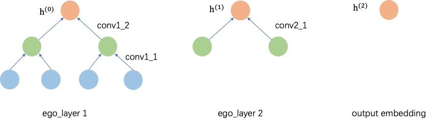

## Model layers

nn/tf/layers and nn/tf/model


Most GNNs algorithms follow a recursive message-passing/neighbor aggregation paradigm, so the concept of layers can be abstracted to represent one message-passing operation, similar to a general DNN. Currently, all common GNNs are graph convolutional neural networks, so we abstract a number of conv layers to represent a single graph convolution process. For EgoGraph, we abstract the concept of layers on top of the conv layers to represent one complete message passing process of a subgraph in order to facilitate message passing for heterogeneous graphs. Based on these conv or layers, it is easy to build a GNNs model. We have built in several common models, and welcome contributions to add more GNNs models.


### Layers
For SubGraph/BatchGraph, we provide several `SubConv` layers, and for EgoGraph, we provide `EgoConv` and `EgoLayer`.
​

#### SubGraph based layer


SubGraph's primary convolution can be calculated by edge_index and node_vec, and we define the basic convolution layer as `SubConv`

- SubConv

```python
class SubConv(Module):
  __metaclass__ = ABCMeta

  @abstractmethod
  def forward(self, edge_index, node_vec, **kwargs):
    """
    Args:
      edge_index: A Tensor. Edge index of subgraph.
      node_vec: A Tensor. node feature embeddings with shape
      [batchsize, dim].
    Returns:
      A tensor. output embedding with shape [batch_size, output_dim].
    """
    pass
```


Based on the SubConv base class, different graph convolution layers can be implemented.​

- GCNConv

```python
class GCNConv(SubConv):
  def __init__(self, in_dim, out_dim,
               normalize=True,
               use_bias=False,
               name='')
```
 
- GATConv

```python
class GATConv(SubConv):
  """multi-head GAT convolutional layer.
  """
  def __init__(self,
               out_dim,
               num_heads=1,
               concat=False,
               dropout=0.0,
               use_bias=False,
               name='')
```
 
- SAGEConv

```python
class SAGEConv(SubConv):
  def __init__(self, in_dim, out_dim,
               agg_type='mean', # sum, gcn, mean
               normalize=False,
               use_bias=False,
               name='')
```

- HeteroConv

```python
class HeteroConv(Module):
  """ Handles heterogeneous subgraph(`HeteroSubGraph`) convolution.
  
  This layer will perform the convolution operation according to the 
  specified edge type and its corresponding convolutional layer(`conv_dict`). 
  If multiple edges point to the same destination node, their results 
  will be aggregated according to `agg_type`.

  Args:
    conv_dict: A dict containing `SubConv` layer for each edge type.
    agg_type: The aggregation type used to specify the result aggregation 
      method when the same destination node has multiple edges.
      The optional values are: `sum`, `mean`, `min`, `max`, the default 
      value is `mean`. 
  """
  def __init__(self, conv_dict, agg_type='mean'):
    super(HeteroConv, self).__init__()
    self.conv_dict = conv_dict
    self.agg_type = agg_type

  def forward(self, edge_index_dict, node_vec_dict, **kwargs):
    """
    Args:
      edge_index_dict: A dict containing edge type to edge_index mappings.
      node_vec_dict: A dict containing node type to node_vec mappings.
    Returns:
      A dict containing node type to output embedding mappings.
    """
    out_dict = defaultdict(list)
    for edge_type, edge_index in edge_index_dict.items():
      h, r, t = edge_type
      if edge_type not in self.conv_dict:
        continue
      if h == t:
        out = self.conv_dict[edge_type](edge_index, node_vec_dict[h])
      else:
        out = self.conv_dict[edge_type](edge_index, [node_vec_dict[h], node_vec_dict[t]])
      out_dict[t].append(out)
    
    for k, v in out_dict.items():
      if len(v) == 1:
        out_dict[k] = v[0]
      else:
        out_dict[k] = getattr(tf.math, 'reduce_' + self.agg_type)(v, 0)
    
    return out_dict
```

#### EgoGraph based layers
For EgoGraph, we define the aggregation process from neighbors of one k+1 hop to neighbors of k hop as an `EgoConv`


- EgoConv

```python
class EgoConv(Module):
  """Represents the single propagation of 1-hop neighbor to centeric nodes."""
  __metaclass__ = ABCMeta

  @abstractmethod
  def forward(self, x, neighbor, expand):
    """ Update centeric node embeddings by aggregating neighbors.
    Args:
      x: A float tensor with shape = [batch_size, input_dim].
      neighbor: A float tensor with shape = [batch_size * expand, input_dim].
      expand: An integer, the neighbor count.

    Return:
      A float tensor with shape=[batch_size, output_dim].
    """
```
 
Based on `EgoConv` you can implement the respective graph convolution layer
​

- EgoSAGEConv

```python
class EgoSAGEConv(EgoConv):
  """ GraphSAGE. https://arxiv.org/abs/1706.02216.

  Args:
    name: A string, layer name.
    in_dim: An integer or a two elements tuple. Dimension of input features.
      If an integer, nodes and neighbors share the same dimension.
      If an tuple, the two elements represent the dimensions of node features
      and neighbor features.
      Usually, different dimensions happen in the heterogeneous graph. Note that
      for 'gcn' agg_type, in_dim must be an interger cause gcn is only for 
      homogeneous graph.
    out_dim: An integer, dimension of the output embeddings. Both the node
      features and neighbor features will be encoded into the same dimension,
      and then do some combination.
    agg_type: A string, how to merge neighbor values. The optional values are
      'mean', 'sum', 'max' and 'gcn'.
    use_bias: A boolean, whether add bias after computation.
  """

  def __init__(self,
               name,
               in_dim,
               out_dim,
               agg_type="mean",
               use_bias=False,
               **kwargs)
```

- EgoGATConv

```python
class EgoGATConv(EgoConv):
  """ Graph Attention Network. https://arxiv.org/pdf/1710.10903.pdf.

  Args:
    name: A string, layer name.
    in_dim: An integer or a two elements tuple. Dimension of input features.
      If an integer, nodes and neighbors share the same dimension.
      If an tuple, the two elements represent the dimensions of node features
      and neighbor features.
      Usually, different dimensions happen in the heterogeneous graph.
    out_dim: An integer, dimension of the output embeddings. Both the node
      features and neighbor features will be encoded into the same dimension,
      and then do some combination.
    use_bias: A boolean, whether add bias after computation.
  """

  def __init__(self,
               name,
               in_dim,
               out_dim,
               num_head=1,
               use_bias=False,
               attn_dropout=0.0,
               **kwargs)
```


- EgoGINConv

```python
class EgoGINConv(EgoConv):
  """ GIN. https://arxiv.org/abs/1810.00826.

  Args:
    name: A string, layer name.
    in_dim: An integer or a two elements tuple. Dimension of input features.
      If an integer, nodes and neighbors share the same dimension.
      If an tuple, the two elements represent the dimensions of node features
      and neighbor features.
      Usually, different dimensions happen in the heterogeneous graph.
    out_dim: An integer, dimension of the output embeddings. Both the node
      features and neighbor features will be encoded into the same dimension,
      and then do some combination.
    use_bias: A boolean, whether add bias after computation.
  """

  def __init__(self,
               name,
               in_dim,
               out_dim,
               eps=0.0,
               use_bias=False,
               **kwargs)
```


#### EgoLayer
The above `EgoConv` layer only represents the aggregation process from k+1 hops to k-hop neighbors. For an `EgoGraph` consisting of ego and `K`-hop neighbors, a full-graph messaging needs to perform `EgoConv` forward operations on all adjacent neighbor pairs in the EgoGraph, i.e., for k = {0, 1, 2, ... `K-1`}, all performing aggregation from k+1 to k hops.
We denote the message-passing process of such a single EgoGraph full graph consisting of several 1-hop neighbor aggregations `EgoConv` by `EgoLayer`.
The relationship between `EgoLayer` and `EgoConv` is shown in the following figure. The `EgoLayer` represents one message passing on the EgoGraph subgraph, while `EgoConv` represents one message passing on the adjacent k-hop and k+1-hop neighbors. For the `EgoGraph` composed of 2-hop neighbors, there are 2 `EgoLayers`, the first `EgoLayer` contains 2 `EgoConv` and the second `EgoLayer` contains 1 `EgoConv`. It can be seen that the `EgoLayer` composed by `EgoConv` naturally supports the meta-path message passing process for heterogeneous graphs.
For isomorphic graphs, it is only necessary to reuse `EgoConv`.
​




```python
class EgoLayer(Module):
  """Denotes one convolution of all nodes on the `EgoGraph`. 
  For heterogeneous graphs, there are different types of nodes and edges, so 
  one convolution process of graph may contain serveral different aggregations
  of 1-hop neighbors based on node type and edge type. We denote `EgoConv` as 
  a single propogation of 1-hop neighbor to centric nodes, and use `EgoLayer` to
  represent the entire 1-hop propogation of `EgoGraph`.
  """
  def __init__(self, convs):
    super(EgoLayer, self).__init__()
    self.convs = convs

  def forward(self, x_list, expands):
    """ Update node embeddings.

    x_list = [nodes, hop1, hop2, ... , hopK-1, hopK]
               |   /  |   /  |   /        |    /
               |  /   |  /   |  /         |   /
               | /    | /    | /          |  /
    output = [ret0,  ret1, ret2, ... , retK-1]

    Args:
      x_list: A list of tensors, representing input nodes and their K-hop neighbors.
        If len(x_list) is K+1, that means x_list[0], x_list[1], ... , x_list[K]
        are the hidden embedding values at each hop. Tensors in x_list[i] are
        the neighbors of that in x_list[i-1]. In this layer, we will do
        convolution for each adjencent pair and return a list with length K.

        The shape of x_list[0] is `[n, input_dim_0]`, and the shape of x_list[i]
        is `[n * k_1 * ... * k_i, input_dim_i]`, where `k_i` means the neighbor
        count of each node at (i-1)th hop. Each `input_dim_i` must match with
        `input_dim` parameter when layer construction.

      expands: An integer list of neighbor count at each hop. For the above
        x_list, expands = [k_1, k_2, ... , k_K]

    Return:
      A list with K tensors, and the ith shape is
      `[n * k_1 * ... * k_i, output_dim]`.
    """
```


### Model


#### SubGraph based model
Based on the `SubConv` layer, it is easy to build a GNNs model, and we have some common GNNs models built-in. All models need to implement the `forward` procedure, `forward` accepts `BatchGraph` objects and returns the final embedding.
Currently, only homogeneous graph edge traversal is supported, and the embedding of src and dst is returned.

```python
def forward(self, batchgraph)
```

- GCN

```python
class GCN(Module):
  def __init__(self,
               batch_size,
               input_dim,
               hidden_dim,
               output_dim,
               depth=2,
               drop_rate=0.0,
               **kwargs)
```
​

- GAT

```python
class GAT(Module):
  def __init__(self,
               batch_size,
               hidden_dim,
               output_dim,
               depth=2,
               drop_rate=0.0,
               attn_heads=1,
               attn_drop=0.0,
               **kwargs)
```
​

- SAGE

```python
class GraphSAGE(Module):
  def __init__(self,
               batch_size,
               input_dim,
               hidden_dim,
               output_dim,
               depth=2,
               drop_rate=0.0,
               agg_type='mean', # sum, gcn, mean
               **kwargs)
```
​

- SEAL

```python
class SEAL(Module):
  def __init__(self,
               batch_size,
               input_dim,
               hidden_dim,
               output_dim,
               depth=2,
               drop_rate=0.0,
               agg_type='mean', # sum, gcn, mean
               **kwargs)
```


#### EgoGraph based model


Based on the `EgoLayer` composed by `EgoConv`, we can quickly construct a GNN model. Since `EgoLayer` supports general heterogeneous graphs, the `EgoGraph` based GNN can be implemented uniformly with the following model.
​

- EgoGNN

```python
class EgoGNN(Module):
  """ Represents `EgoGraph` based GNN models.

  Args:
    layers: A list, each element is an `EgoLayer`.
    bn_func: Batch normalization function for hidden layers' output. Default is
      None, which means batch normalization will not be performed.
    act_func: Activation function for hidden layers' output. 
      Default is tf.nn.relu.
    dropout: Dropout rate for hidden layers' output. Default is 0.0, which
      means dropout will not be performed. The optional value is a float.
  """

  def __init__(self,
               layers,
               bn_func=None,
               act_func=tf.nn.relu,
               dropout=0.0,
               **kwargs):
    super(EgoGNN, self).__init__()

    self.layers = layers
    self.bn_func = bn_func
    self.active_func = act_func
    self.dropout = dropout

  def forward(self, graph):
    """ Update node embeddings through the given ego layers.

    h^{i} is a list, 0 <= i <= n, where n is len(layers).
    h^{i} = [ h_{0}^{i}, h_{1}^{i}, h_{2}^{i}, ... , h_{n - i}^{i} ]

    For 3 layers, we need nodes and 3-hop neighbors in the graph object.
      h^{0} = [ h_{0}^{0}, h_{1}^{0}, h_{2}^{0}, h_{3}^{0} ]
      h^{1} = [ h_{0}^{1}, h_{1}^{1}, h_{2}^{1} ]
      h^{2} = [ h_{0}^{2}, h_{1}^{2} ]
      h^{3} = [ h_{0}^{3} ]

    For initialization,
      h_{0}^{0} = graph.src
      h_{1}^{0} = graph.hop_node{1}
      h_{2}^{0} = graph.hop_node{2}
      h_{3}^{0} = graph.hop_node{3}

    Then we apply h^{i} = layer_{i}(h^{i-1}), and h_{0}^{3} is the final returned value.

    Args:
      graph: an `EgoGraph` object.

    Return:
      A tensor with shape [batch_size, output_dim], where `output_dim` is the
      same with layers[-1].
    """
    graph = graph.transform() # feature transformation of `EgoGrpah`

    # h^{0}
    h = [graph.src]
    for i in range(len(self.layers)):
      h.append(graph.hop_node(i))

    hops = graph.nbr_nums
    for i in range(len(self.layers) - 1):
      # h^{i}
      current_hops = hops if i == 0 else hops[:-i]
      h = self.layers[i].forward(h, current_hops)
      H = []
      for x in h:
        if self.bn_func is not None:
          x = self.bn_func(x)
        if self.active_func is not None:
          x = self.active_func(x)
        if self.dropout and conf.training:
          x = tf.nn.dropout(x, keep_prob=1-self.dropout)
        H.append(x)
      h = H

    # The last layer
    h = self.layers[-1].forward(h, [hops[0]])
    assert len(h) == 1
    return h[0]
```
​

#### Other
In addition to the common GNNs models, we have also encapsulated corresponding models for some common modules, such as the link prediction module.


- LinkPredictor
The Link Predictor module encapsulates a number of dense layers to output the final result after the input vector has passed through these dense layers.

```python
class LinkPredictor(Module):
  """ link predictor.

  Args:
    name: The name of link predictor.
    input_dim: The Input dimension.
    num_layers: Number of hidden layers.
    active_fn: Activation function for hidden layers' output.
    dropout: Dropout rate for hidden layers' output. Default is 0.
  """

  def __init__(self,
               name,
               input_dim,
               num_layers,
               dropout=0.0)
    
  def forward(self, x):
    """
    Args:
      x: input Tensor of shape [batch_size, input_dim]
    Returns:
      logits: Output logits tensor with shape [batch_size]
    """
```


