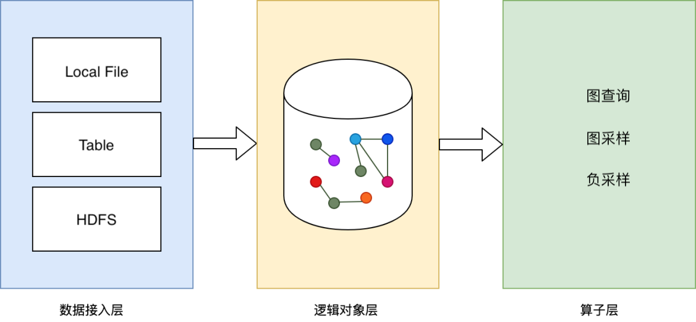

# 数据源

本文档用以说明GraphLearn支持的数据格式，以及如何通过API来描述和解析。<br />

## 数据格式
Graph数据可分为**顶点数据**和**边数据**。一般的，顶点数据包含**顶点ID**和**属性**，描述一个实体；边数据包含**源顶点ID**和**目的顶点ID**，描述顶点间的关系。在异构图场景中，顶点和边分别存在多种类型。因此，我们需要顶点和边的类型信息，才能对不同类型的顶点和边加以识别。类型信息通过API来描述。顶点和边都可以具有属性，比如“某用户在星期六上午购买了某商品”，时间信息“星期六上午”就是边属性。此外，很多场景用户需要“权重”的概念，或是顶点权重，或是边的权重，作为某种重要性的度量，比如“按权重进行邻居节点采样”。“权重”的来源多种多样，因任务不同而不同。在有监督学习的分类任务中，顶点或边还可能拥有标签。<br />
<br />我们将这些典型场景的数据格式抽象为**ATTRIBUTED**、**WEIGHTED、LABELED**，分别用于表示顶点或边包含属性的、具有权重的、具有标签的。对顶点数据源和边数据源来说，这三者可以同时存在，也可以部分存在。<br />

### 基础格式
基础的顶点数据只包含一个顶点的ID，ID类型为bigint，每条数据代表一个顶点。很多时候只有顶点ID是不够的，还需包含属性、权重或标签。<br />
<br />基础的边数据只包含源顶点ID和目的顶点ID，ID类型为bigint，每条数据代表一条边，表示两个顶点之间的关系。基础边数据源的schema如下所示。
基础的边数据格式可以独立使用，即不附加属性、权重和标签。<br />

边基础格式schema

| 域 | 数据类型 | 备注 |
| --- | --- | --- |
| src_id | BIGINT |  |
| dst_id | BIGINT |  |

<br />

### 属性格式（ATTRIBUTED）
用于表达顶点或边的属性信息。一般情况下，顶点默认具有属性，不然只需要边表就够了。属性列只有一列，为string类型。
string内部可通过自定义分隔符分割多个属性。比如，某一顶点属性有3个，分别为`shanghai, 10, 0.01`，用分隔符‘:’分隔，则该顶点对应的属性数据为`shanghai:10:0.01`。
当数据格式具有属性时，无论是顶点数据，还是边数据，在API描述时，都需要显示指定**ATTRIBUTED**以告知系统。

顶点数据属性格式schema

| 域 | 数据类型 | 备注 |
| --- | --- | --- |
| id | BIGINT |  |
| attributes | STRING |  |

<br />
边数据属性格式schema

| 域 | 数据类型 | 备注 |
| --- | --- | --- |
| src_id | BIGINT |  |
| dst_id | BIGINT |  |
| attributes | STRING |  |
<br />

### 权重格式（WEIGHTED）
用于表达顶点或边带有权重的情况。权重列只有一列，为**float**类型。当数据格式具有权重时，无论是顶点数据，还是边数据，在API描述时，都需要显示指定**WEIGHTED**以告知系统。

顶点数据权重格式schema

| 域 | 数据类型 | 信息列 |
| --- | --- | --- |
| id | BIGINT |  |
| attributes | FLOAT |  |

<br />
边数据权重格式schema

| 域 | 数据类型 | 备注 |
| --- | --- | --- |
| src_id | BIGINT |  |
| dst_id | BIGINT |  |
| weight | FLOAT  |  |
<br />

### 标签格式（LABELED）
用于表达顶点或边带有标签的情况。标签列只有一列，为int类型。当数据格式具有标签时，无论是顶点数据，还是边数据，在API描述时，都需要显示指定**LABELD**以告知系统。

顶点数据标签格式schema

| 域 | 数据类型 | 备注 |
| --- | --- | --- |
| id | BIGINT |  |
| label | INT |  |
<br />

边数据标签格式schema

| 域 | 数据类型 | 备注 |
| --- | --- | --- |
| src_id | BIGINT |  |
| dst_id | BIGINT |  |
| label | INT |  |
<br />

### 组合格式
ID是组成顶点和边数据源的必选信息，weight，label，attribute为可选信息。当同时具备**WEIGHTED、ATTRIBUTED、LABELED**一到多个时，在数据源中，必选信息和可选格式信息的组合需要遵循一定的顺序。<br />
<br />1）**顶点数据源**，混合格式schema的顺序如下表所示。<br />

| 域 | 数据类型 | 备注 |
| --- | --- | --- |
| id | BIGINT | 必选 |
| weight | FLOAT | 可选: WEIGHTED |
| label | BIGINT | 可选: LABELED |
| attributes | STRING | 可选: ATTRIBUTED |


<br />2）**边数据源**，混合格式schema的顺序如下表所示。<br />

| 域 | 数据类型 | 备注 |
| --- | --- | --- |
| src_id | BIGINT | 必选 |
| dst_id | BIGINT | 必选 |
| weight | FLOAT | 可选: WEIGHTED |
| label | BIGINT | 可选: LABELED |
| attributes | STRING | 可选: ATTRIBUTED |


<br />扩展信息可选择**0个或多个**，同时需要保证schema的**顺序维持上表顺序不变**。<br />

## 数据源



<br />系统抽象了数据接入层，可方便对接多种类型的数据源，目前开源支持LocalFileSystem，HDFS，其他类型数据源可以mount到本地。数据表现为二维结构化，行代表一个顶点或一条边数据，列表示顶点或边的某一项信息。<br />


<a name="9Im2p"></a>
### Local FileSystem
接入本地文件/或挂载到本地的文件作为图数据源，支持文件夹、文件；
在分布式下，每个GraphLearn Server读取指定的文件的全部数据作为数据源，因此，用本地文件（包括mount到本地文件）作为分布式GraphLearn的图数据源时，需提前将原始数据做分片，为每个Server指定不同的分片作为数据源。

在本地文件中，数据类型如下。其中，列名不做要求。支持从一个或多个本地文件读取数据。

| 列 | 类型 |
| --- | --- |
| id | int64 |
| weight | float |
| label | int32 |
| features | string |

<br />

- 顶点文件格式。其中，第一行为列名，表示必选信息或扩展信息，以**tab**分隔，每一个元素为“列名:数据类型”。其余每行数据代表一个顶点的信息，与第一列的信息名对应，以**tab**分隔。

```python
# file://node_table
id:int64  feature:string
0 shanghai:0:s2:10:0.1:0.5
1 beijing:1:s2:11:0.1:0.5
2 hangzhou:2:s2:12:0.1:0.5
3 shanghai:3:s2:13:0.1:0.5
```

<br />2）边文件格式。其中，第一行为列名，表示必选信息或扩展信息，以**tab**分隔，每一个元素为“列名:数据类型”。<br />其余每行数据代表一条边的信息，与第一列的信息名对应，以**tab**分隔。

```python
# file://edge_table
src_id:int64  dst_id:int64  weight:float  feature:string
0 5 0.215340  red:0:s2:10:0.1:0.5
0 7 0.933091  grey:0:s2:10:0.1:0.5
0 1 0.362519  blue:0:s2:10:0.1:0.5
0 9 0.097545  yellow:0:s2:10:0.1:0.5
```

<br />通过本地文件作为数据源，可以直接在脚本中使用文件路径。详见下一章“[图对象](graph_object.md)”。<br />

<a name="mzVG6"></a>


### HDFS(since v1.1.0)
列之间的分隔符可以通过如下命令指定：
```
gl.set_field_delimiter("\001")
```
读目录下所有文件(相同schema，表示一个点表或者边表)的话，路径为：hdfs://cluster/xxx/directory/
读单个文件的话，路径为：hdfs://cluster/xxx/directory/file

## 用户API
<a name="IqJlv"></a>
### Decoder定义
`Decoder`类用于描述上所述数据格式，定义如下。

```python
class Decoder(weighted=False, labeled=False, attr_types=None, attr_delimiter=":")
"""
weighted:       描述数据源是否带权重，默认为False
labeled:        描述数据源是否带有标签，默认为False
attr_types:     当数据源带属性时，该参数为一个string list，描述每一个属性的类型。
                list中的每个元素仅支持"string"、"int"和"float"类型。
                参数形如["string", "int", "float"]，代表数据的属性列包含有3个属性，
                按照顺序分别是string类型，int类型，float类型。
                默认None，即数据源不带属性。
attr_delimiter: 当数据带有属性(被压缩为一个大string)时，需要知道如何解析，该参数描述各个属性间的分隔符。
                如"shanghai:0:0.1"，分隔符为":"。默认为":"。
attr_dims:      仅用于TF版本的图神经网络中，描述对应的离散属性编码成embeding的dimension，是一个int list。

        所有有效的attr_type和attr_dim的对应关系如下：
        |    attr_type     |attr_dim|             encoded into                 |
        |    ---------     | -- |                  --------                    |
        |   ("string",10)  | 8  |   Embedding variable, bucketsize=10, dim=8   |
        |("string",10,True)| 8  |Sparse embedding variable, bucketsize=10,dim=8|
        |("string",None,True)| 8|   Sparse dynamic embedding variable, dim=8   |
        |       "int"      |None|           Continues numeric tensor           |
        |    ("int",10)    | 8  |   Embedding variable, bucket size=10, dim=8  |
        |      "float"     |None/0|           Continues numeric tensor           |
"""

  @property
  def feature_spec(self):
  """
  仅在和TF NN模型结合时使用，返回一个FeatureSpec对象。  
  """
```
<a name="A2hT8"></a>
### 顶点Decoder
顶点的Decoder有以下几种形式。

```python
import graphlearn as gl

# schema = (id int64, weight double)
gl.Decoder(weighted=True)

# schema = (id int64, label int32)
gl.Decoder(labeled=True)

# schema = (id int64, attributes string)
gl.Decoder(attr_type={your_attr_types}, attr_delimiter={you_delimiter})

# schema = (id int64, weight float, label int32)
gl.Decoder(weighted=True, labeled=True)

# schema = (id int64, weight float, attributes string)
ag.Decoder(weightd=True, attr_type={your_attr_types}, attr_delimiter={you_delimiter})

# schema = (id int64, label int32, attributes string)
gl.Decoder(labeled=True, attr_type={your_attr_types}, attr_delimiter={you_delimiter})

# schema = (id int64, weight float, label int32, attributes string)
gl.Decoder(weighted=True, labeled=True, attr_type={your_attr_types}, attr_delimiter={you_delimiter})
```


<a name="wKeTO"></a>
### 边Decoder
边的Decoder有以下几种形式。

```python
import graphlearn as gl

# schema = (scr_id int64, dst_id int64)
gl.Decoder()

# schema = (src_id int64, dst_id int64, weight float)
gl.Decoder(weighted=True)

# schema = (src_id int64, dst_id int64, label int32)
gl.Decoder(labeled=True)

# schema = (src_id int64, dst_id int64, attributes string)
gl.Decoder(attr_type={your_attr_types}, attr_delimiter={you_delimiter})

# schema = (src_id int64, dst_id int64, weight float, label int32)
gl.Decoder(weighted=True, labeled=True)

# schema = (src_id int64, dst_id int64, weight float, attributes string)
gl.Decoder(weightd=True, attr_type={your_attr_types}, attr_delimiter={you_delimiter})

# schema = (src_id int64, dst_id int64, label int32, attributes string)
gl.Decoder(labeled=True, attr_type={your_attr_types}, attr_delimiter={you_delimiter})

# schema = (src_id int64, dst_id int64, weight float, label int32, attributes string)
gl.Decoder(weighted=True, labeled=True, attr_type={your_attr_types}, attr_delimiter={you_delimiter})
```


<a name="BdNad"></a>
### 使用示例
假设数据源如下表1，表2，表3所示。<br />

表1 item顶点表

| id | feature |
| --- | --- |
| 10001 | feature1:1:0.1 |
| 10002 | feature2:2:0.2 |
| 10003 | feature3:3:0.3 |

表2 user顶点表

| id | feature |
| --- | --- |
| 123 | 0.1:0.2:0.3 |
| 124 | 0.4:0.5:0.6 |
| 125 | 0.7:0.8:0.9 |


表3 user-item边表

| src_id | dst_id | weight |
| --- | --- | --- |
| 123 | 10001 | 0.1 |
| 124 | 10001 | 0.2 |
| 124 | 10002 | 0.3 |

<br />对item顶点表构建`item_node_decoder`，对user顶点表构建`user_node_decoder`，边表构建`edge_decoder`，代码如下。

```python
import graphlearn as gl

item_node_decoder = gl.Decoder(attr_types=["string", "int", "float"])
user_node_decoder = gl.Decoder(attr_types=["float", "float", "float"])
edge_decoder = gl.Decoder(weighted=True)
```

<br />对每一个数据源构建完Decoder之后，在图中加入数据源，并指定对应的Decoder，详见[图对象](graph_object.md) 。

### Decoder和NN模型结合
#### attr_types, attr_dims
<br />一般的，`Decoder`只需要描述`weighted`, `labeled`, `attr_types`, `attr_delimiter`，即可将图数据解析加载到图中。

<br />GraphLearn支持原始图数据中的顶点或边包含`int`、`float`、`string` 三种类型的特征，每种类型在NN模型中又有不同的表现形式。例如，`int`类型的特征即可当成连续的值来用，也可做为离散的id。 `string`类型的特征即可以为单值，也可以包含个数不定的多值。特征的定义需要在添加图数据源时描述清楚，后续便可通过GraphLearn提供的接口无缝转换，进而对接GNN算法。

<br />因此，与神经网络结合时，`attr_types`和`attr_dims`需要做以下处理。
1. `attr_types`中`string`属性建议hash成`int`，即将`"string"`变为`tuple`类型`("string", bucket_size)`。
`string`类型的属性比较难处理，通常做法是先将`string`通过`hash`映射到`int`，再把`int`编码成embedding。GL对`string`类型的属性做了特别扩展，即支持在图数据初始化阶段把`string`转成`int`。
此时，`attr_types`参数中的`"string"`需要变为`tuple`类型`("string", bucket_size)`，`bucket_size`表示被转换到的`int`空间大小。若做此转换，后续访问时统一为`int`类型的attributes（包括条件负采样时）。
除了简化后续操作以外，该转换也会大大降低内存开销。

2. 离散属性需要指定`attr_dims`。
在和TF的GNN模型结合时，数据的每一列属性会经过feature column，表达成向量。因此，在结合TF模型的代码中，`Decoder`不仅需要表达每一列属性原始输入类型`attr_types`，还应该描述离散属性如何编码为Embedding向量。具体地，`attr_dims`需要填写对应位置属性的Embedding维度。我们将`attr_type`和对应`attr_dim`表达属性的所有情况列举在`Decoder`类的参数注释中，以下是几个常用的示例。

<br />case1：只有 float 特征。
```
# 20个float特征
# 下面user顶点的向量维度为20
decoder = gl.Decoder(attr_types=['float'] * 20)
# 都是float属性时，不需要指定attr_dims

g = gl.Graph()
g.node(source=file_path, node_type='user', decoder=decoder)
```
<br />case2：把 int 特征当成连续特征来用。
```
# 1个float、2个int特征，int会被当做连续特征来处理
# 下面user顶点的向量维度为1 + 1 + 1 = 3
decoder = gl.Decoder(attr_types=['float', 'int', 'int'])

g = gl.Graph()
g.node(source=file_path, node_type='user', decoder=decoder)
```

<br />case3：把 int 特征当成离散特征来用。
```
# 1个float、2个int特征，第一个int当做连续特征处理，第二个int作为bucket大小为1000的id处理
# 其中，id化的int将要被映射到维度为16的向量空间
# attr_dims长度必须与attr_types一致，非id类特征对应的位置填None即可
# 下面user顶点的向量维度为1 + 1 + 16 = 18
decoder = gl.Decoder(attr_types=['float', 'int', ('int', 1000)]
                     attr_dims=[None, None, 16])

g = gl.Graph()
g.node(source=file_path, node_type='user', decoder=decoder)
```

<br />case4：单值 string 特征，即原始数据类型为 string ，首先hash成 int ，再作为离散特征处理。
```
# 2个string、1个int特征，分别作为bucket大小为500、800、1000的id处理
# 三类id将要被映射到维度为8、12、16的向量空间
# 下面user顶点的向量维度为8 + 12 + 16 = 36
decoder = gl.Decoder(attr_types=[('string', 500), ('string', 800), ('int', 1000)]
                     attr_dims=[8, 12, 16])

g = gl.Graph()
g.node(source=file_path, node_type='user', decoder=decoder)
```

<br />case5：多值 string 特征，即原始数据类型为 string ，值以 , 分隔，每个值再作为单值 string 处理。
```
# 2个string特征，其中第二个为多值特征，多值以逗号分割，每个值将被当做bucket大小为800的id处理
# 两类特征将要被映射到维度为8、12的向量空间，其中多值特征的结果为每个值向量化后的加和
# 下面user顶点的向量维度为8 + 12 = 20
decoder = gl.Decoder(attr_types=[('string', 500), ('string', 800, True)]
                     attr_dims=[8, 12])

g = gl.Graph()
g.node(source=file_path, node_type='user', decoder=decoder)
```
以上以顶点特征为例进行说明，同样适用于边特征。


