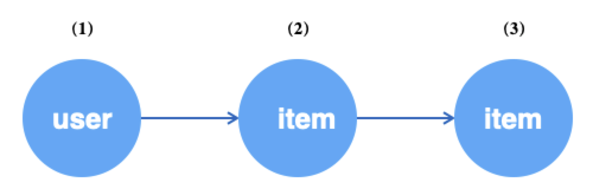
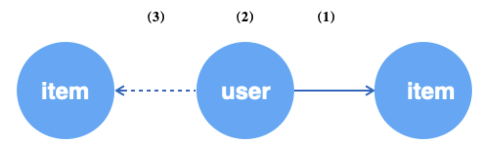
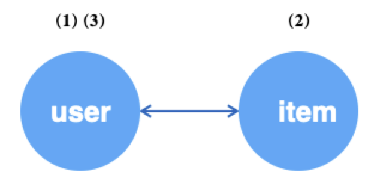
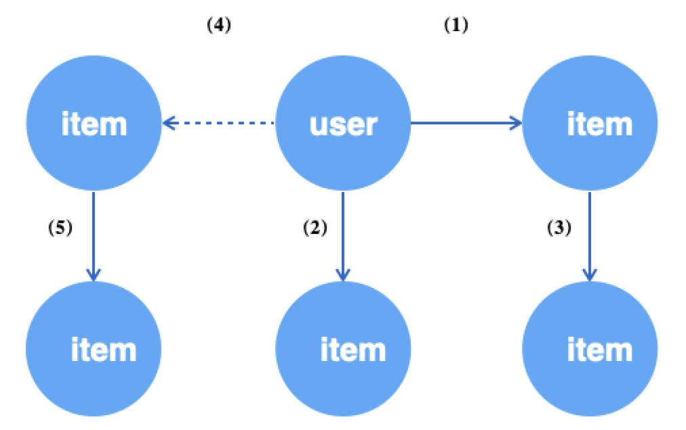

# Graph Sampling Language（GSL）

<a name="TUTVl"></a>
## 简介
GNN发展至今，有一套相对成熟的编程范式。我们将一个GNN模型的开发分为两个阶段：图模式的数据处理部分和神经网络部分。
神经网络部分，我们可以借助成熟的DL框架，如TensorFlow、PyTorch。
如何简单高效的描述和实现适合GNN的图数据访问模式，以及如何与主流的深度学习框架对接，是GL重点关注的。<br />
<br />实际中的图由于规模原因，采样是必要阶段。总结下来，图采样大致包含几类：

- 遍历型（Traverse），从图上获取一个batch的点或边数据；
- 关系型（Neighborhood，Subgraph），获取点的N跳邻域或生成由点构成的子图，用于构造训练样本；
- 负采样（Negative），与关系型相对，一般用于无监督训练场景，产生负例样本；


<br />我们把如上几类操作抽象成了一套接口，称为 **GSL**。
开发者可以基于**GSL**描述用于GNN的图数据流，例如，针对“用户点击商品”异构图场景，“随机采样64个user，并按边的权重为每个user采样10个关联商品”，
可以写成<br />`g.V("user").batch(64).outV("click").sample(10).by("edge_weight")`<br />
<br />**GSL**考虑实际图数据的特点，覆盖了对超大图、异构图、属性图的支持，语法设计贴近[Gremlin](http://tinkerpop.apache.org/docs/current/reference/#_tinkerpop_documentation)形式，便于理解。<br />

<a name="KFXRf"></a>
## GSL语法
我们把一个由**GSL**描述的语句称为**Query**，一个**Query**通常由**SOURCE**、**STEP**和**SINK**三种类型的操作组成。
其中，**SOURCE**为查询语句的入口，表示从哪些数据出发；**STEP**为查询过程中游走和采样的路径，**SINK**为对执行结果的封装。
在GSL中，一条Query必须包含**一个SOURCE**和**一个SINK**操作。<br />

<a name="5xWGq"></a>
## SOURCE

<a name="IHxBA"></a>
### `V/E`
SOURCE是查询语句的入口，支持 `V()` 和 `E()` 两个接口，分别表示从顶点和从边开始查询。具体如下。

```python
def V(t, node_from=gl.NODE)
"""
Args:
    t(string): 顶点类型或边类型，后续操作会针对该类型的顶点进行;
    node_from: gl.NODE | gl.EDGE_SRC | gl.EDGE_DST，分别为对指定的顶点类型遍历，对指定边类型的源顶点遍历，对指定边类型的目的顶点遍历。
"""

def E(edge_type, reverse=False)
"""
Args:
    edge_type(string): 边类型，后续操作会针对该类型的边进行;
    reverse(boolean): 是否遍历反向边，默认为False，及遍历原始的边。
"""
```

- **无向边遍历**

构图时添加边，指定为无向边。 <br />

```python
g.edge(source, (src_type, dst_type, edge_type), decoder, directed=False)
```

遍历时有几下几种情况：<br />
（1）src_type和dst_type一致，如边类型为("item", "item", "i2i")，当i2i为无向边时，边会增加一份dst到src的连接，同时去重。<br />
```
原始i2i数据                     加载到图中的i2i数据   
item	item         ->         item	item
1	2                           1	2
2	1                           2	1
1	3                           1	3
2	3                           3	1
3	3                           2	3
1	4                           3	2
                                3	3
                                1	4
                                4	1
```
`g.E("i2i")`: 遍历double and unique的i2i数据，如上"加载到图中的i2i数据 "。<br />
`g.E("i2i", reverse=Ture)`: 不支持，因为这时候i2i是无向边，不区分正向和反向。<br />

（2）src_type和dst_type不一致，如边类型为("user", "item", "u2i")，当u2i为无向边时，在加载时实际上除了加载原始的u2i边之外，额外加载了一份i2u的反向边。<br />
```
原始u2i数据                 加载到图中的u2i数据    +     加载到图中的i2u数据
user	item            ->      user	item                 item	user
1	2                           1	2                        2	1
2	1                           2	1                        1	2
1	3                           1	3												 3	1
2	3                           2	3												 3	2
3	3                           3	3												 3	3
1	4                           1	4												 4	1
```
`g.E("u2i")`: 遍历"加载到图中的u2i数据 "，即原始数据。<br />
`g.E("u2i", reverse=Ture)`: 遍历“加载到图中的i2u数据”，即反向数据。<br />

### `batch`
当从图获取数据时，`batch()`用于指定每次获取到的V()或E()的多少。若同时要对数据进行`shuffle()`，注意在`batch()`之后。当`shuffle(traverse=True)`时，如果剩余数据不足batch_size但不为0，则返回实际数据，此时不会触发OutOfRangeError。只有剩余数据为0时，才会`OutOfRangeError`。

```python
def batch(batch_size):
"""
Args:
	batch_size(int): 每次获取的源数据的多少。
"""
```

<a name="t34wT"></a>
### `shuffle`
`batch`之后可以接 `shuffle`。 `shuffle()` 为可选接口，当从图获取数据时，表示是否要对顶点/边进行随机获取。

```python
def shuffle(traverse=False):
"""
Args:
  traverse(boolean): 是否要随机获取数据源，默认False。
      True表示按序遍历，当遍历到结尾时会触发OutOfRangeError，False则不会OutOfRangeError。
"""
```

<a name="WQ5EP"></a>
### 示例
（1）顺序遍历图中的user顶点，batch size为64，当遍历完全图user顶点后，OutOfRange。<br />

```python
query = g.V("user").batch(64).alias('seed').values()
ds = gl.Dataset(query)
while True:
  try:
    ds.next()
  except gl.OutOfRangeError:
    break
```

（2）随机有放回地遍历64个user类型的顶点。永远不会OutOfRange。<br />

```python
query = g.V("user").batch(64).shuffle().alias('seed').value()
ds = gl.Dataset(query)
for i in range(100):
  ds.next()
```

（3）随机无放回地遍历64个user类型的顶点，当遍历完全图的user顶点后，OutOfRange。<br />

```python
query = g.V("user").batch(64).shuffle(traverse=True).alias('seed').values()
ds = gl.Dataset(query)
while True:
  try:
    ds.next()
  except gl.OutOfRangeError:
    break
```

通过E遍历边的方式类似。

<a name="5kq55"></a>
## STEP 图采样/负采样

STEP用于描述查询游走的路径和采样的方式。一条查询语句中可以包含0到多个STEP。目前，STEP包含以下两类接口：描述路径游走，描述采样方式。一个完整的STEP包含**游走**+**采样**（图采样或负采样）。<br />

描述路径游走的接口，表示当前操作对象的转移。例如，`g.V()`表示当前操作对象为顶点，可以通过`outE()`把当前操作对象转移到顶点的出边上，后面的操作表示针对边来进行。当边的操作结束后，可以通过`inV()` / `outV()`，再将焦点转移到边对应的目的顶点或源顶点上。<br />

(1）游走接口：<br />

```python
def inV():
""" 承接边（只能跟在边操作之后），表示两个顶点中箭头指向的那个，即目的顶点
"""

def outV():   
""" 承接边（只能跟在边操作之后），表示两个顶点中箭头发起的那个，即源顶点
"""

def inE(edge_type):
""" 承接顶点（只能跟在顶点操作之后），表示顶点的入边
Args:
	edge_type(string): 边的类型，当该边为有向边时, 调用inE报错
"""

def outE(edge_type):
""" 承接顶点（只能跟在顶点操作之后），表示顶点的出边
Args:
	edge_type(string): 边的类型
"""

def inV(edge_type):
""" 承接顶点（只能跟在顶点操作之后），表示顶点沿着边的上游顶点
Args:
	edge_type(string): 边的类型，当该边为有向边时, 调用inV报错
"""

def outV(edge_type):
""" 承接顶点（只能跟在顶点操作之后），表示顶点沿着边的下游顶点
Args:
	edge_type(string): 边的类型
"""

def outNeg(edge_type):
""" 承接顶点（只能跟在顶点操作之后），表示在该边类型下负采样下游顶点
Args:
	edge_type(string): 边的类型
"""
    
def inNeg(edge_type):
""" 承接顶点（只能跟在顶点操作之后），表示在该边类型下负采样上游顶点
Args:
	edge_type(string): 边的类型，当该边为有向边时, 调用inNeg报错
"""
```

（2）采样接口：<br />

描述采样方式的接口，在前序路径描述的基础上，且当前操作对象为顶点时，如何采样该类型的顶点作为前序顶点的邻居，包括采样多少、采样策略。<br />

```python
def sample(N):
""" 承接顶点（只能跟在顶点操作之后），表示当前顶点采样多少作为前序顶点的邻域
Args:
	N(int): 采样的数量
"""

def by(strategy):
""" 紧跟sample()之后，表示采样策略
Args:
	strategy(string): 采样策略
    	如果前序路径为采样，支持的策略包括: 
          “edge_weight”, "in_degree", "topk", "random", "full";
    	如果前序路径为负采样，支持的策略包括: 
          "in_degree", "random", "node_weight"
"""
```

<a name="wOTQV"></a>

### 图游走
`outV(edge_type)`/`outE(edge_type)`：从边的源顶点开始到目的顶点向前推进，即源顶点沿着其出边游走。
`inV(edge_type)`/`inE(edge_type`)：从边的目的顶点开始到源顶点向后回溯，即目的顶点沿着入边游走。其中，`edge_type`对应的边必须为无向边（在构图时，必须指定`directed=false`，即可以反向游走，参考 图对象）。

例如，对于如下所示异构图，从user顶点开始，沿u2i边采样user的一跳邻居，再沿i2i边采样user的二跳邻居。



```python
g.V("user").batch(64).alias('src')                       # (1) 获取64个user顶点
 .outV("u2i").sample(10).by("edge_weight").alias('hop1') # (2) 为上述每个user采样10个邻居item
 .outV("i2i").sample(15).by("random").alias('hop2')      # (3) 为上述每个item采样15个邻居item

```

<br />若以边为数据源，可以再获取边后分别针对其端点进行操作。一般情况下，获取边往往用于无监督学习，把边看成正样本，再对边的源顶点进行负邻居采样作为负样本。



```python
g.E("u2i").batch(64).alias('edge')                    # (1) 随机获取64条u2i的边
 .ouV().alias('src')                                  # (2) 跳转到边的源顶点，即user
 .outNeg("u2i").sample(10).by("random").alias('neg')  # (3) 为上述每个user采样10个不相关的item

```

<br />当边为无向边时，可以通过`outV(edge_type)`和`inV(edge_type)`来实现循环采样，源点和目的点互为邻居。



```python
g.V("user").batch(64).alias('src')                   # (1) 随机获取64个user顶点
 .outV("u2i").sample(10).by("random").alias('hop1')  # (2) 为上述每个user采样10个邻居item
 .inV("u2i").sample(5).by("random").alias('hop2')    # (3) 为上述每个item采样10个邻居user

```

### 图采样

图采样的Query接口组合如下：

```python
# 沿出边采样邻居顶点
outV(edge_type).sample(N).by(strategy)

# 沿入边采样邻居顶点
inV(edge_type).sample(N).by(strategy)

# 沿出边采样邻居边
outE(edge_type).sample(N).by(strategy)

# 沿出边采样邻居边
inE(edge_type).sample(N).by(strategy)
```


GL目前已支持以下几种采样策略，对应**.by**接口的`strategy`参数。<br />


| **strategy** | **说明** |
| --- | --- |
| edge_weight | 以边权重为概率采样 |
| random | 有放回随机采样 |
| random_without_replacement | 无放回随机采样，邻居数不够时，参考填充规则 |
| topk | 返回边权重topK的邻居，邻居数不够时，参考填充规则 |
| in_degree | 以顶点入度为概率采样 |
| full | 邻居数不足N时，返回全部邻居，大于N时，以N截断 |


填充规则：当采样要求的数据不足时，需要以某种方式填充返回结果。默认情况下，用`default_neighbor_id`填充补齐不足的`id`，`default_neighbor_id`默认为0，可以通过`gl.set_default_neighbor_id(xx)`来设置。如要循环填充，即循环使用已有邻居id而非`default_neighbor_id`，则设置填充模式`gl.CIRCULAR`，`gl.set_padding_mode(gl.CIRCULAR)`。


**示例：**
以下示例表示以64的batch size遍历图中的“**用户**“顶点，并按照“**购买**”边的权重为采样概率，对每个“**用户**”采样10个“**用户**”“**购买**”的“**商品**”。<br />

```python
g.V("user").batch(64).alias("u") \
 .outV('buy').sample(10).by("edge_weight").alias("1hop")
```


### 负采样

负采样的Query接口组合如下：<br />

```python
# 沿出边采样负邻居顶点（.where表示加上条件的负采样）
outNeg(edge_type).sample(expand_factor).by(strategy)[.where(target, condition={})]

# 沿入边采样负邻居顶点（.where表示加上条件的负采样）
inNeg(edge_type).sample(expand_factor).by(strategy)[.where(target, condition={})]

# 顶点表负采样
Neg(node_type).sample(expand_factor).by("node_weight")
```
`sample`接口的参数expand_factor，表示对每个顶点采样做少个负样本。
​

GL目前已支持以下几种负采样策略，对应**.by**接口的`strategy`参数。<br />

| strategy | 说明 |
| --- | --- |
| random | 随机负采样，不保证true-negative |
| in_degree | 以顶点入度分布为概率进行负采样，保证true-negative |
| node_weight | 按照顶点权重在顶点表负采样，仅适用于Neg(node_type) |

<br />

`where`参数使用: <br />

```python
def where(target, condition={}):
  """ Add condition for negative samlpler. Used after `by`.

    Args:
      target (string): Alias of upstream  which is the postive sample
        that condition should match.
      condition (dict, optional): Keys are as following.
        "batch_share" (bool, optional): Whether sampled negative samples are
          shared by this batch. Defaults to False.
        "unique" (bool, optional): Whether sampled negtive samples are unique.
          Defaults to False.
        "int_cols" (int list, optional): int columns as condition.
          Defaults to []. 表示在这些指定的属性下进行负采样。
          比如target的int属性有3个，int_cols=[0,1]表示，在第一个int属性和target的第1个
          int属性一样的节点，以及第2个int属性和target的第2个属性一样的节点里选取负样本。
        "int_props" (float list, optional) : proportions of int columns.
          Defaults to []. 表示int_cols里每个属性采样的比例。
          比如int_cols=[0,1],int_props=[0.1,0.2],表示在和target的第1个int属性一样的点
          里采样expand_factor*0.1个负样本，在和dst_ids的
        第2个int属性一样的点里采样expand_factor*0.2个负样本。
        "float_cols" (int list, optional): float columns as condition.
          Defaults to [].
        "float_props" (float list, optional): proportions of float columns.
          Defaults to [].
        "str_cols" (int list, optional): string columns as condition.
          Defaults to [].
        "str_props" (float list, optional): proportions of string columns.
          Defaults to [].
    """
```
**Note：**

- Decoder中attr_types描述为("string", Size)的属性，在condition中看做int属性。
- int_props, float_props, str_props中的每一项必须为float类型，即如[1]需要写成[1.0]

**示例：**

- 以下示例表示以64的batch size遍历图中的“**用户**“顶点，并对每个“**用户**”随机采样10个“**用户**”“**未购买**”的“**商品**”。

```python
g.V("user").batch(64).alias("u") \
 .outNeg('buy').sample(10).by("random").alias("1hop") \
 .values()
```

- 以下示例表示以64的batch size遍历图中的“**购买**“边，并对边上每个“**用户**”按条件采样10个“**用户**”“**未购买**”的“**商品**”，其中“**商品**”需要满足的条件是，和“**用户**”的第1个int属性相同的“**商品**”采样10*0.25个，和“**用户**”的第2个int属性相同的“**商品**”采样10*0.25个，和“**用户**”的第1个str属性相同的“**商品**”采样10*0.5个：

```python
g.E("buy").batch(64).alias("e").each(
  lambda e: (
             e.inV().alias('dst'),
             e.outV().alias('src') \
              .outNeg("buy").sample(10).by('random').where(
                   "dst",
                   condition={
                     "int_cols": [0,1], "int_props": [0.25,0.25],
                     "str_cols": [0], "str_props": [0.5]}).alias('neg'))) \
              .values()
```

## 多路下游
### each
一个典型的GNN算法对图数据的需求往往是多路的。`each()`接口用于表达Query的多分枝，当进行到某个阶段后，针对前序结果（可能有多个）分别进行不同的操作。

```python
def each(func):
""" 
Args:
	func(lambda): 构造子query的lambda表达式，表达式的输入为紧跟上游操作的输出。
Return:
	Query对象
"""
```


例如，在二部图（user-item-item）GraphSAGE算法中，我们为了学习user和item在同一空间下的相似性，首先会随机获取图的u2i边作为训练的正样本，再对边的源点（即user顶点）采样其负邻居（item顶点）产生负样本。user通过一阶邻居进行编码（把邻域信息聚合到中心节点），即需要采样其一跳邻居。item也需要一阶邻居来编码。图数据的访问模式如下所示。



```python
query = g.E("u2i").batch(512).shuffle().alis('edge')       # (1) 随机获取512条u2i的边
 .each(lambda edge:                                        # 上游输出的是边
    (edge.outV().alias('src').each(
      lambda src:
        (src.outV("u2i").sample(10).by("edge_weight").alias('src_1hop'), # (2) 为边的源顶点user采样10个邻居
         src.outNeg("u2i").sample(5).by("in_degree").alias('src_neg') \ # (4) 为边的源顶点user负采样5个邻居
            .outV("i2i").sample(10).by("random").alias('src_neg_1hop')), # (5) 为上述负采样的每个item采样其10个邻居
      edge.inV().alias('dst').outV("i2i").sample(10).by("random").alias('dst_1hop') # (3) 为边的目的顶点item采样10个邻居
    ).values()

```

### 变量
each接口用lambda function对上游进行多路下游操作。也可以将上游赋值给一个变量，用该变量接多路下游。


**Note: **从同一个**SOURCE**游走的任意**STEP**，后面接**.values()**都表示这个Query描述完成。从同一个SOURCE游走的任意STEPs只能接一次vlaues().
如下示例的第19行，edge.values()和src.values() / dst.values() 等价。
```powershell
# 采样边
edge = g.E("u2i").batch(512).shuffle().alias(...)

# 获取边的源顶点
src = edge.outV().alias('src')
# 获取边的目的顶点
dst = edge.inV().alias('dst')

# 给源顶点采样邻居
src.outV("u2i").sample(10).by("edge_weight").alias('src_1hop')

# 给源顶点做负采样
src.outNeg("u2i").sample(5).by("in_degree").alias('src_neg')
   .outV("i2i").sample(10).by("random").alias('src_neg_1hop'))

# 给目的顶点采样邻居
dst.outV("i2i").sample(10).by("random").alias('dst_1hop')

query = edge.values()
```


## 命名
### alias
每一个SOURCE或STEP都需要由**alias**命名，便于后续对输出结果的访问。

```python
def alias(name):
""" 
Args:
	name(string): 给操作起一个别名。
Return:
	Query对象
"""
```


## SINK
### values
一句Query描述完Source、Step后，需要以.values()结尾，表示Query描述完整。Query中的任意一个节点.values()都表示该query结束。如：

```python
query1 = g.E("u2i").batch(512).shuffle().alias("edges")
         .values()

src = g.V("user").batch(64).alias("src")
dst = src.outV("u2i").sample(5).by("random").alias('dst')
query2 = src.values() # 等价于query2 = dst.values()
```


## GSL执行结果
GSL表达的Query以遍历图中的顶点或边开始，因此可以循环地执行。
GSL执行的结果是Query中描述的所有游走的顶点或边构成的对象，他们包含了自身的**id**和**属性、标签、权重**。
​

### Dataset
**graphlearn.Dataset**接口，用于将Query的结果构造为Numpy组成的**graphlearn.Nodes**/**graphlearn.Edges**或**graphlearn.SparseNodes**/**graphlearn.Edges**对象的生成器。Nodes等对象描述详见文档 [数据对象](data_object.md)

```python
class Dataset:
    def __init__(self, qeury, window=10):
    """
    query: GSL query, 从g.V()/g.E()开始，以.values()结束
    window: Dataset会进行异步地预取数据，window为预取数据的大小。
    """
    
    def next(self):
    """
    返回一个dict，其中，key为Dataset对应的GSL query中的每一个alias，
    value为alias对应的Nodes或Edges的数据。
    *V()对应Nodes，*E()对应Edges。
    特殊地，full采样对应的输出为SparseNodes或SparseEdges。
    """
```
​

使用方式如下：

```python
import graphlearn as gl
query = g.V("user").batch(64).alias('u') \
         .outV('buy').sample(10).by('random').alias('i') \
         .outE('i2i').sample(5).by('random').alias('i-i')
         .values()

ds = gl.Dataset(query)
while True:
  try:
    res = ds.next()
  except gl.OutOfRangeError:
    break
```


上例中，`Dataset.next()`的输出如下。

```python
res = ds.next()
# { "u": Nodes, 'i': Nodes, 'i-i': Edges}

res["u"].ids
# Int64 np array, shape: [64]([batch_size])
res["u"].int_attrs
# Int64 np array, shape: [64, 2]([batch_size, int_attr_num]) or None
res["u"].float_attrs
# Float np array, shape: [64, 3]([batch_size, float_attr_num]) or None
res["u"].string_attrs
# String np array, shape: [64, 1]([batch_size, string_attr_num]) or None
res["u"].weights
# Float np array, shape: [64]([batch_size]) or None
res["i"].labels
# Int32 np array, shape: [64]([batch_size]) or None

res["u"].ids
# Int64 np array, shape: [64, 10]([batch_size, nb_count])
res["u"].int_attrs
# Int64 np array, shape: [64, 10, 2]([batch_size, nb_count, int_attr_num]) or None
res["u"].float_attrs
# Float np array, shape: [64, 10, 5]([batch_size, nb_count, float_attr_num]) or None
res["u"].string_attrs
# String np array, shape: [64, 10, 3]([batch_size, nb_count, string_attr_num]) or None
res["u"].weights
# Float np array, shape: [64, 10]([batch_size, nb_count])
res["i"].labels
# Int32 np array, shape: [64, 10]([batch_size, nb_count])

res["i-i"].src_ids
# Int64 np array, shape: [64 * 10, 5]([batch_size, nbr_count])
res["i-i"].dst_ids
# Int64 np array, shape: [64 * 10, 5]([batch_size, nb_count])
res["i-i"].int_attrs
# Int64 np array, shape: [64 * 10, 5, 1]([batch_size, nb_count, int_attr_num]) or None
res["i-i"].float_attrs
# Float np array, shape: [64 * 10, 5, 1]([batch_size, nb_count, float_attr_num]) or None
res["i-i"].string_attrs
# String np array, shape: [64 * 10, 5, 2]([batch_size, nb_count, string_attr_num]) or None
res["i-i"].weights
# Float np array, shape: [64 * 10, 5]([batch_size, nb_count])
res["i-i"].labels
# Int32 np array, shape: [64 * 10, 5]([batch_size, nb_count])
```
# 示例

- **数据准备**

```powershell
vim gen_test_data.py
```

[gen_test_data.py](../../../examples/basic/gen_test_data.py)

```python
def gen_files():
    import random

    u_count = 100
    i_count = 10

    with open("data/user", 'w') as f:
        s = 'id:int64\tweight:float\n'
        f.write(s)
        for i in range(u_count):
            s = '%d\t%f\n' % (i, i / 10.0)
            f.write(s)

    with open("data/item", 'w') as f:
        s = 'id:int64\tfeature:string\n'
        f.write(s)
        for i in range(100, 100 + i_count):
            s = '%d\t%s:%d:%f:%f:%s\n' % (i, str(i) + 's', i, i*1.0, i * 10.0, 'x')
            f.write(s)

    with open("data/u-i", 'w') as f:
        s = 'src_id:int64\tdst_id:int64\tweight:float\n'
        f.write(s)
        for i in range(u_count):
            for j in range(100, 100 + i_count):
                s = '%d\t%d\t%f\n' % (i, j, (i + j) * 0.1)
                f.write(s)

gen_files()
```
执行脚本
```powershell
mkdir -p data
python gen_test_data.py
```


- **图对象构建和GSL执行
**本示例中“buy”边为无向边。
```powershell
vim test_local.py
```

[test_local.py](../../../examples/basic/test_local.py)

```python
import os
import sys

import graphlearn as gl

def test_node_iterate(graph):
  """Iterate users, sample 2 hops with path user-(buy)-item-(buy_reverse)-user.
  """
  query = graph.V("user").batch(32).shuffle(traverse=True).alias("src") \
          .outV("buy").sample(5).by("edge_weight").alias("hop1") \
          .inE("buy").sample(2).by("random").alias("hop1-hop2") \
          .inV().alias("hop2") \
          .values()

  ds = gl.Dataset(query)
  epoch = 2
  for i in range(epoch):
    step = 0
    while True:
      try:
        res = ds.next()
        step += 1

        src_nodes = res["src"]
        hop1_nodes = res["hop1"]
        hop1_hop2_edges = res["hop1-hop2"]
        hop2_nodes = res["hop2"]

        assert isinstance(src_nodes, gl.Nodes)
        assert isinstance(hop1_nodes, gl.Nodes)
        assert isinstance(hop1_hop2_edges, gl.Edges)
        assert isinstance(hop2_nodes, gl.Nodes)

        assert src_nodes.type == "user"
        assert hop1_nodes.type == "item"
        assert hop1_hop2_edges.type == ("item", "user", "buy_reverse")
        assert hop1_hop2_edges.edge_type == "buy_reverse"
        assert hop2_nodes.type == "user"

        if  step == 100 // 32 + 1:  # total user nodes count is 100
          assert tuple(src_nodes.ids.shape) == (100 % 32, )
          assert tuple(hop1_nodes.ids.shape) == (100 % 32, 5)
          assert tuple(hop1_hop2_edges.src_ids.shape) == (100 % 32 * 5, 2)
          assert tuple(hop1_hop2_edges.dst_ids.shape) == (100 % 32 * 5, 2)
          assert tuple(hop2_nodes.ids.shape) == (100 % 32 * 5, 2)

          assert tuple(hop1_nodes.float_attrs.shape) == (100 % 32, 5, 2)  # 2 float attrs
          assert tuple(hop1_hop2_edges.weights.shape) == (100 % 32 * 5, 2)
          assert tuple(hop2_nodes.weights.shape) == (100 % 32 * 5, 2)
        else:
          assert tuple(src_nodes.ids.shape) == (32, )
          assert tuple(hop1_nodes.ids.shape) == (32, 5)
          assert tuple(hop1_hop2_edges.src_ids.shape) == (32 * 5, 2)
          assert tuple(hop1_hop2_edges.dst_ids.shape) == (32 * 5, 2)
          assert tuple(hop2_nodes.ids.shape) == (32 * 5, 2)

          assert tuple(hop1_nodes.float_attrs.shape) == (32, 5, 2)  # 2 float attrs
          assert tuple(hop1_hop2_edges.weights.shape) == (32 * 5, 2)
          assert tuple(hop2_nodes.weights.shape) == (32 * 5, 2)
      except gl.OutOfRangeError:
        break

def test_edge_iterate(graph):
  """Iterate buy edges, sample hops of src and dst nodes.
    user-(buy)-item   (1) iterate edges
      |         |
    (buy)  (buy_reverse)
      |         |
    item       user   (2) sample neighbors of src and dst nodes. `
  """
  edges = graph.E("buy").batch(32).shuffle(traverse=True).alias("edges")
  src = edges.outV().alias("src")
  dst = edges.inV().alias("dst")
  neg = src.outNeg("buy").sample(2).by("in_degree").alias("neg")

  neg.inV("buy").sample(4).by("random").alias("neg_hop1")
  src.outE("buy").sample(5).by("random").alias("src_hop1_edges") \
     .inV().alias("src_hop1")
  dst.inE("buy").sample(3).by("edge_weight").alias("dst_hop1_edges") \
      .inV().alias("dst_hop1")

  query = edges.values()
  ds = gl.Dataset(query)
  epoch = 2
  for i in range(epoch):
    step = 0
    while True:
      try:
        res = ds.next()
        step += 1

        edges = res["edges"]
        src_nodes = res["src"]
        dst_nodes = res["dst"]
        neg_nodes = res["neg"]
        src_hop1_edges = res["src_hop1_edges"]
        src_hop1_nodes = res["src_hop1"]
        neg_hop1_nodes = res["neg_hop1"]
        dst_hop1_edges = res["dst_hop1_edges"]
        dst_hop1_nodes = res["dst_hop1"]

        assert edges.type == ("user", "item", "buy")
        assert src_nodes.type == "user"
        assert dst_nodes.type == "item"
        assert neg_nodes.type == "item"
        assert src_hop1_edges.type == ("user", "item", "buy")
        assert src_hop1_nodes.type == "item"
        assert neg_hop1_nodes.type == "user"
        assert dst_hop1_edges.type == ("item", "user", "buy_reverse")
        assert dst_hop1_nodes.type == "user"

        if step == 1000 // 32 + 1:  # total buy edges count is 1000
          assert tuple(neg_nodes.float_attrs.shape) == (1000 % 32, 2, 2)
          assert tuple(neg_hop1_nodes.weights.shape) == (1000 % 32 * 2, 4, )
          assert tuple(src_hop1_edges.weights.shape) == (1000 % 32, 5)
          assert tuple(src_hop1_nodes.float_attrs.shape) == (1000 % 32, 5, 2)
          assert tuple(dst_hop1_edges.weights.shape) == (1000 % 32, 3)
          assert tuple(dst_hop1_nodes.weights.shape) == (1000 % 32, 3)
        else:
          assert tuple(neg_nodes.float_attrs.shape) == (32, 2, 2)
          assert tuple(neg_hop1_nodes.weights.shape) == (32 * 2, 4, )
          assert tuple(src_hop1_edges.weights.shape) == (32, 5)
          assert tuple(src_hop1_nodes.float_attrs.shape) == (32, 5, 2)
          assert tuple(dst_hop1_edges.weights.shape) == (32, 3)
          assert tuple(dst_hop1_nodes.weights.shape) == (32, 3)

        src_ids = list(dst_hop1_edges.src_ids.flatten())
        dst_ids = list(dst_hop1_edges.dst_ids.flatten())
        weights = list(dst_hop1_edges.weights.flatten())
        for src_id, dst_id, weight in zip(src_ids, dst_ids, weights):
          assert abs(0.1 * (src_id + dst_id) - weight) < 10 ** -6

        src_ids = list(src_hop1_edges.src_ids.flatten())
        dst_ids = list(src_hop1_edges.dst_ids.flatten())
        weights = list(src_hop1_edges.weights.flatten())
        for src_id, dst_id, weight in zip(src_ids, dst_ids, weights):
          assert abs(0.1 * (src_id + dst_id) - weight) < 10 ** -6

      except gl.OutOfRangeError:
        break


def main(argv):
  cur_path = sys.path[0]

  # Step 1: Construct graph with data source.
  #   Edges:
  #     user<--(buy)-->item
  g = gl.Graph()
  g.node(os.path.join(cur_path, "data/user"),
         node_type="user", decoder=gl.Decoder(weighted=True)) \
    .node(os.path.join(cur_path, "data/item"),
          node_type="item", decoder=gl.Decoder(attr_types=['string', 'int', 'float', 'float', 'string'])) \
    .edge(os.path.join(cur_path, "data/u-i"),
          edge_type=("user", "item", "buy"), decoder=gl.Decoder(weighted=True), directed=False) \
    .init()

  # Step 2: Describe the queries on graph.
  test_node_iterate(g)
  test_edge_iterate(g)

  g.close()


if __name__ == "__main__":
  main(sys.argv[1:])
```


执行脚本
```powershell
>>> python test_local.py
```

详细的示例见代码： [query_examples.py](../../../examples/basic/query_examples.py)

